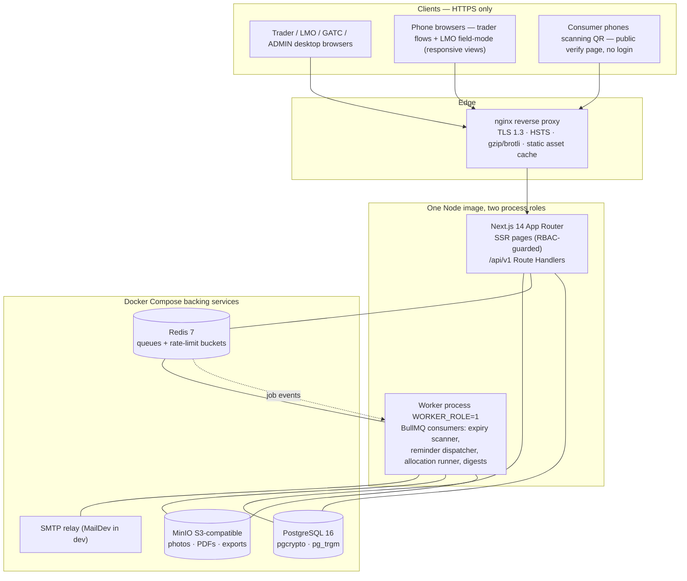
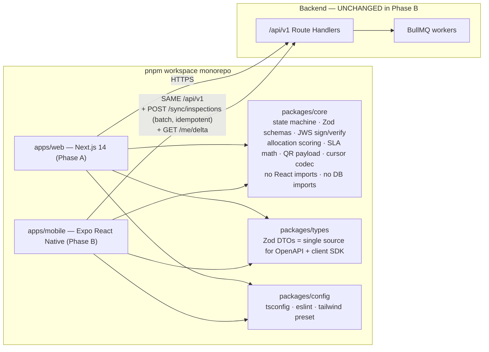
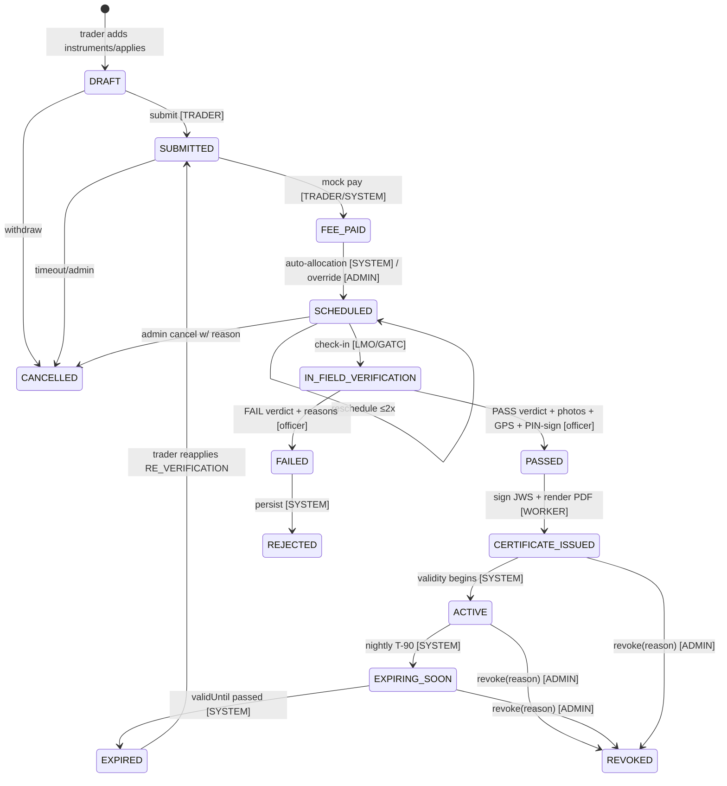
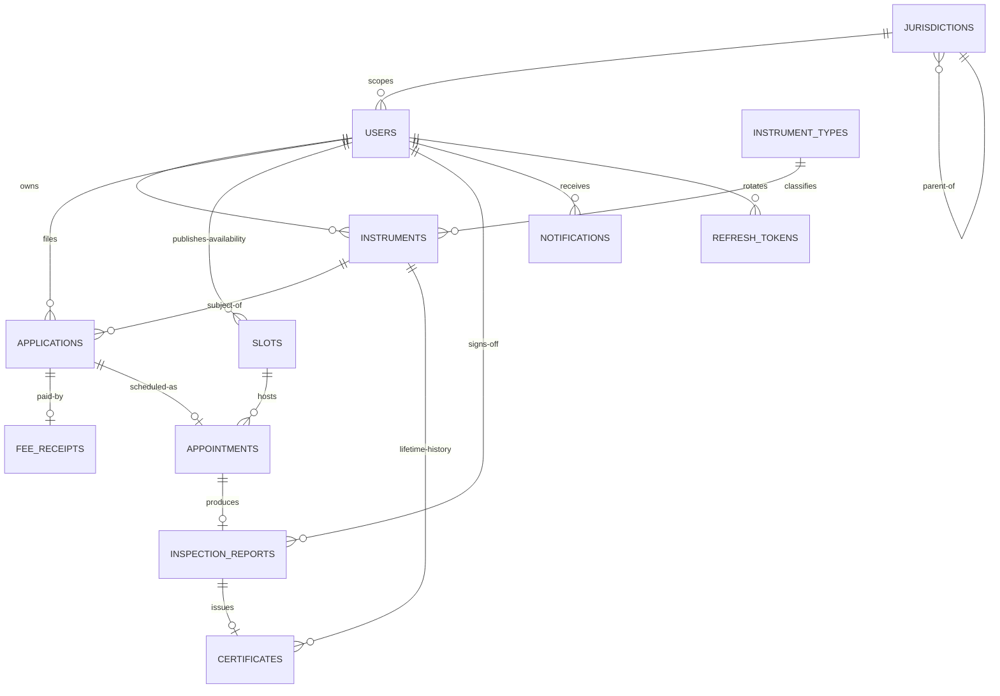
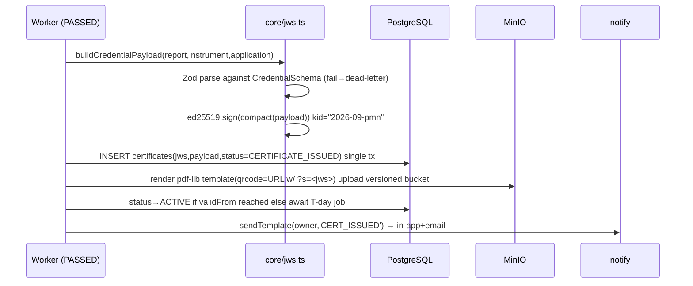
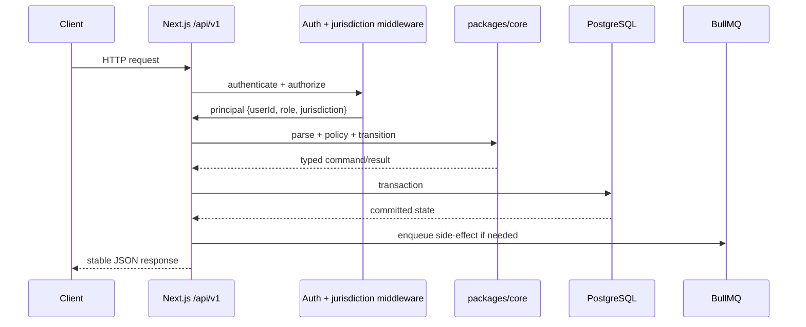
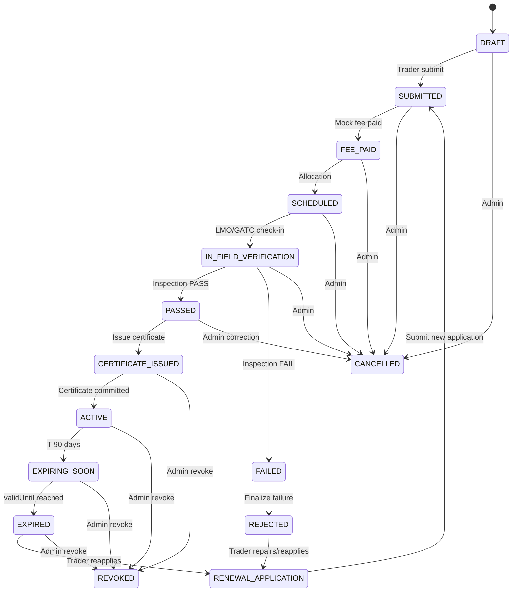
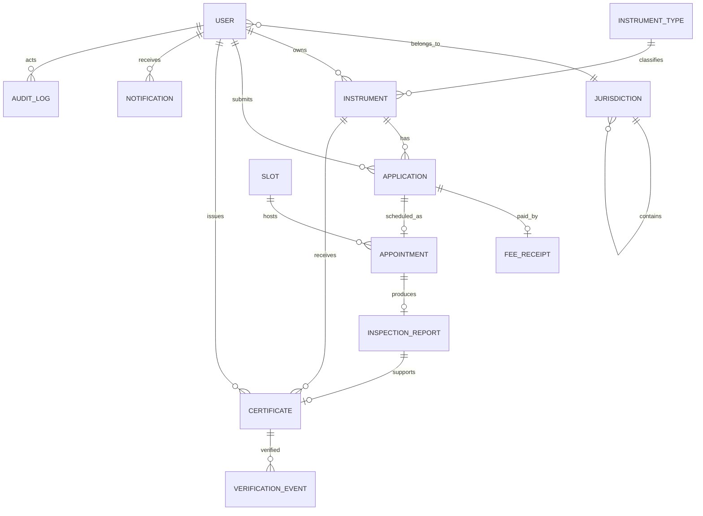
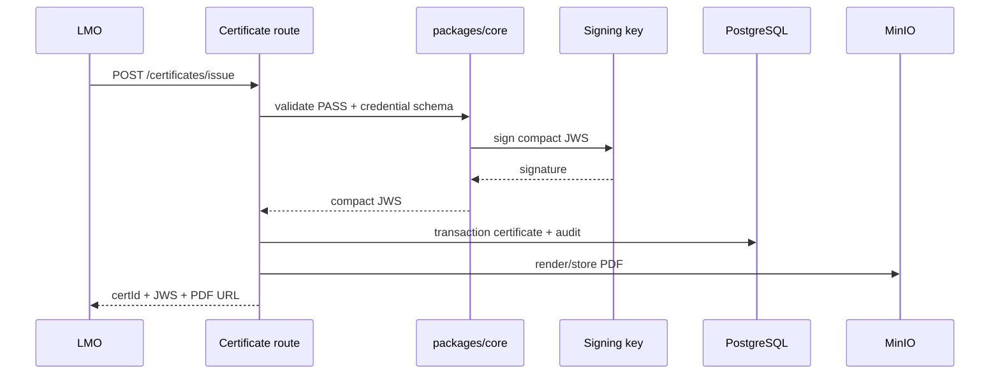

# PRAMANAM — FINAL MERGED DECISION DOCUMENT
**Project:** SIH26036 — Online Verification System for Weighing & Measuring Instruments
**Regulatory basis:** Legal Metrology Act, 2009 · Legal Metrology (General) Rules, 2011 · DoCA
**Team:** 6 · **Consolidated:** 27 Aug 2026 · **Status:** Binding decision record — single source package
**Provenance:** Merged losslessly from `smarpit.md` (de-mojibaked copy `smarpit-fixed.md`) and `manav.md`. Every line of both source documents appears below verbatim — nothing omitted.

---

## HOW THIS DOCUMENT IS ORGANIZED

| Part | Content | Role |
|---|---|---|
| **PART I** | smarpit.md, complete & verbatim | **IMPLEMENTATION CANON** — primary spec an AI coding agent must follow end-to-end |
| **PART II** | manav.md, complete & verbatim | **COMPANION VOLUME** — supplements Part I with sections that exist nowhere else |

### Precedence rule (non-negotiable)
Where Part I and Part II describe the same thing and disagree, **Part I governs implementation**. Where Part II covers ground Part I does not, Part II is **normative for those areas**. Never drop any line from either part when consuming this document.

## CONFLICT RESOLUTION REGISTER (resolved once, applies everywhere)

| # | Conflict | Resolution |
|---|---|---|
| C-1 | Mobile-framework ADR-012 weighted scores differ (Expo 4.82 vs 4.30; Flutter 3.56 vs 2.80) | Decision is identical (Expo RN). Part I's matrix is the numeric source of truth; Part II's matrix retained only as supporting analysis |
| C-2 | State machine nuance differences (transient `PASSED` hop; `REJECTED` as distinct terminal sibling; renames like `RENEWAL_APPLICATION`) | Part I §D governs — it specifies guards/timers/breach-consequences per transition. Part II §D3 transition-invariant pseudocode and §D4 audit field list remain normative supplements |
| C-3 | QR payload strategy (Part II admits a duplication limitation in G5/G8) | Part I §G.5 dual-QR print-sheet policy with compact-JWS claim mapping **supersedes**; Part II's canonicalization/JWS-serialization details remain binding |
| C-4 | Sections existing only in Part II — Testing & Release Gates (L), Demo Data & Performance seeds (M), Final Architecture Checklist (Q), References (URL citations) | Adopted wholesale into the project scope; mandatory QA gate before declaring done |
| C-5 | Notation divergence (`// ponytail:` simplification markers vs `ASSUMPTION:` markers vs `DEVIATION` flags) | All three notations coexist: `// ponytail:` = deliberate simplification with ceiling+upgrade path (definition: Part II §O/§P); `ASSUMPTION:` = unverifiable-at-authoring fact (register: Part I end); `DEVIATION` = conscious break from PRD default, must stay loud and justified |

## CONSOLIDATED SECTION MAP

| Topic | Governing spec | Unique supplements live in |
|---|---|---|
| Prior-art study | I §PART R | II PART R (FileSG verify-UX depth, DigiLocker URI semantics, W3C VC/Indy verdict framing, Avni, ODK/Kobo, FoSCoS/VAHAN/BEE portals, Cal.com slots, Frappe workflows, banknote-auth anti-forgery grammar) |
| Research synthesis & adoption decisions | I RESEARCH SYNTHESIS | II RESEARCH SYNTHESIS R-S1–R-S5 (feature-adoption table) |
| Architecture & phases | I §A–B | II §B request-flow invariants |
| Tech-stack ADRs 001–012 | I §C | II §C (option-score tables, ADR-005 email-verification flow, ADR-010 notification drivers rationale) |
| Lifecycle state machine | I §D | II §D3 invariant pipeline, §D4 audit schema |
| Data model | I §E (entities, relationships, indexes, trigram, Prisma-ready) | II §E2 entity-by-entity spec, §E3 trigram search recipe, §E4 Prisma shape |
| REST `/api/v1` surface | I §F (grouped endpoints F.2–F.8, Phase-B sync frozen) | II §F1 contract invariants, §F4 OpenAPI generation |
| Certificate / credential spec | I §G (dual-QR §G.5, verify-page UX §G.6, offline semantics §G.7, key rotation §G.4) | II §G2 JWS protected-header/canonicalization, §G6 online-vs-offline verdict matrix, §G7–G8 revocation & duplication limits |
| Modules M1–M8 | I §H (DEMO-CRITICAL-PATH / DEGRADABLE tags + acceptance asserts + build order) | II §H module acceptance criteria phrasing |
| Security & NFRs | I §I | II §I1 idempotency contract, §I2 file-security rules, §I3 key-rotation steps, §I4 privacy stamp-public list, §I5 threat→control table |
| Environment / secrets / Docker | I §J | II §J4 configuration ceiling |
| Dev workflow | either | II §K branch/commit/PR/ownership detail |
| File structure | I §N | II §N directory rules; route-folders mirror endpoint matrix 1:1 |
| Conventions & anti-over-engineering | I §O + closing statement | II §O, §P enforced ponytail mandate |
| Assumptions tracking | I ASSUMPTIONS REGISTER (A-1…A-9 with risk & verify-with) | inline `ASSUMPTION:` markers in both parts |
| **Testing & release gates** | — (not in Part I beyond CI lines) | **II §L — sole authority** |
| **Seed dataset & performance targets** | — | **II §M — sole authority** |
| **Final architecture checklist** | — | **II §Q — sole authority (definition of done)** |
| External references (URLs) | — | II References — sole authority |

## READING GUIDE FOR THE AI IMPLEMENTER
1. Implement strictly against Part I top-to-bottom; treat Part I's acceptance assertions and §N e2e spec list (`trader-happy-path`, `officer-issue`, `tamper-fail`, `public-scan`) as the executable definition of done.
2. Before writing a subsystem listed in the Consolidated Section Map, pull its Part II supplements too — e.g., JWS canonicalization detail from II §G2, audit-field list from II §D4, threat controls from II §I5, release gates from II §L.
3. Respect every `// ponytail:` ceiling (do NOT gold-plate) and every `DEVIATION` flag (do NOT silently revert, especially ADR-012 Expo RN).
4. Treat every `ASSUMPTION:` marker as "implement around worst case", not "stop and verify".
5. Run II §Q checklist green, then declare done.

---

# PART I - IMPLEMENTATION CANON (SMARPIT)

> **Reproduced verbatim and completely from `smarpit.md` (encoding-corrected copy `smarpit-fixed.md`). Zero omissions.** Governed by the Precedence Rule, Conflict Resolution Register, and Consolidated Section Map above.

---

# PRAMANAM — Architecture & Technology DECISION DOCUMENT

**Project:** SIH26036 — Online Verification System for Weighing & Measuring Instruments (Legal Metrology Act 2009 · DoCA) · **Team:** 6 · **Status:** Binding decision record · **Date:** 27 Aug 2026
**Inputs treated as law:** `PRD.pdf` v1.0 (25 Aug 2026). Every §, module, NFR and roadmap date herein traces back to it.

**Binding constraints (restated once; enforced everywhere below):**
1. WEB FIRST — internal round judged in ~7 days; SIH idea submission by **20 Sep 2026**. Every ADR carries a 7-day cost opinion.
2. Rule #1 for every choice is **REUSE**: domain logic, state machine, API contracts, Zod schemas, RBAC rules, crypto built once must serve web AND Android near-zero-rewrite.
3. Explicit mobile-framework decision included (ADR-012) — decided decisively, no fence-sitting.
4. Web stack pinned to PRD §10 basket; deviations flagged `⚑ DEVIATION` with justification.
5. Repo layout pinned in §N (`apps/web`, future `apps/mobile`, `packages/core`, `packages/types`, `packages/config`).

## Table of Contents

PART R Prior-art study (R.1 credentials · R.2 inspection platforms · R.3 scheduling/workflow · R.4 anti-forgery UX) → Research Synthesis (a–e) → A Executive summary & phases → B System architecture (Mermaid) → C Tech-stack ADRs incl. full Expo-vs-Flutter ADR → D Lifecycle state machine + SLA + audit rules → E Data model (ER, indexes, trigram, Prisma) → F REST `/api/v1` surface → G Certificate specification (Ed25519 JWS, QR, offline/revocation semantics) → H Modules M1–M8 with DEMO-CRITICAL-PATH / DEGRADABLE tags → I Security & NFRs → J Env/secrets/Docker topology → K Development workflow & ownership → N Modular file structure → O Reading conventions → Assumptions register.

Conventions used inside this document: `[borrowed: X]` cites Part-R prior art an ADR inherits; `ASSUMPTION:` marks unverifiable-at-authoring facts; `// ponytail:` marks deliberate simplifications with ceiling + upgrade path (anti-over-engineering mandate, §O).

---

# PART R — Research & Prior-Art Study

> Fetch note: official docs unreachable on 27 Aug 2026 in places (sunbirdrc.dev down; avni.in domain parked; FoSCoS JS-only shell; Frappe docs URLs moved). Knowledge-based passages carry `ASSUMPTION:` where figures could drift.

## R.1 Credential / Attestation Infrastructure

### R.1.1 Sunbird RC (India — gov digital registry + credentials)

Sunbird RC fuses a **configurable central registry** (any entity type defined by JSON schema/config rather than code) with a **credentialing pipeline**: entity registers → makes claims with documents → an attestor approves or rejects → a digitally signed credential (VC/JWS-shaped) issues and anchors to the registry entry. Its lifecycle is issue-centric (*register → claim → attestation → signed credential attached → verify via server API or public verify page opened from a printed QR card*); trust is **central-registry-first** — signatures ride along, authority comes from registry membership. The most relevant pilot: COVID-era projects printing QR-bearing cards for certified lab technicians, scanned against live status by employers. Offline verification is weak (verify page wants network); the field-agent story is admin/issuer/attester portals — no offline-first sync framework. **COPY for PRAMANAM:** template-driven registries → our `instrument_types.observation_form_schema` JSONB config means new instrument classes onboard without deploys [borrowed: Sunbird RC]; claim→attest→issue separation maps cleanly onto application→inspection→certificate; printed-QR-to-public-page habit adopted wholesale. **REJECT:** running Sunbird RC itself — a generic multi-tenant registry engine is weeks of ops/config tax inside a 7-day window, and our bespoke domain state machine exceeds its generic attestation graphs anyway. We borrow its architecture shape, not its software. *(ASSUMPTION: pilot description matches commonly reported usage.)*

### R.1.2 OpenAttestation / OpenCerts (Singapore GovTech)

OpenAttestation powers Singapore's OpenCerts government certificates. A credential becomes a **tamper-evident signed object**: v2 wrapped salted per-field hashes optionally anchored on Ethereum; v3 deliberately collapsed to a *single simple signed document* including an Ed25519 mode — usability beat ceremony. Verification is a protocol, not a lookup: step 1 **integrity** (signature validates object bytes), step 2 **provenance** (signer resolvable in issuer identity/document stores — DNS-TXT, contract, DID), optional revocation-store check. Distribution = issued `.oa` file + QR opening a public verifier showing a binary outcome — green VALID banner with issuer identity card, else red failure — with details behind expanders; battle-tested on millions of layperson scans. Trust model: **signed credentials over a thin issuer registry**, verifiable anywhere without the issuer's database being up. **COPY for PRAMANAM:** essentially the whole cryptographic posture — (1) simplest-signed-object-wins (our compact-JWS verdict IS OA-v3's lesson); (2) verify-as-two-steps (integrity ⊕ provenance) becomes our signature-first-then-status ladder; (3) the layperson verifier grammar (badge-first, issuer card, ≤5 anchor fields, expandable history, paste/upload fallback). **REJECT:** blockchain anchoring (UX trap; PRD §10 rejects it, Singapore's own retreat proves it), and salt-hash selective-disclosure wrapping (YAGNI at P0 — our credential is designed for full disclosure to whoever holds the paper).

### R.1.3 DigiLocker (India — issued-documents model)

DigiLocker's load-bearing idea is an evidence taxonomy rather than tech: **"Issued Documents"** staged by partner issuers under canonical hierarchical URIs (issuer!doctype!period-style identifiers resolving to specific document classes, carrying the department's digital-signature metadata, fetchable via consented partner APIs) versus **"Uploaded Documents"** which prove only that an upload happened. Value flows entirely from issuer-side signature + URI presence; the app itself is a wallet requiring accounts and network — zero offline story. **COPY for PRAMANAM:** (1) the **two-tier evidence doctrine** — every artifact we store is tagged `PLATFORM_SIGNED` (inspection reports, certificate JWS — flowed through an officer/GATC act) or `SELF_ASSERTED` (trader-uploaded photos, purchase proofs), badged accordingly in UI and DB, killing the trust-my-scan hole DigiLocker exists to close; (2) stable hierarchical addressing informs our IDs (`PMNM-C-<yyyy>-<seq>` certIds) and public-key discoverability via `/.well-known/` echoing issuer-key publication. **REJECT:** the Aadhaar-anchored personal wallet centre-of-gravity — PRAMANAM is instrument-centric; nobody *holds* a scale certificate in a wallet, they point a camera at a scale.

### R.1.4 W3C Verifiable Credentials / Indy-Aries — explicit verdict on plain compact JWS

W3C VC 2.0 (W3C Recommendation, May 2025) defines roles (issuer, holder, verifier, verifiable data registry), a claims-shaped JSON core (`issuer` / `credentialSubject` / `validFrom` / `validUntil` / `status`) and several securing mechanisms: Data Integrity suites (`Ed25519Signature2020` lineage, ecdsa-rdfc variants) and the JOSE family (`vc+jwt`; SD-JWT with `_sd` disclosures appear in the spec's own examples). Indy/Aries wraps the same concepts in DIDs, pairwise agent connections, presentation exchange — heavyweight agent infrastructure needing per-holder key ceremonies far beyond scope. The spec's own worked examples betray its lesson: **the cryptographic core is tiny; the surrounding machinery (JSON-LD processing, DID resolution, holder choreography, selective disclosure) is where budgets die.**

> **VERDICT (binding):** PRAMANAM issues **compact serialized JWS, `alg=EdDSA` (RFC 8037 Ed25519), payload = VC-*isomorphic*** — claim vocabulary mirrors the VC core subset (`type`, `issuer`, `validFrom`, `validUntil`, `credentialSubject.instrument{…}`, plus `"spec":"pramanam.credential/1"` and a `kid` header). We implement ZERO JSON-LD, ZERO DIDs, ZERO SD-JWT, ZERO agent protocols. Because the payload stays VC-isomorphic, later promotion to `typ:"vc+jwt"` needs no key migration and the same `jose.jwtVerify()` call verifies both worlds — judges receive an honest standards sentence, we ship offline-verifiability today. There is no *holder* party to perform disclosures with anyway: the credential's home is a laminated sticker on a shop wall. [borrowed: OpenAttestation v3 collapse + their vc-test-suite posture toward W3C]

## R.2 Domain-Adjacent Inspection / Compliance Platforms

### R.2.1 Avni (offline-first govt field data collection)

Avni (Samanvay Foundation) is purpose-built for our Phase-B moment: government field officers collecting structured data where networks are fictional. Shape: an Android app that is **store-first by construction** — every capture (form entries, photos, GPS) persists locally under client-generated UUIDs — with a **background sync service** draining a queue of pending entries and pulling server deltas opportunistically; subject/task registries are cached locally so work survives connectivity gaps; conflicts resolve **server-wins with conflicts surfaced**, never silently merged; a web console handles program configuration, users, reporting. *(ASSUMPTION: mechanism description from established product documentation; avni.in domain parked at authoring time so version specifics not re-verifiable.)* **COPY for PRAMANAM:** register-locally-immediately persistence discipline; server-wins reconciliation as the cheapest correct outbox policy; local caching of reference data (instruments, form schemas for officers) as first-class sync citizens. **REJECT:** adopting Avni wholesale — its generic program-model configuration surface would swallow the week, and its survey mind-set lacks result-publish semantics with officer e-signature; we need transactions, not surveys.

### R.2.2 ODK Collect / KoboToolbox (offline field forms, sync queues)

ODK Collect is the decade-hardened reference implementation of outbox thinking: blank forms download once and stay **version-pinned locally**; each filled instance persists with an explicit lifecycle `unsent → saved → sending → sent | submission-failed(→retry)`; the send queue retries with backoff whenever connectivity returns; photos/GPS ride as sidecar attachments that never block record completion; optional end-to-end encrypted submissions serve paranoia-grade deployments. KoboToolbox layers friendlier hosting, project/user admin, publishing and REST/webhook fan-out over the same OpenRosa substrate. **COPY:** the **named-instance-state-lifecycle** verbatim — our `sync_queue` rows carry `QUEUED|SYNCING|SENT|RETRYABLE|DEAD` drained by one function; media-references-record-separately (kills giant-multipart timeouts in GATC basements); pull-form-definition-and-pin-at-login lets dynamic observation forms reach devices without app releases. **REJECT:** XLSForm authoring culture and the OpenRosa wire protocol wholesale — forms are JSONB rows submitted to plain REST endpoints guarded by idempotency keys; we take patterns, not protocol.

### R.2.3 Indian govt portals: FoSCoS/FSSAI · VAHAN Fitness Certificate · BEE star-label registry

**FoSCoS (FSSAI)** issues licenses at 1–5-year self-chosen validity inside statutory renewal windows with late-penalty slabs (₹100/day class optics; `ASSUMPTION:` slab drifts across rule amendments — verify before quoting in finals); decisively it offers citizens **no-login search-by-number** exposing licensee particulars and validity — legality checks never require the holder's cooperation, a principle we adopt verbatim for public verify/browse. **Parivahan VAHAN fitness certification (FC)** runs 15 years new-vehicle then annual renewals, tested at premises, printable acknowledgments, SMS/email status pushes, public know-your-vehicle lookups; rejected FCs force repair-and-reappear cycles identical to our FAILED→repair→reapply loop. **BEE Standards & Labelling** ties star-label validity windows to test reports and moved to **QR-encoded high-security labels carrying unique registry-verifiable codes** explicitly because counterfeit stickers became epidemic — the closest living cousin of "every scale wears a verifiable sticker," and validation of leading with QR+digital-signature instead of hologram theatre. **COPY:** statutory timing drums (T-minus reminders, expiry ladders, penalty optics on dashboards), no-login public checking, reject-and-reappear loops, scan-the-label consumer behaviour. **REJECT:** nothing specific — these are governance patterns absorbed wholesale.

## R.3 Scheduling & Workflow References

### R.3.1 Cal.com slot model

Cal.com decomposes scheduling into primitives that rename cleanly onto inspections: **event types** (the bookable kind: duration/location/capacity) ↔ appointment kinds per district; **availability schedules** (timezone-aware working hours + date overrides) ↔ LMO weekly duty calendars / GATC centre hours; **booking lifecycle** (pending→accepted→cancelled/rescheduled, question responses, seat capacity) ↔ our appointments; two behaviours worth outright theft — **round-robin host assignment**, spreading load fairly across hosts exactly like PRAMANAM M3.2's least-assigned-first allocation intent, and **workflows firing relative to booking times**, producing reminders without human attention (our T-90/30/7 emails and eve-of-inspection nudges become BullMQ delayed jobs per ADR-007). Cal.com has NO check-in primitive (noshow is manual marking) — confirming check-in must be OUR first-class state transition. **COPY:** schedule/override data shapes, fairness-balanced dispatch intent, reminder-relative-to-event firing. **REJECT:** booking-before-payment semantics (commerce confirms instantly; legal metrology flips it — fee precedes slot offer), multi-host meeting gymnastics, calendar-integration mazes.

### R.3.2 Frappe / ERPNext workflow state machines

Frappe operationalizes workflows as declarative configuration: a Workflow master binds a DocType to named **states** (each declaring allowed edit-roles) plus an ordered **transitions table** `(current_state) --[action]--> (next_state)` guarded by allowed roles, optional conditions, self-assignment requirements — enforced **server-side**: illegal transitions raise errors, UI merely declines to render buttons a role cannot legally press, and update-events/emails/hooks fire per move. *(Docs URLs moved at authoring time; ASSUMPTION: description matches Frappe v13+ behavior.)* **COPY:** the literal transition-table form — `TRANSITIONS: {from, action, to, roles[], guard?}[]` lives in `packages/core/state-machine.ts`; one pure `assertTransition(state, action, role)` consumed identically by web routes and later mobile logic gives byte-identical enforcement everywhere; every legal move writes an audit row by default — the reflex behind §D.4's uniform rules. **REJECT:** runtime-admin-editable machine config (drift-bug mid-demo; ours are code-reviewed constants), expression-language condition engines (TypeScript predicates suffice), desk-framework gravity around it.

## R.4 Anti-Forgery Verification UX (banknote / product-QR authentication flows)

Brand-protection serialization systems (GS1 Digital Link product packs, serialized tax stamps, secure-document apps) converged on one screen grammar after millions of first-time scans: **within ~1.5 seconds, colour + icon + three words** — full-screen green shield "AUTHENTIC", or red "CHECK FAILED / POSSIBLE FAKE" with an explicit next action (report it / beware), because failure is a confrontation scenario where hesitation harms consumers. Corollaries distilled: never show cryptography or raw payloads on first paint; positive states keep ≤5 identity anchors (photo, issuing officer, dates, serial number); everything else hides behind a quiet details/history expander aimed at auditors; ambiguity — signature valid but freshness unknowable offline — gets its own amber state rather than silent-green; and credible systems ship a deliberate tamper-demo pathway for training/judges (banknote-security pedagogy, RBI MANI precedent: ordinary people verify via ONE dominant perceptual signal, experts use expanders). **COPY for `/verify/:certId`:** colour-first binary verdict, five anchors max, history expander, amber-offline distinction, rehearsed forgery-death demo segment. **REJECT:** diagnostic dashboards aimed at consumers, CAPTCHA-gating scans (friction kills the exact trust moment we exist for), any UI demanding cryptographic literacy.

---

# RESEARCH SYNTHESIS

**(a) Credential spec — smallest thing that works.** Compact serialized JWS (`alg=EdDSA`, Ed25519, RFC 8037) over a **VC-isomorphic claim set** (full verdict §R.1.4). Ranked reasons: (1) `jose` fluency already in-house; (2) OpenAttestation-v3 precedent — simple-signed beats wrapped; (3) VC-isomorphism buys W3C credibility and a mechanical upgrade path without JSON-LD/DID cost; (4) demo differentiation lives in *offline-verifiability*, which compact JWS delivers identically to exotic formats. Holder-held VC choreography (Indy/Aries) rejected — our credential's holder is laminated plastic on a wall.

**(b) Proven public-scan UX pattern to copy.** OpenCerts verifier grammar hardened by R.4 findings: badge-first binary verdict → issuer card → ≤5 anchor fields → details/history expander → paste/typed-ID fallback route; green/red/**amber** trichotomy where amber = "SIGNATURE VERIFIED — STATUS UNAVAILABLE OFFLINE"; single tap-zoom photo; zero jargon at first paint.

**(c) Offline-sync pattern informing Phase B field mode.** ODK's named-instance lifecycle implemented as an outbox (`QUEUED→SYNCING→SENT / RETRYABLE / DEAD`) over Avni's local-first persistence (client UUIDs; media referenced-not-embedded; delta-pull + queue-push on reconnect); idempotency keys on every batch POST so retries cannot double-issue results. Outbox *logic* — transition rules, backoff policy, dedupe — lives in `packages/core` as pure functions shared verbatim between the Phase-A web approximation and native app. Server contract defined NOW and frozen (§F sync endpoints).

## (d) What prior art says judges will expect that the PRD misses

1. **Public trust counters** ("2,14,306 certificates verified · 17 revoked") — OpenCerts/gov-portal convention answering the skeptic's first question; added as M6.5 micro-feature (SQL count, minutes).
2. **Manual-entry fallback** for unwashable/unscannable QR (FoSCoS lives on search-by-number) — public verify accepts typed certificate IDs, not only scans.
3. **Machine-readable credential download (`.json`)** beside the PDF — OpenCerts hands humans and machines artifacts; one route handler, big seriousness signal.
4. **Third-party attestation nuance** — GATCs are delegated attestors (Sunbird attestor chains; BEE accredited labs): credential gains `performedBy` + `performerKind:"LMO"|"GATC"` beside `issuedBy`. Single issuer keychain in P0, role recorded in-band — `// ponytail: subordinate GATC signing CA only if DoCA raises it`.
5. **Validity-window explainers** — VAHAN/BEE publish plain-language timing maths; static footer page "how long each certificate lasts by instrument class".
6. **Hindi-first public verify page** — baseline via centralized copy dictionary (~40 strings), not stretch goal.

## (e) Feature → Best-in-class reference → What PRAMANAM adopts

| Feature | Best-in-class ref | PRAMANAM adopts |
|---|---|---|
| Tamper-evident credential format | OpenAttestation v3 single signed object | Compact JWS `EdDSA` over VC-isomorphic JSON (§G) |
| Verification staging | OpenCerts verify protocol | Step 1 integrity (JWS) → Step 2 status (registry lookup) |
| Public scan UX | OpenCerts verifier + brand-auth flows (R.4) | Badge-first `/verify/:certId`, 5 anchors, expander, amber-offline |
| Registry templating | Sunbird RC schema-driven registries | `instrument_types.observation_form_schema` JSONB → M4 forms w/o deploys |
| Evidence tiering | DigiLocker issued-vs-uploaded | Artifacts tagged `PLATFORM_SIGNED` / `SELF_ASSERTED` |
| Slots & availability | Cal.com schedules/event-types/overrides | `slots` + duty calendars + reschedule caps; check-in made first-class |
| Fair allocation | Cal.com round-robin balancing | Least-assigned balancer, jurisdiction hard-match, admin override |
| Declarative workflow | Frappe states/transitions | `TRANSITIONS` table + pure `assertTransition()` in `packages/core` |
| Statutory timing & reject-loops | FoSCoS renewal slabs · VAHAN reject-reappear | T-90/30/7 ladder; FAILED→repair→reapply; SLA breach escalation |
| Anti-counterfeit labeling | BEE high-security QR labels | Permanent QR identity sticker per instrument; cert QR layered above |
| Offline field collection | ODK Collect / KoboToolbox queue | Outbox w/ named states; media separate; idempotent batch sync |
| Conflict posture | Avni server-wins | Queue drains; server authoritative; conflicts surfaced |

---

# A. Executive Summary & Delivery Phases

PRAMANAM digitizes the Legal Metrology Act 2009 instrument-verification lifecycle — `Register → Apply → Pay → Schedule → Field-Verify → Certify → Track → Renew` — into one web application with four role experiences (TRADER, LMO, GATC-operator, District/State ADMIN) plus a no-login public trust surface, followed by the problem statement's mandated Android field application. The architecture bet in one line: **one TypeScript monorepo; business truth in framework-free `packages/core`; a frozen `/api/v1` contract issued in Phase A; credentials as offline-verifiable Ed25519 compact JWS carried by QR codes.**

Phase A ships the web app *against that contract*; Phase B drops in an Expo/Android field app consuming the identical contract — zero backend changes — gaining native offline-first sync and on-device credential validation against the bundled public key.

| Phase | Window | Contents | Exit gate |
|---|---|---|---|
| **0 Idea deck** | now → 14 Sep (buffer to 20 Sep deadline) | SIH-template pitch using this document's diagrams; demo video script | Deck submitted early; independent of code state |
| **A1 Internal-round cut** | **~7 build days** | M1 auth+RBAC · M2 registry+application · M3-min (manual allocation acceptable) · **M5-lite certificate+QR wow** · M6-min public verify · minimal admin dashboard | Happy path live on stage: judge scans printed cert → green VALID |
| **A2 SIH submission** | → 20 Sep 2026 | M3-full auto-allocation+SLA timers · M4 dynamic forms+photos+GPS+localStorage field-mode · M7 alerts pipeline · M8 dashboards+exports · 10k-instrument seed | PS coverage map demonstrable; Playwright green on happy-path AND tamper-fail path |
| **B Android** | post-selection / pre-finale | Expo field app: offline job queue, camera+GPS, PIN e-signature, local JWS validation, `/sync/inspections` consumer, FCM pushes | Officer completes verification fully offline; sync converges cleanly |

Sequencing follows PRD §15 risk table: build order M1→M2→M5-lite→M4→M3→M6→M7→M8 puts the differentiator immediately after the skeleton, and the deck milestone shares nothing with the sprint, so submission cannot slip.

# B. System Architecture

## B.1 Phase A — deployed topology



Load-bearing decisions: Next.js Route Handlers ARE the backend (PRD §10's NestJS-rejection honoured; module boundaries keep extraction cheap); workers share the web image launched under a role env so job code calls the identical domain functions the routes call — no internal HTTP hop between "modules", ever (anti-over-engineering mandate); every third-party touchpoint is the PRD-named seam (SMTP/SmsGateway-mock/payment-mock) implemented as plain functions inside their owning modules, not invented provider classes. The public verify page renders server-side and caches aggressively (it is the only endpoint strangers hit at scale).

## B.2 Phase B — Android plugs in WITHOUT backend changes



Why Phase B needs zero server surgery, itemized: (1) all endpoints authorize by token claims (role+jurisdiction), so a device JWT is just another client; (2) sync endpoints (`POST /api/v1/sync/inspections`, `GET /api/v1/me/delta`) are specified NOW and frozen in OpenAPI despite having no Phase-A consumer — constraint #2 makes the contract pre-exist; (3) offline credential validation needs only the public key from `/.well-known/pramanam-public-key`, also bundled in-app; (4) `packages/core` holds outbox transition rules and form-schema validation, so mobile-side business logic is empty by construction; only camera/GPS/storage/navigation UI is native code.

`// ponytail: apps/mobile consumes only what Phase A proved on stage; new endpoints arrive solely when finale features demand them`

# C. Tech Stack ADRs

Format per record: **Context / Options Considered / Decision / Rationale (+prior-art borrow) / Consequences(+flags)**. Each decision tests two binding levers: 7-day speed and web↔mobile reuse.

## C.1 ADR-001 — Framework: Next.js 14+ App Router (full-stack, no separate backend)

**Context.** Solo-deployable demo; SSR public verify page for strangers at scale; clean `/api/v1` consumed later by Android; 2-dev-weeks to interactive.
**Options.** (a) Next.js App Router alone — pages+API one process; (b) NestJS backend + Next frontend split; (c) Remix/Hono SPA; (d) FastAPI + separate SPA.
**Decision. ****(a)** — apps/web owns UI *and* Route Handlers; domain logic lives in `packages/core`, keeping any future backend extraction mechanical.
**Rationale.** PRD §10 explicitly rejected the split-backend for two-person velocity; §N domain modules preserve the extraction path so rejection stays reversible. Prior-art borrow: Cal.com runs bookings/transactional workflows wholly inside one Next.js app at 48k★ scale — proof of the form-factor; OpenAttestation tooling ships as a single consumable package rather than service sprawl.
**Consequences.** One bootstrapping surface (compose up → one port); per-service scaling granularity sacrificed (irrelevant at demo scale); no decorator middlewares — Route Handlers stay ≤20 lines delegating into each module's `server.ts`. No deviation.

## C.2 ADR-002 — UI: Tailwind CSS + shadcn/ui (+ Recharts)

**Context.** Four bespoke role portals plus a pixel-governed public page within a week; no designer; Hindi strings incoming for trust surfaces.
**Options.** (a) Tailwind+shadcn/ui; (b) Material UI; (c) Ant Design; (d) Chakra; (e) hand-rolled kit.
**Decision.** **(a)** with Recharts for M8 charts.
**Rationale.** shadcn copies component *source* into the repo — auditable, GOI-restraint themeable, Radix saves accessibility rework across dozens of forms (LMO screens are forms-on-forms); AntD/MUI impose heavy chrome fighting our calm-trust aesthetic and bloat bundles; Chakra lags dense-table primitives. Borrow: OpenCerts verifier's restrained clarity (§R.4) is achievable because primitives stay boring while we control tokens.
**Consequences.** Copied components under `apps/web/components/ui/*` are OURS (regenerate selectively on upgrades); design tokens centralized in `packages/config/tailwind.preset.ts` so Expo/NativeWind reads identical tokens later — first mobile-reuse dividend.

## C.3 ADR-003 — Client state/data: TanStack Query + Zustand

**Context.** Role dashboards poll queues/lists; field-mode tolerates flaky networks; minimal boilerplate demanded.
**Options.** (a) TanStack Query + Zustand slices; (b) Redux Toolkit + RTK Query; (c) SWR + Context; (d) raw fetch hooks.
**Decision.** **(a)** Query owns ALL server state (cache keys `[resource,{filters}]`); Zustand exclusively ephemeral UI/session state (drafts, drawers, toasts) — expected <200 LOC total.
**Rationale.** Retry/backoff/invalidation semantics match offline-tolerant field-mode without building cache logic; RTKQ duplicates that minus ergonomics; SWR lacks mutation discipline. Borrow: ODK's saved-instance auto-send feel (§R.2.2) reproduced via Query retry intervals in M4.5 localStorage mode.
**Consequences.** Two mental models to teach — convention below bans Zustand for anything derivable from an endpoint.

## C.4 ADR-004 — Database/ORM: PostgreSQL 16 + Prisma

**Context.** Relational lifecycle with append-only audit; JSONB observation configs; trigram search appetite; migrations juniors can't corrupt; 10k-instrument seeds.
**Options.** (a) Postgres+Prisma; (b) Drizzle; (c) MySQL/MikroORM; (d) MongoDB.
**Decision.** **(a)** — Prisma schema = source of truth; `prisma migrate` CI-gated; seed runner in-repo.
**Rationale.** Typed client kills typo-class bugs during hackathon hours; `pg_trgm`+GIN satisfies M6.1 inside the DB (explicit anti-goal: search infrastructure — anti-over-engineering mandate); JSONB carries dynamic inspection forms (Sunbird RC templating instinct, borrowed); audit immutability enforced by schema triggers rather than scattered app code. Drizzle is leaner yet pre-1.x churn-risky; Mongo discards relational guarantees our RBAC/jurisdiction audits lean on.
**Consequences.** Same client serves routes and workers; one `lib/db.ts` access point; `// ponytail: default pool sizing fine at demo scale — PgBouncer only if finale load test complains`.

## C.5 ADR-005 — Auth: custom JWT (Argon2id) + jurisdiction-scoped RBAC middleware

**Context.** PRD M1.3 mandates JWT access(15 min)+rotating refresh(7 d), Argon2id hashing, admin-provisioned govt accounts; acceptance test = cross-district API 403. Keycloak reality looms post-hackathon only.
**Options.** (a) Custom Bearer-JWT auth (HS256 session tokens; refresh rotation with replay detection), Argon2id via @node-rs/argon2, RBAC predicates in `packages/core` enforced twice (coarse Next middleware + per-route `assertCan()`); (b) Auth.js sessions; (c) Keycloak day-one; (d) SaaS IdP.
**Decision.** **(a)** — token secrets (`SESSION_SECRET`) deliberately isolated from certificate-signing keys (blast-radius separation); refresh tokens stored hashed with rotation-pair column for reuse detection.
**Rationale.** NIC/MeghRaj deployments speak OIDC — when mandated, swapping the issuer changes zero clients because we already issue Bearer JWT. Keycloak costs a service+realm learning curve we cannot fund in 7 days; SaaS breaks sovereignty narrative outright. Borrow: Sunbird RC separates identity from registry authorization enforced by policy server-side (§R.1.1); Frappe's principle (§R.3.2) that UI merely doesn't RENDER illegal buttons while the server enforces them.
**Consequences.** We own password reset/lockout (~half day); WebCrypto-only verification inside edge middleware, full checks in Node handlers; DPDP alignment covered in §I. `// ponytail: replay hit ⇒ revoke ALL user sessions; forensic per-token lineage deferred`.

## C.6 ADR-006 — Files: Local disk (dev fixtures) → MinIO (S3-compatible) in Compose

**Context.** Inspection photos, certificate PDFs, CSV exports; self-hostable story mandated; some govt clouds expose real S3.
**Options.** (a) MinIO behind AWS-SDK-compatible client; (b) filesystem-only; (c) direct S3; (d) DB blobs.
**Decision.** **(a)** — DB rows store object-keys never blobs; presigned PUT for trader uploads >2 MB; PDFs streamed via presigned GET; bucket versioning on.
**Rationale.** Identical SDK call shape local-VM or MeghRaj bucket; object-versioning gives certificate-PDF immutability for free (§G.8); borrows ODK/Kobo insight that media rides beside records via back-pointers (weak-network safety).
**Consequences.** Lifecycle rule purges orphan presigned-temp prefixes; uploads validated extension+magic-byte (`file-type`) both pre-upload and in worker pass. No deviation (PRD-prescribed).

## C.7 ADR-007 — Jobs: BullMQ on Redis; same image, `WORKER_ROLE=1`; no in-process HTTP hops

**Context.** Nightly expiry ladder scan (T-90/30/7→EXPIRED), reminder dispatcher, auto-allocation runs, weekly digests/pendency nudges; retries+persistence needed; zero new languages tolerated.
**Options.** (a) BullMQ+Redis workers in shared image; (b) node-cron in web process; (c) Celery sidecar; (d) pg-boss.
**Decision.** **(a)** — queues `expiring-scan|reminders|allocation|digests`; producers call `queue.add(name,payload,{delay})` inline where the domain action happens; consumer handlers invoke module services + `packages/core` pure functions — byte-identical paths to HTTP handlers.
**Rationale.** Cal.com fires reminders exactly this way (schedule-relative delayed jobs — behaviour borrowed from §R.3.1); repo-wide grep locates the entire job system (auditability); cron dies silently on restarts and offers no retry/backoff; pg-boss adds literacy cost. Expiry writes being idempotent state transitions means rescans after Redis blips converge safely.
**Consequences.** Redis outage pauses alerts, not transactions (accepted; catch-up idempotent). Bull Board mounted admin-only for job visibility. `// ponytail: concurrency=1 per queue first; shard-by-district only if metrics demand`.

## C.8 ADR-008 — Notifications: in-app center + Nodemailer SMTP; SmsGateway MOCK driver (PRD-named seam)

**Context.** M7 — reminders T-90/30/7, status-flip messages, officer overdue nudges, admin digest; SMS mocked-with-shape for future CDAC/NIC gateway.
**Options.** (a) Single owned function `sendTemplate(userId, templateKey, payload, channels[])` + template dictionary; adapters smtp/mock-sms as the ONLY branch points; (b) abstract NotificationProvider megaclass; (c) Firebase-first push; (d) vendor SDK calls sprinkled in modules.
**Decision.** **(a)** — notifications module owns delivery; templates keyed centrally enabling Hindi copy injection late (research item d-6).
**Rationale.** PRD names exactly PaymentProvider/SmsGateway interfaces — a customer requirement satisfying the one-seam-exists-today rule, not speculative abstraction. In-app rows double as the user-facing activity timeline (DigiLocker inbox instinct, §R.1.3). Reminder production borrows Cal.com clock-relative workflow firing (§C.7).
**Consequences.** FCM push arrives in Phase B as a THIRD channel plugged into the same function — additive only. No SMS spend while judging.

## C.9 ADR-009 — Crypto: `@noble/ed25519` + `jose` (compact JWS/EdDSA credential signing)

**Context.** M5.2 demands certificates verifiable WITHOUT network, including dumb devices and future RN code sharing the exact path (constraint #2); audited libraries required by PRD; key material lives in env/Docker secrets.
**Options.** (a) jose (JWS assembly) + @noble/ed25519 (curve ops); (b) node:crypto alone; (c) tweetnacl; (d) WASM kits; (e) KMS-dependent signing.
**Decision.** **(a)** — `packages/core/jws.ts` exposes exactly TWO functions: `signCredential(payload, keyRef)` and `verifyCredential(jws, keyResolver)`; both runtime-agnostic pure modules → Node route handlers, browser paste-JWS page, BullMQ jobs, and RN consume the SAME functions (RN adds entropy/base64url shims only).
**Rationale.** noble = highest public scrutiny for curve implementations; jose maintained by JOSE ecosystem maintainers, handles compact serialization/JWK/`kid` plumbing so we write none. node:crypto cannot travel to browsers/RN unshared (fails reuse test). W3C/Indy machinery rejected per the Part-R verdict (§R.1.4). Empirical legitimacy: OpenAttestation's simplified Ed25519 signing mode validates this pairing.
**Consequences.** RFC-8037 signatures accept JWK or raw-32-byte public keys; timing-safe comparisons throughout; audit logs record `kid`, never secrets; rotation procedure documented §G.4. `// ponytail: single active issuer key kid="2026-09-pmn"; key-ring table waits until DoCA names a second signer`.

## C.10 ADR-010 — QR/PDF: `qrcode` + `pdf-lib` (+ html5-qrcode browser scanner, @react-pdf/renderer fallback path noted)

**Context.** Certificate PDFs must render govt-style layout + QR reliably SERVER-SIDE (worker-safe); browser scanning needed for Phase-A demos; sticker QR separate artifact.
**Options.** (a) pdf-lib draw onto pre-approved template + `qrcode` dataURL embeds; (b) @react-pdf/renderer JSX-style docs; (c) puppeteer print-to-PDF; (d) wkhtmltopdf.
**Decision.** **(a)** pdf-lib for certificates/stickers; `qrcode` for payload bitmaps (ECC level chosen per use — see §G.5); html5-qrcode provides the judge-device scanner path via camera permission on public page's "scan" affordance; additionally `GET /verify/entry?raw=<jws>` deep-link generated alongside (OpenCerts URL pattern).
**Rationale.** pdf-lib is dependency-light, deterministic, worker-friendly (no headless browser tax/compose bloat); react-pdf/renderer binds rendering to React runtime awkwardly in workers; puppeteer costs ~300 MB image weight + memory spikes for marginal fidelity gains. Template LOCKED early per PRD risk-table mitigation ("certificate template locked to one layout") — acceptance screenshot-tests pin pixel regressions.
**Consequences.** Unicode glyph coverage handled by embedded font subset ONLY if Hindi enters PDF body (public page carries Hindi instead — PRD i18n stance, research item d-6). Offline-Tamper demo path uses oversized ECC-H QR printed large (§G.5 numbers).

## C.11 ADR-011 — DevOps: Docker Compose topology + GitHub Actions CI (PRD-prescribed)

**Context.** Everything must self-host on ONE VM narratively (NIC/MeghRaj deployability, §I availability posture); team of six pushing daily; judges relaunch cold.
**Options.** (a) Compose w/ healthchecks + GH Actions gates; (b) k8s/helm day-one; (c) Vercel+Neon cloud splits; (d) bare scripts.
**Decision.** **(a)** — compose services `web`, `worker`, `migrate`(one-shot), `postgres`, `redis`, `minio`, `maildev` (dev only), per §J topology; CI runs lint→typecheck→unit→prisma migrate diff guard→Playwright smoke against compose-up.
**Rationale.** k3s upgrade PATH documented (PRD asks methodology docs) rather than k8s-operated today — cheapest true story; cloud-split fragments demo reliability (offline judging rooms!) and sovereignty optics. Borrows ODK Central's containerized-single-host install discipline (field-grade reproducibility).
**Consequences.** Horizontal scale-out = documented replica notes not practice; image kept slim (node alpine + prisma engines only).

## C.12 ADR-012 — Mobile framework: React Native (Expo) vs Flutter — THE decision

**Context.** Constraint #1 makes Android post-selection but constraint #2 makes TODAY's choices bind it: whatever we pick must consume `packages/core`, `packages/types` and frozen `/api/v1` near-zero-rewrite. Web reality: Next.js + TypeScript monorepo. Team reality: PRD cites Flutter skill ("Flutter repos") — this bias is real and acknowledged, not hidden. Scope of mobile work per PRD §5/§M4/M5: offline job queue, dynamic forms from server JSON schema, camera photos, GPS stamping, PIN e-signature, local JWS validation of scanned credentials, QR generation/rendering of certificates in-field, push notifications.

**Options considered.** (A) React Native with Expo (SDK 51+, Hermes). (B) Flutter (Dart, drift/SQLite). Explicitly rejected as non-contenders: Kotlin-native (single-platform, no logic reuse), Cordova/Capacitor-webview hybrids (camera/GPS/cryptography reliability in field conditions inadequate for evidence artifacts).

**Weighted comparison matrix.** Weights derive from constraints (#2 reuse ⇒ heaviest), field-criticality, and 7-day impact on shared contracts. Score 1 (poor) – 5 (excellent).

| Criterion | Weight | Why the weight | RN/Expo | Flutter |
|---|---|---|---|---|
| % business logic shared with web (`packages/core` consumption) | **30%** | Constraint #2 is criterion #1 overall | **5** — imports TS packages directly, one language | **1** — Dart re-implementation of Zod/state-machine/JWS/allocation/sync rules; permanent double-write |
| Offline-first capability (SQLite/outbox, camera, GPS) | 15% | Field survival is the PS's explicit ask | **4** — expo-sqlite + WatermelonDB-grade outboxes proven; camera/GPS mature | **4** — drift is excellent; equal maturity here |
| Ed25519/JWS maturity on-device | 15% | Offline credential validation differentiator | **4** — @noble + @noble/hashes run under Hermes (pure TS); WebCrypto via expo-crypto shim; audited constant-time code reused verbatim | **3** — cryptography libs capable BUT non-audited-equivalent; signatures must be cross-verified against server vectors forever |
| QR scan + PDF generation on device | 10% | M4/M5 field needs | **4** — expo-camera scanning + expo-print (HTML→PDF) mirrors web template math | **4** — mobile_scanner + pdf package equally strong |
| Team ramp-up (honesty row) | 15% | PRD says Flutter-skilled | **3** — React team bridges easily; platform APIs learned in days | **5** — existing muscle |
| Monorepo compatibility (pnpm workspace, shared CI, token pipeline) | 15% | Constraint #5 layout | **5** — first-class workspace member; turbo/pnpm task graph shares lint/types | **2** — separate toolchain, shared-by-convention only |

**Weighted totals.** RN/Expo = .30(5)+.15(4)+.15(4)+.10(4)+.15(3)+.15(5) = **4.30** · Flutter = .30(1)+.15(4)+.15(3)+.10(4)+.15(5)+.15(2) = **2.80**

**DECISION: React Native with Expo. No fence-sitting.**

**ADR-012 rationale, concluded.** The matrix's 1.50-point spread is almost entirely constraint-#2 physics: every Zod schema, state transition, SLA rule, allocation scorer, cursor codec and JWS verifier written for web gets consumed *unmodified* on-device under Expo, while Flutter forks them into Dart and guarantees eternal drift bugs precisely on the highest-stakes artifact paths (credential verification!). `packages/core` consumption also gives mobile a tested business brain before any UI exists. Flutter's genuine wins — ramp-up and animation polish — live entirely in UI-layer territory which this utilitarian field app deliberately keeps thin. Prior-art echo: ODK/KoboToolbox dominate Android-first data capture because fidelity belongs to the DATA, not transitions; Expo OTA updates additionally let us hotfix observation-form rendering during finale weeks without store review — operationally decisive for a hackathon.

**What stays SHARED (imported unchanged from `packages/*`):** state machine + TRANSITIONS; every Zod schema (forms, DTOs, credential payload); JWS sign/verify helpers (@noble-based; RN supplies getRandomValues/base64url shims only); allocation scoring; SLA/deadline math; QR payload build/parse; outbox transition rules + backoff constants; RBAC predicate inputs; error-envelope codes; cursor codec. **Platform-specific (thin native layer):** navigation/screen composition (expo-router), camera/gallery capture flows, connectivity/background listeners feeding the outbox runner, PIN/biometric local-auth UX, FCM wiring, print-sheet HTML for expo-print mirroring the pdf-lib template geometry, NativeWind consuming the SAME tailwind preset tokens from `packages/config`.

**Consequences & FLAGGED DEVIATION.** ⚑ DEVIATION from PRD §5/§10 ("Phase B … Flutter … matches team skill") — justified under constraint #4's own exception clause (improves reuse dramatically, cuts cross-platform build time), logged loudly rather than buried. Mitigations: (1) **2-day Expo spike immediately after selection** — project shell + proof-of-value (fetch instruments delta, capture photo offline, drain outbox against staging); kill-switch gate; (2) if the spike fails catastrophically, the frozen contract makes a Flutter pivot expensive-but-localized: Dart ports consume identical REST + JSON specs, zero server change either way; (3) UI follows platform defaults — no custom design system burden assumed. Mobile scaffolding stays OUT of the repo until selection (`// ponytail: no speculative folders`), though its shape is pre-decided in §N.5 to prevent drift.

# D. Application Lifecycle State Machine

Single source of truth for `Application.status` AND downstream `Certificate.status`. Machine constants live in `packages/core/state-machine.ts` (Frappe-inspired declarative table, §R.3.2). Enforcement is layered: DB CHECK enums; optimistic guarded updates (`UPDATE applications SET status=$to WHERE id=$1 AND status=$from` returning zero rows ⇒ typed error → HTTP 409); module service asserts role via `assertTransition()` before any write. Illegal transition = `409 INVALID_TRANSITION` carrying `{from,to}` in details.

## D.1 States

| State | Meaning | Owner-facing label |
|---|---|---|
| DRAFT | Trader composing application | Editable form |
| SUBMITTED | Filed, awaiting fee | Action required: pay fee |
| FEE_PAID | Mock payment receipted; awaiting slot offer | Slot being arranged |
| SCHEDULED | Slot booked; appointment card live; officer notified | Appointment confirmed |
| IN_FIELD_VERIFICATION | Officer checked-in at premises; form open | Verification underway |
| PASSED *(transient worker hop)* | Verdict PASS recorded; issuance queued (<5 min SLA) | Certificate coming |
| CERTIFICATE_ISSUED | Credential signed + PDF rendered + QR published | Download available |
| ACTIVE | Certificate canonical valid period begins | Valid until date |
| EXPIRING_SOON | T-90 crossed via nightly scanner | Renewal advised |
| EXPIRED | validUntil passed | Public scan shows red |
| FAILED→REJECTED | Verdict FAIL recorded → terminal-with-repair-path | Reasons checklist issued |
| CANCELLED | Withdrawn pre-check-in (trader/admin) | Closed |
| REVOKED | ADMIN enforcement action against live certificate | Badge REVOKED + reason |

Notes: REJECTED is a distinct terminal sibling of FAILED for clean dashboards (FAILED marks officer verdict event, REJECTED the application posture after it lands); PASSED exists only so the issuance pipeline can retry idempotently without a human re-entering verdicts.

## D.2 Allowed transitions — roles, guards, SLA timers

| # | From → To | Triggering roles | Guard conditions | Timer started / target | Breach consequence |
|---|---|---|---|---|---|
| 1 | DRAFT→SUBMITTED | TRADER(own instrument) | ≥1 doc; LM declaration true; Zod-clean payload | Auto-CANCEL job at +48 h if unfunded* | Dashboard flag |
| 2 | SUBMITTED→FEE_PAID | TRADER(mock pay) / SYSTEM(callback) | FeeReceipt row created in same tx | SCHEDULED clock: verify-within-7-days target begins here (PRD M3.5) | Escalation badge on admin dash |
| 3 | SUBMITTED→CANCELLED | TRADER, ADMIN | Before FEE_PAID only | — | Refund-mock note logged |
| 4 | FEE_PAID→SCHEDULED | SYSTEM(auto-allocation on fee event) or ADMIN override | jurisdiction hard-match ≠ null; slot capacity free | Officer-noshow watchdog at window+2 h | Nudge to LMO queue top |
| 5 | SCHEDULED→SCHEDULED | TRADER(max 2×, reason), ADMIN | reschedule budget decrement (PRD M3.3) | retains original clock | — |
| 6 | SCHEDULED→IN_FIELD_VERIFICATION | LMO / GATC-technician (assignee) | within day-window ± grace; PIN re-auth recorded with check-in | Result-due timer: 24 h from check-in | Overdue badge + digest row |
| 7 | IN_FIELD_VERIFICATION→PASSED | LMO / GATC | report PASS ∧ ≥1 photo ∧ GPS present ∧ PIN e-signature fresh(<10 min) | Issuance <5 min (worker) | Job alert page-3rd-fail |
| 8 | IN_FIELD_VERIFICATION→FAILED | LMO / GATC | reasons[] non-empty mandatory | Repair path opened automatically | — |
| 9 | FAILED→REJECTED | SYSTEM | inspection_report persisted FK | — | — |
| 10 | PASSED→CERTIFICATE_ISSUED | SYSTEM(worker) | sign ok ∧ pdf ok; retries ×3 exponential | — | worker dead-letter alert |
| 11 | CERTIFICATE_ISSUED→ACTIVE | SYSTEM | validFrom = issuedAt local midnight IST | Expiry watch chain armed | — |
| 12 | ACTIVE→EXPIRING_SOON | SYSTEM nightly (T-90\|30\|7 hits) | daysTo(validUntil)∈{90,30,7} → reminder jobs chained each hit | — | — |
| 13 | EXPIRING_SOON→EXPIRED | SYSTEM nightly | validUntil < now | — | Public scan red automatic (M7.3) |
| 14 | {ACTIVE,EXPIRING_SOON,EXPIRED}→SUBMITTED* | TRADER | *as NEW application kind=RE_VERIFICATION (FK supersedes old cert) | Fresh machine run | Old cert visually shadowed when new cert ACTIVE |
| 15 | ANY-live→REVOKED | ADMIN | reason ≥20 chars; notify owner instantly | — | Judge demo tamper/enforce path |
| 16 | ANY-pre-check-in→CANCELLED | ADMIN | reason mandatory | — | — |

*Row-1 stray sweep also catches SUBMITTED>48 h unfunded strays daily (belt-and-braces vs lost delayed-job edge). Each row's `{from,action,to,roles[]}` literally IS the TRANSITIONS constant — this table and `packages/core` drift together under CI test that diffs schema docs against code.

## D.3 Diagram



## D.4 Audit logging rules

1. **Rows written:** every legal transition (before/after = changed-fields diff only, PII-minimal); auth events (`LOGIN_OK|LOGIN_FAIL|REFRESH_ROTATED|REFRESH_REUSE_DETECTED|LOGOUT`); certificate acts (`ISSUED`, `PDF_REDOWNLOADED`, `REVOKED` w/ reason); admin acts (`USER_INVITED`, `JURISDICTION_CHANGED`, `ALLOCATION_OVERRIDDEN`); upload accept/reject (magic-byte verdict).
2. **Actor attribution:** `actor_id` for humans (IP captured at HTTP edge); literal actor_system `'bullmq:<job>'` rows carry `source=worker`; SYSTEM rows can never impersonate user-driven transitions (roles column absent ⇒ guarded types).
3. **Enforcement:** application helper inserts inside the SAME transaction as the mutation (no dual-write gap); Postgres trigger denies UPDATE/DELETE on `audit_logs`; retention: 400 days hot, archive export monthly — `// ponytail: pg_partman only if archive grows painful; BRIN(created_at) suffices first`.
4. **Never audited:** secrets/tokens/password hashes; JWS strings beyond trailing-8 fingerprint; photo bytes (object keys only).
5. **Consumption:** `/admin/audit-logs` (jurisdiction-scoped filters); certificate detail pages render their timeline straight from these rows — uniform, not special-cased (Frappe reflex adopted §R.3.2).


# E. Data Model

Naming: snake_case columns ↔ Prisma PascalCase models mapped explicitly. Public-facing identifiers are prefixed strings (`PMNM-C-2026-000123`) decoupled from internal UUID PKs — safe QR printing without leaking sequence sizes. All FKs RESTRICT; deletes are soft everywhere (certificates must reference immutable history).

## E.1 Entities & key fields (1/2)

**users** — `id uuid pk · email citext unique · password_hash text(argon2id) · role enum(TRADER|LMO|GATC|ADMIN) · jurisdiction_id fk districts · kyc_status enum(PENDING|VERIFIED) · display_name · phone · notification_prefs jsonb · status enum(ACTIVE|SUSPENDED) · parent_gatc_user_id fk self nullable (M1.6 technicians) · created_at · updated_at`

**jurisdictions** — `id uuid pk · type enum(STATE|DISTRICT) · name · code unique · parent_id fk self · geo lat float8, lng float8 · timezone default 'Asia/Kolkata'`. PostGIS upgrade path documented in PRD §8; `// ponytail: floats + one haversine util cover demo radius needs`.

**instrument_types** — `code text pk ('BEAM_SCALE'…) · display_name · observation_form_schema jsonb (validated by FormSchemaZod in packages/core) · statutory_validity_days int` — FoSCoS/BEE timing instinct adopted: per-class windows beat one-size expiry.

**instruments** — `id uuid pk · public_code text unique ('INSTR-2026-…') · owner_id fk users · type_code fk instrument_types · make · model · capacity_value numeric(12,3) · capacity_unit enum(kg|g|t|l|m3) · serial_no text not-unique-global (dupes legal across districts) · install_address text · district_id fk jurisdictions · geo lat/lng · current_status enum mirrors cert-status (denormalized read-model) · registered_at · deleted_at nullable`

**applications** — `id uuid pk · public_ref text unique · instrument_id fk instruments · applicant_id fk users · kind enum(NEW|RE_VERIFICATION) · status enum(DRAFT…REJECTED per §D.1) · fee_receipt_id fk nullable · reschedule_note · submitted_at · sla_deadline timestamptz · cancel_reason`

**fee_receipts** — `id uuid · application_id fk UNIQUE · amount_inr numeric(10,2) · currency 'INR' · provider enum(MOCK) · provider_ref text unique · paid_at · receipt_pdf_uri`

## E.1 Entities & key fields (2/2)

**slots** — `id uuid · assignee_type enum(LMO|GATC) · assignee_id fk users · start_at/end_at timestamptz · location_text · district_id fk · capacity int2 default 1 · active bool`; unique `(assignee_id,start_at)`; overlapping ranges allowed on purpose (co-located officers share premises hours).

**appointments** — `id uuid · application_id fk UNIQUE · slot_id fk slots · status enum(BOOKED|CHECKED_IN|DONE|NOSHOW|RESCHEDULED_FROM) · reschedule_count int2 ≤2 · checked_in_at · history jsonb[] (audit-friendly trail of prior bookings)`

**inspection_reports** — `id uuid · appointment_id fk UNIQUE · form_version int + instrument_type_snapshot jsonb · observations jsonb (schema-valid against stored version) · result enum(PASS|FAIL) · fail_reasons text[] · photos object_key[] min 1 · gps lat,lng,accuracy_m · signed_by_id fk users · performed_kind enum(LMO|GATC) · evidence_tier enum DEFAULT 'PLATFORM_SIGNED' (research d-4) · submitted_at`

**certificates** — `id uuid pk · public_cert_id unique PMNM-C-* · instrument_id fk · application_id fk · report_id fk UNIQUE · issued_by fk users · issued_by_name snapshot · performed_by jsonb(performedBy,performedKind) · spec const 'pramanam.credential/1' · credential_jws text · credential_payload jsonb · valid_from/valid_until · status enum(ACTIVE|EXPIRING_SOON|EXPIRED|REVOKED) · pdf_uri · revoked_at/revoked_reason nullable · kid text`. Row is INSERT-once except status+revocation columns (DB trigger denies other column updates).

**notifications** — `id · user_id fk · channel enum(IN_APP|EMAIL|SMS|PUSH) · template key · payload jsonb · status enum(QUEUED|SENT|FAILED|READ) · sent_at/read_at · related_entity urn`

**audit_logs** — `bigserial pk · actor_id fk nullable · actor_system text nullable('bullmq:expiring-scan') · action code · entity_type/entity_id · before jsonb/after jsonb (changed-fields diff only) · ip inet nullable · created_at` — append-only via trigger (§D.4); BRIN(created_at); btree(entity_type,entity_id).

**refresh_tokens** — `id · user_id fk · token_hash sha256 hex · rotated_to_id self nullable · expires_at · revoked_at · reuse_detected_at`

**sync_queue** *(ships Phase A; primary consumer is web field-mode, native joins Phase B)* — `client_uuid pk · user_id fk · op_type enum(INSPECTION_SUBMIT…) · payload jsonb · state enum(QUEUED|SYNCING|SENT|RETRYABLE|DEAD) · attempts int2 · last_error · idempotency_key unique · created_at/submitted_at/server_seq bigint` 📎 borrowed lifecycle ODK/Kobo (§R.2.2).

## E.2 Relationships & structural truths

Key chains (Mermaid ER follows): jurisdictions⇄users; users→instruments (owner); instruments→applications; applications→fee_receipts(1:1); applications→appointments(1:1 after scheduling); appointments→slots(N:1); appointments→inspection_reports(1:1); inspection_reports→certificates(1:1); certificates→instrument same instrument as its application enforced structurally via composite uniqueness `(application_id,instrument_id)` pairs rather than prose; audit_logs polymorphic by entity_type/entity_id (no FK, indexed lookup).

## E.3 ER diagram



## E.4 Indexing & search strategy

| Table | Index | Purpose |
|---|---|---|
| instruments | `GIN (owner_name_tsv)` skip — NO tsvector; instead | see trigram below |
| instruments | `(owner_id)`, `(district_id,current_status)`, `(type_code)` | dashboards & scoping |
| instruments | `GIN ((to_tsvector('simple', make||' '||model)))` | model-make fallback |
| instruments/applications/certificates | `GIN (col gin_trgm_ops)` on `serial_no`, `public_code`, `public_ref`, `public_cert_id`, owner-name denorm column | M6.1 ILIKE '%q%' plans |
| applications | `(status, sla_deadline)` where status live | queue ordering p95 |
| appointments | `(slot_id)`, `(status, checked_in_at)` | calendar/day lists |
| certificates | `(instrument_id, created-at desc)`, `(status, valid_until)` | history tabs + expiry scan |
| audit_logs | BRIN(created_at), btree(entity_type,entity_id) | timeline cheap |
| refresh_tokens | `(user_id, expires_at)` partial WHERE revoked_at IS NULL | rotation sweeps |
| sync_queue | `(user_id,state,created_at)` partial QUEUED | drain query |

**Trigram plan (M6.1, no external engine):** one shared SQL snippet builds `pg_trgm` GIN indexes over the four public-ish text columns + a denormalized `owner_name_norm` (lowercased, diacritics-folded in JS at write). Search endpoint composes role/jurisdiction predicate THEN `col ILIKE %norm(q)% OR col % q` similarity ordering `LIMIT 50`. `ASSUMPTION:` unaccent extension optional; JS-normalize instead keeps migrations dependency-free — upgrade path documented.

## E.5 Prisma-ready schema (representative core; full file lives at `packages/types/prisma/schema.prisma`)

```prisma
enum Role { TRADER LMO GATC ADMIN }
model User {
  id String @id @default(uuid())
  email String @unique @db.Citext
  passwordHash String
  role Role
  jurisdictionId String?
  jurisdiction Jurisdiction? @relation(fields:[jurisdictionId], references:[id])
  parentGatcUserId String?
  instruments Instrument[]
  @@index([role, jurisdictionId])
}
model Instrument {
  id String @id @default(uuid())
  publicCode String @unique
  ownerId String
  typeCode String
  serialNo String
  districtId String
  currentStatus AppStatus
  applications Application[]
  certificates Certificate[]
  @@index([ownerId]) @@index([districtId, currentStatus])
}
model Application {
  id String @id @default(uuid())
  status AppStatus
  kind AppKind
  instrumentId String
  applicantId String
  feeReceipt FeeReceipt?
  appointment Appointment?
  slaDeadline DateTime?
  @@index([status, slaDeadline])
}
model Certificate {
  id String @id @default(uuid())
  publicCertId String @unique
  credentialJws String
  credentialPayload Json
  validFrom DateTime
  validUntil DateTime
  status CertStatus
  revokedReason String?
  kid String
  @@index([status, validUntil])
}
```

# F. REST API Surface — `/api/v1` (CONTRACT IS SACRED)

Mobile depends on these byte-for-byte; changes follow §K's frozen-contract process only.

## F.1 Global conventions

- **Base path** `/api/v1`. Content type JSON except `multipart/form-data` on uploads and PDF octet-streams.
- **Auth:** `Authorization: Bearer <access JWT>`; public routes marked PUBLIC below accept none and must never leak owner PII.
- **Error envelope (uniform, exact):**
  ```json
  { "error": { "code": "FORBIDDEN_JURISDICTION", "message": "human-readable", "details": {"required":"district:Guntur","have":"district:Krishna"} } }
  ```
  Success responses return the resource object directly; list responses return `{ "items": [...], "nextCursor": "<opaque|null>" }`.
- **Error code registry (closed set):** `VALIDATION_ERROR(400) · AUTH_REQUIRED(401) · TOKEN_EXPIRED(401) · FORBIDDEN(403) · FORBIDDEN_JURISDICTION(403) · NOT_FOUND(404) · CONFLICT_DUPLICATE(409) · INVALID_TRANSITION(409,details{from,to}) · RESCHEDULE_BUDGET_EXHAUSTED(409) · PAYMENT_REJECTED(402) · UPLOAD_INVALID(415) · RATE_LIMITED(429) · SYNC_IDEMPOTENCY_MISMATCH(409) · INTERNAL(500)` — codes are a `packages/core/errors.ts` enum shared by web+mobile switch-handling.
- **Pagination:** cursor-only. Cursor = base64url(`createdAt.toISOString()|id`); filters composite-index-backed; response `nextCursor:null` ends page. No offsets ever (drift under concurrent inserts).
- **Validation:** Zod schemas from `packages/types` parse bodies/query/params FIRST (`VALIDATION_ERROR` w/ Zod issues in details); Prisma constraints are second line of defense (anti-over-engineering: no duplicated hand-rolled checks beyond what both layers genuinely need).
- **Idempotency:** mutating POSTs accept optional `Idempotency-Key` header stored w/ response hash for 24 h replay-safety (mobile outbox mandates it).
- **Rate limits:** auth endpoints 10/min/IP+email-bucket via Redis; public verify 60/min/IP; uploads 30/min/user.

## F.2 Endpoints — Auth & profile

| Method+Path | Roles | Jurisdiction scoping | Notes |
|---|---|---|---|
| POST `/auth/register` | PUBLIC(TRADER self-serve) | binds district param | email verification token flow |
| POST `/auth/verify-email` | PUBLIC | — | consumes emailed token |
| POST `/auth/login` | PUBLIC | — | Argon2id verify; access15m+refresh7d |
| POST `/auth/refresh` | Bearer refresh | — | rotation + reuse-detection ⇒ revoke-all |
| POST `/auth/logout` | any authed | — | revokes presented refresh chain |
| GET `/auth/me` | any authed | own | profile + role + jurisdiction labels |
| PATCH `/auth/me` | any authed | own | contact/prefs/change-password(current pw check) |
| POST `/admin/users/invite` | ADMIN | within scope | provisions LMO/GATC/ADMIN (M1.2) |
| POST `/gatc/technicians` | GATC | centre-bound | creates technician sub-account |

## F.3 Endpoints — Instruments

| Method+Path | Roles | Scope | Notes |
|---|---|---|---|
| GET `/instruments?status=&type=&district=&q=` | TRADER/LMO/GATC/ADMIN | TRADER=own; LMO/GATC=district; ADMIN=subtree | trigram q joins |
| POST `/instruments` | TRADER | own district | Zod-clean; returns public_code |
| GET `/instruments/:id` | as above + possession rule | | includes current cert summary |
| PATCH `/instruments/:id` | TRADER(owner), ADMIN | | only pre-application fields editable |
| GET `/instruments/:id/history` | scoping as above | | applications+certs timeline from audit |
| GET `/instruments/:id/sticker.pdf` | TRADER(owner)/LMO/ADMIN | | QR identity sticker render |

## F.4 Endpoints — Applications & payment

| Method+Path | Roles | Scope | Notes |
|---|---|---|---|
| GET `/applications?status=&kind=` | role-scoped lists | as table above | feeds all three queue UIs |
| POST `/applications` | TRADER | own instrument | kind NEW/RE_VERIFICATION; RE blocked while ACTIVE-cert exists |
| GET `/applications/:id` | party-or-jurisdiction | | |
| POST `/applications/:id/pay` | TRADER(owner) | | mock gateway → FeeReceipt → status flip tx → allocation job enqueue |
| POST `/applications/:id/reschedule` | TRADER(max2×reason)/ADMIN(free) | | guarded by D.2 row 5 |
| POST `/applications/:id/cancel` | TRADER(pre-FEE_PAID), ADMIN | reason mandatory | |

## F.5 Endpoints — Slots, allocation, field work

| Method+Path | Roles | Scope | Notes |
|---|---|---|---|
| GET `/slots?from=&to=&assignee=` | LMO/GATC(self)/ADMIN | district-scoped | calendar render source |
| POST `/slots` | LMO/GATC | self publish | bulk-weekly template accepted |
| DELETE `/slots/:id` | owner-of-slot, ADMIN | only when zero bookings | else 409 |
| POST `/allocations/run` | SYSTEM(worker auto) / ADMIN(manual retry) | district param admin-only | least-assigned balancer (packages/core/allocation.ts); returns assignments report |
| PATCH `/appointments/:id/check-in` | assigned officer | window ± grace; PIN re-auth header `X-Reauth-Pin-Verified:true` | flips IN_FIELD_VERIFICATION |
| POST `/inspection-reports` | LMO/GATC | appointment-mine | multipart: form json + photos[] + gps; ≥1 photo enforced server-side |
| GET `/inspection-forms/:typeCode` | LMO/GATC/ADMIN | — | serves schema JSON (version-pinned at login for mobile cache) |
| POST `/inspection-reports/:id/verdict` *(merged into POST body actually)* | — | — | verdict PASSED/FAILED inside same submit payload; separated only if UX demands |

Officer verdict path reuses ONE endpoint: submit carries observations+result; worker handles issuance next hop.

## F.6 Endpoints — Certificates, public trust surface

| Method+Path | Roles | Scope | Notes |
|---|---|---|---|
| POST `/certificates/issue` | SYSTEM(worker internal token) / LMO(one-tap manual fallback M4.4) | PASS-guarded | idempotent per application |
| GET `/certificates/:id/pdf` | party/jurisdiction/officer | presigned GET | audit REDOWNLOADED row |
| GET `/certificates/:id/credential.json` | party/jurisdiction | machine-readable artifact (research d-3) |
| GET `/public/certificates/:certId` | PUBLIC | — | badge data + anchors ≤5 fields + history expander payload; NO owner phone/email |
| GET `/public/certificates/lookup?q=` | PUBLIC | typed-ID fallback (research d-2) | normalized match on cert ID/instrument public_code |
| GET `/verify/offline` | PUBLIC | browser paste-JWS validator (PRD M5.4) | static page + bundled pubkey fetch |
| GET `/.well-known/pramanam-public-key` | PUBLIC | key distribution envelope §G.3 |
| POST `/admin/certificates/:id/revoke` | ADMIN(reason≥20) | subtree | notify instant; signature stays valid — documented semantics §G.8 |

## F.7 Endpoints — Search, dashboards, notifications, exports

| Method+Path | Roles | Notes |
|---|---|---|
| GET `/search?q=` | scoped all roles | multi-entity trigram search returning typed result unions |
| GET `/dashboards/admin` | ADMIN | KPI cards, pendency heatmap, SLA breaches, productivity, compliance trend |
| GET `/dashboards/officer` | LMO/GATC | my queue/today/overdue/personal stats |
| GET `/dashboards/trader` | TRADER | countdown rings, in-progress, alerts |
| GET `/reports/export?entity=&format=csv|xlsx` | ADMIN | streams via temp MinIO object + presigned link |
| GET `/notifications` · POST `/notifications/:id/read` | any authed | in-app center |
| GET `/public/stats` | PUBLIC | counters (research d-1): verified-to-date, active, revoked |

## F.8 Sync endpoints — PHASE-B CONTRACT, SPECIFIED NOW & FROZEN

| Method+Path | Consumer | Semantics |
|---|---|---|
| GET `/me/delta?sinceSeq=&types=instruments,certificates,forms` | device | server_seq monotonic cursor; compact snapshots; forms include version-pins |
| POST `/sync/inspections` | device outbox drain | ARRAY of client ops each with `clientUuid`; `Idempotency-Key` REQUIRED; per-item `{result:"ACCEPTED"\|"DUPLICATE"\|"CONFLICT"}`; conflicts return server-authoritative state (Avni server-wins, research c) |
| POST `/sync/ack` | device | marks SENT→ack received; enables GC of device-side rows |

No other mobile-specific endpoints will EVER be added without §K process — native certificate validation deliberately needs NONE (bundled public key + pasted/scanned JWS works fully offline).

## F.9 OpenAPI generation strategy

Single source: Zod schemas in `packages/types` → `@asteasolutions/zod-to-openapi` registry declares each route once beside its handler registration table → artifact served at `GET /api/v1/openapi.json` + statically rendered into `/docs` (PRD PS requirement #15). CI guard fails if drift between route table and docs. Mobile SDK later generates FROM this artifact (`openapi-typescript`) for types parity — reinforcing constraint #2.

# G. Certificate Specification (Ed25519 / compact JWS)

## G.1 Credential payload — exact JSON (canonical form, VC-isomorphic per §R.1.4 verdict)

```json
{
  "spec": "pramanam.credential/1",
  "type": "LegalMetrologyVerificationCertificate",
  "certId": "PMNM-C-2026-000123",
  "issuer": { "systemId": "pramanam.doca.gov.demo", "issuedByName": "LMO K. Ramesh", "performedByKind": "GATC" },
  "validFrom": "2026-09-15T00:00:00+05:30",
  "validUntil": "2027-03-14T23:59:59+05:30",
  "credentialSubject": {
    "instrument": {
      "publicCode": "INSTR-2026-004512",
      "instrumentType": "PLATFORM_SCALE",
      "make": "Essae",
      "model": "PS-150",
      "capacityValue": "150.000",
      "capacityUnit": "kg",
      "serialNo": "ES77812"
    },
    "ownerName": "Sri Balaji Traders",
    "district": "Guntur",
    "resultSummary": {
      "observationsPassed": true,
      "notesMaxErrorE": "±20 g at 60 kg checkload"
    }
  },
  "specMeta": {
    "formVersion": 3,
    "inspectionReportRef": "rep_9f2c…",
    "law": "LM Act 2009 §15/§19; LM(G) Rules 2011"
  },
  "iat": 1789410600
}
```

Field rules: certId is THE public identifier everywhere; `spec` enables forward negotiation; timestamp fields carry explicit IST offsets to avoid verifier-timezone math; JWS header adds `"typ":"JWS","alg":"EdDSA","kid":"2026-09-pmn"` on top of this payload — payload itself is the JWS PAYLOAD part. Byte-level canonicalization = JSON.stringify key-order-stable from typed object (single code path shared web/mobile); NO whitespace pretty-print before signing.

## G.2 Signing flow (issue path)



Failure ladder: sign failure → retry ×3 → dead-letter queue alert; PDF render failure never corrupts credential row (payload/jws persist first; pdf_uri backfilled, verify page shows "certificate ready · print rendering" until then).

## G.3 Public-key distribution

`GET /.well-known/pramanam-public-key` returns:

```json
{
  "keys": [{
    "kty": "OKP", "crv": "Ed25519",
    "kid": "2026-09-pmn",
    "x": "<base64url 32-byte public key>",
    "use": "sig",
    "status": "active",
    "notBefore": "2026-08-25T00:00:00Z"
  }],
  "retrievedAtHintTtlSeconds": 86400,
  "docUrl": "https://…/.well-known/pramanam-public-key"
}
```

Browsers/mobile cache ≥24 h (`Cache-Control: public,max-age=86400`); Phase-B app bundles THIS snapshot at build time so zero-network validation works day one; en-route the verify/offline page fetches live keys with cached fallback.

## G.4 Key management & rotation

Private key generated once via `openssl genpkey -algorithm ED25519`, seed stored base64url in Docker secret `ED25519_PRIVATE_KEY_B64`; `kid` encodes period (YYYY-MM prefix convention). Rotation = add new entry to `keys[]` with fresh kid + notBefore future date while old flips `"status":"decommission-but-verify-only"` for its certificate lifetime (certs outlive validity by record-retention years). Verifiers MUST accept any listed active-or-past `kid`. Dual-operator custody documented (two half-shares envelope) — ceremony content beyond doc scope. `// ponytail: no HSM/KMS integration in P0; OS-level secret perms + gitignored env only`.

## G.5 QR payload structure & scan-density engineering (HONEST numbers)

Primary QR contract (PRD M5.4 honoured verbatim):
`https://<PUBLIC_HOST>/verify/<certId>?s=<compact-jws>`
Size math forces an engineering decision we make EXPLICITLY rather than hand-wave:

| Variant | Encodes | Approx bytes | QR version @ ECC-L | Scan reliability |
|---|---|---|---|---|
| Online URL (no s) | `/verify/PMNM-C-2026-000123?src=qr` | ~52 | v3 (~29×29) | excellent at ≥15 mm |
| URL + trimmed JWS (see below) | `?s=` | ~450–600 | v10–13 | good at ≥28 mm print, matte paper |
| Full-JWS mega QR | `?s=` full canonical | 900–1400+ | v20+ | poor indoors; camera-dependent — NOT default |

Adopted policy: **dual-QR print sheet** on every certificate PDF and officer's sticker reprint — (A) small scannable ONLINE QR always; (B) large "OFFLINE VERIFICATION" QR (≥30 mm × 30 mm, ECC level **L**, high-contrast, quiet-zone 4 modules) embedding the compact JWS with a MINIFIED claim mapping (`spec→sp, certId→id, instrument.serialNo→sn, type→t, capacity→cap, district→dt, issuedBy.name→by, performedByKind→pk, validFrom→vf, validUntil→vu`) whose expansion dictionary is itself `"map":"pmnm.v1"`-tagged and shipped inside packages/core — expansion is deterministic both directions; integrity unaffected (signature covers whatever bytes were signed, mapping is presentational). Identity sticker (M2.2) carries ONLY variant-A URL QR (instrument public_code, no signature needed pre-certificate). Tamper-demo prints use variant-B oversized.

Acceptance criterion (testable): decode variant-B from A4 office printout held by generic mid-range phone camera under ceiling light within 3 attempts; Playwright/BrowserStack screenshot test pins the render.

## G.6 Verify page UX spec (borrowed grammar §R.4/R-synthesis-b)

First paint ≤1.5 s target: full-viewport status hero — GREEN shield `VALID till <date>` / RED `EXPIRED`·`REVOKED(try reason-line)` / AMBER `SIGNATURE VERIFIED · STATUS UNAVAILABLE OFFLINE`; beneath it exactly five anchors: instrument photo(latest inspection), issuing officer name, performer kind chip(LMO/GATC), serial+type line, district; then collapsed `Details & history ▾` exposing observations summary, prior certificates chain, audit-event count; footer: trust counters strip + Hindi toggle-first (`lang=h` default when Accept-Language hi). Anti-forgery affordances: "Download .json credential" link; report-abuse mailto/policy note; ZERO cryptographic jargon visible pre-expansion; offline paste-page shares the identical component set minus network calls.

## G.7 Online vs offline verification semantics (documented honestly)

| Capability | Online `/verify/:certId` | Offline (paste/scanned JWS w/o net) |
|---|---|---|
| Signature authenticity & integrity | ✅ (server recomputes AND cross-checks registry copy) | ✅ local key validate |
| Cert field tampering | ❌ impossible silently | ❌ fails visibly (demo centerpiece) |
| Expiry/date status | ✅ authoritative clock | ⚠️ computed vs device clock (trusting device time — flagged in UI footnote) |
| Revocation knowledge | ✅ instant | ❌ UNKNOWN — amber state, NEVER green |
| History/expander | ✅ | ❌ absent |
Phase B narrows the revocation gap: nightly delta-sync caches `REVOKED` list into local SQLite so offline checks mark known-revoked RED instead of AMBER — still honest about staleness ("revocation data refreshed <date>") — mirrors StatusList intent without the machinery (W3C verdict §R.1.4).

## G.8 Revocation semantics

Admin revoke ⇒ DB status flip + notification + public badge (reason shown; min length enforced); underlying JWS remains cryptographically valid BY DESIGN (offline proof of issuance ≠ proof of current legality) — this asymmetry is FEATURE-documented everywhere users meet it, mirroring OpenCert revocation-store behaviour online-only. Bucket versioning keeps the original PDF recoverable post-mistake (ADR-006). Bulk CSV exports annotate revoked rows.

# H. Modules M1–M8 — restated, accepted, tagged

Tag legend: **DCP** = DEMO-CRITICAL-PATH (the chain auth → instrument add → application → mock pay → allocation → field verify form → PASS → certificate+QR → public scan VALID — failing any link kills the demo); **DEG** = degradable post-internal-round without demo damage.

| Module | Restated scope (PRD §6) | Acceptance criteria (testable) | Tag |
|---|---|---|---|
| **M1 Identity/Access** | TRADER self-reg + email verify; admin-provisioned LMO/GATC/ADMIN invites; JWT 15m/7d Argon2id; route guards + jurisdiction-scoped API authz; profile mgmt; GATC technician sub-accounts | Cross-district fetch ⇒403 automated test green; refresh replay ⇒ revoke-all sessions; password change invalidates outstanding tokens (`pv` claim, I-11) | **DCP** |
| **M2 Registry/Application** | Instrument CRUD w/ type/make/model/capacity/serial/install address/purchase proof; permanent ID + printable QR sticker; NEW/RE_VERIFICATION apply + docs + declaration; MOCK pay → FeeReceipt unlocks scheduling; server-enforced machine §D; trader dashboard chips/SLA countdowns | DRAFT→FEE_PAID <3 min on phone viewport; illegal transition POST ⇒ 409 INVALID_TRANSITION e2e assert; sticker PDF scannable variant-A QR | **DCP** |
| **M3 Scheduling/Allocation** | Slot publishing calendars; auto-allocation at FEE_PAID — jurisdiction hard-match + least-assigned balance + admin override; appointment card (officer/window/place); reschedule ≤2× w/ reason; SLA timers w/ breach escalation | Seed property test: 100 FEE_PAID allocate balanced, zero cross-district; budget-exhausted reschedule ⇒ 409 RESCHEDULE_BUDGET_EXHAUSTED; window-guard check-in ±grace enforced | Manual-allocation min = **DCP**; full auto+SLA polish → A2 (**DEG**) |
| **M4 Field verification** | Mobile job page per appointment (details/history/last cert); JSON-schema-driven dynamic forms per instrument type (new types deploy-free); ≥1 photo + GPS + remarks + PASS/FAIL + PIN e-signature; FAIL reasons checklist path; phone-browser offline-tolerant queue via localStorage+SW; Phase B native later | Full verification flow completable ≤5 min phone-sized; offline-cached form version renders no-network; GPS accuracy stored; PIN expiry forces re-auth | Submit path **DCP**; offline-tolerance polish **DEG** |
| **M5 Certificate service** | Credential JSON §G.1 → Ed25519 JWS → branded PDF dual-QR sheet; storage/serving; public badge page; revocation semantics; download/print/bulk hooks | Tampered payload ⇒ visible red INVALID-TAMPERED (Playwright); issuance latency <5 min p95 from PASS; verify TTFB <500 ms warm; revoke propagation <60 s | **DCP — differentiator; sign+verify min-viable by Day-4** |
| **M6 Registry/Search/Public** | Role-scoped trigram global search; certificate detail pages w/ immutable audit timeline; public browse of stamp-public data; open read-only endpoints + OpenAPI docs; trust counters (d-1); typed-ID fallback (d-2); credential.json artifact (d-3) | Search p95 <500 ms @10k seed; cross-jurisdiction probes return NOT_FOUND not leak; endpoints documented; counters match DB arithmetic | Search core **DCP-lite** (officers lean on it live); browse/counters/artifacts **DEG** |
| **M7 Alerts/Validity** | Nightly ladder T-90/30/7 → EXPIRING_SOON→EXPIRED; reminders in-app+email+SMS-mock; expired-red automatic on public scan; weekly digest + overdue nudges | Scanner idempotent rerun converges states (property test); exactly-once reminder per hit/channel; Hindi-ready template dictionary | Ladder engine **DCP-lite** (powers expiry demo sentence); digests/SMS breadth **DEG** |
| **M8 Dashboards/Reports** | Admin KPI cards, pendency heatmap, productivity, compliance trend; LMO home queue/today/overdue/stats; trader countdown rings; CSV/XLSX exports + print views | p95 <500 ms @10k; exports open clean in Excel; every dashboard query jurisdiction-scoped (SQL log audit) | KPI minimal **DCP-lite**; heatmap/trend/XLSX **DEG** |

**Build order (PRD §15 risk mitigation honoured):** M1 → M2(+schemas) → **M5-lite(sign+verify page)** → M4(submit-only) → M3(manual-first) → M6(search+public) → M7(ladder) → M8(charts). Every increment leaves `pnpm e2e:smoke` green so demo-readiness never regresses silently.

**Pre-agreed degradable list:** heatmap visual flair · XLSX(CSV suffices) · bulk sticker reprints · SMS channel breadth beyond shape-proof · notification-preferences UI depth · print-view variants · compliance trend chart.

# I. Security & Non-Functional Requirements

PRD §11 preserved verbatim-in-spirit; gaps closed marked *(gap-closed)*.

| # | Requirement (source) | Implementation decision (where) |
|---|---|---|
| I-1 | TLS 1.3, HSTS (§11 transport) | nginx termination in deploy conf; HSTS one-year preload; single-host internal hops plain w/ k8s mTLS upgrade note |
| I-2 | Secrets via environment/Docker secrets; rotation policy documented (§11) | §J table; Ed25519 ceremony §G.4; `/docs/runbook-secrets.md` covers SESSION_SECRET double-secret rotation window |
| I-3 | PII encrypted at rest pgcrypto; DPDP Act 2023 alignment (§11) | phone fields column-encrypted; PII-minimal audit diffs (§D.4.4); data-subject export/erasure handled by ADMIN action fully audited (`/docs/dpdp-note.md`) |
| I-4 | Role+jurisdiction defense-in-depth middleware not just UI (§11) | double gate — Next middleware coarse + `assertCan()` predicate per handler (ADR-005); Playwright cross-district suite gates CI |
| I-5 | Append-only audit; signed certificates; QR offline-verifiable (§11 integrity) | §D.4 trigger law + §G spec |
| I-6 | OWASP Top-10 checklist; dependency scanning CI; Zod everywhere; upload magic-byte sniffing (§11) | GH Actions `npm audit --audit-level=high` + Dependabot; next.config CSP baseline; `file-type` sniff both edges (ADR-006) |
| I-7 | p95<500 ms dashboards/search @seed; verify <2 s on 3G (§11 perf) | k6 script against compose pre-submission; SSR+cache strategy on public page |
| I-8 | WCAG 2.1 AA basics (§11 a11y) | Radix primitives + contrast tokens; axe-core checks inside critical-path Playwright runs |
| I-9 | Centralized copy; Hindi public pages (§11 i18n) | copy dictionaries `apps/web/copy/{en,hi}.ts`; hi-default on Accept-Language for verify surface (research d-6) |
| I-10 | Single-VM self-host ⇒ NIC/MeghRaj story (§11 availability posture) | §J compose + documented k3s migration path; zero cloud-only dependencies anywhere |
| I-11 *(gap-closed)* | Session binding on privilege change | JWT `pv` password-version int claim checked each request |
| I-12 *(gap-closed)* | Rate-limit state surviving restarts | Redis buckets reusing existing infra (ADR-007), never in-memory maps |
| I-13 *(gap-closed)* | Upload content policy | size caps (photos 8 MB); EXIF stripped at ingest worker; uuidv7 non-guessable object keys |
| I-14 *(gap-closed)* | Public endpoint abuse hygiene | owner contact fields NEVER serialized publicly; typed-ID lookup needs ≥8-char prefix blocking enumeration sweeps; counters rounded |
| I-15 *(gap-closed)* | Offline clock-skew honesty | server clock authoritative online; device-time footnote when computing expiry offline (§G.7) |


# J. Environment/Configuration Strategy & Docker Topology

## J.1 Environment variables (single `.env.example` at repo root; validation via Zod envSchema at boot — fail-fast)

| Var | Consumer | Example/Rule |
|---|---|---|
| NODE_ENV | web/worker | development\|production |
| DATABASE_URL | prisma | postgres://… required |
| DIRECT_DATABASE_URL | migrate job | bypasses pooler (future) |
| REDIS_URL | bullmq, rate-limit | redis://redis:6379 |
| S3_ENDPOINT · S3_REGION · S3_BUCKET · S3_ACCESS_KEY_ID · S3_SECRET_ACCESS_KEY · S3_FORCE_PATH_STYLE | files module | MinIO defaults force-path-style=true |
| PUBLIC_HOST | QR URLs, links | https://pramanam.demo.example — baked into certificates! change ⇒ reissue prints |
| ED25519_PRIVATE_KEY_B64 | core/jws (worker+web issue path) | Docker secret; NEVER logged |
| ED25519_KEY_ID | kid stamping | 2026-09-pmn |
| WELLKNOWN_PUBLIC_KEYS_JSON | .well-known route | generated file mount |
| SESSION_SECRET (HS256) · REFRESH_PEPPER | auth | rotation via double-secret window |
| ARGON2_MEMORY_KIB/TIME_COST/PARALLELISM | auth | 19456/2/1 OWASP phc defaults |
| SMTP_URL | nodemailer | maildev://maildev:1025 dev |
| PAYMENT_PROVIDER | payments seam | fixed 'MOCK' P0 |
| SMS_GATEWAY_DRIVER | notifications seam | fixed 'MOCK' P0 |
| SEED_DATASET_SCALE | seed runner | 10000 |
| WORKER_ROLE · WORKER_CONCURRENCY | process launcher | 0\|1, integer |
| RATE_LIMIT_* (auth_min, public_min) | middleware | 10, 60 |
| LOG_LEVEL · OTEL_EXPORTER(optional finale) | observability | info default |

Rules: one validator, startup crash on missing/unknown extras (typo protection); zero config files beyond env (anti-over-engineering mandate: NO config layer/service); `.env*` gitignored except example; compose injects secrets block for the two asymmetric/password-ish values.

## J.2 Compose topology

```yaml
services:
  web:
    build: { context: ., dockerfile: apps/web/Dockerfile }
    command: node dist/apps/web/server.js   # next start equivalent
    environment: <<env-file>>               # DATABASE_URL etc
    depends_on: { postgres: {condition: service_healthy}, redis: {condition: service_started}, minio: {condition: service_started} }
    ports: ["3000:3000"]
  worker:
    build: same image                        # ONE artifact, role-switched
    command: node dist/workers/index.js
    environment: [WORKER_ROLE=1]
    depends_on: [web]                        # shares migrations readiness
  migrate:
    build: same image
    command: npx prisma migrate deploy && node scripts/seed-if-empty.cjs
    restart: "no"
  postgres:
    image: postgres:16-alpine
    volumes: [pgdata:/var/lib/postgresql/data]
    healthcheck: pg_isready -U pramanam
  redis:
    image: redis:7-alpine
    appendonly: "yes"
  minio:
    image: minio/minio
    command: server /data --console-address ":9001"
    volumes: [miniodata:/data]
  maildev:
    profiles: ["dev"]                       # prod swaps to real relay var
    image: maildev/maildev
volumes: { pgdata: {}, miniodata: {} }
```

One image three roles keeps artefact/testing matrix trivial (`docker compose up -d` is THE judge-recovery incantation). Resource floors documented in README for a 4 vCPU/8 GB VM; nginx sits in front at deploy-time (sample conf in `/deploy/nginx.conf`, TLS handled by certbot there rather than app-layer).

# K. Development Workflow

**Repo/git.** Trunk-based `main` protected (linear history, squash merges). Branches: `feat/<module>-<slug>` · `fix/<module>-<slug>` · `chore/<slug>` · `spike/<topic>` (max 2 open per person). Conventional Commits enforced by CI (`feat(instruments): serial dedupe warning`) — commitlint config ships in `packages/config`.

**PRs.** Target ≤400 changed LOC excluding seeds/migrations/docs; template checklist: Zod schema updated? RBAC predicate touched? OpenAPI route row added? State-transition constant modified (⇒ §D diff)? Ponytail marks present? Screenshots attached for UI PRs. Under deadline pressure the two-reviewer rule degrades to ONE reviewer outside the authoring module (ownership matrix structurally enforces independence).

**Frozen-contract process (sacred `/api/v1` + `packages/core` exports).** Any change to `packages/types` schemas or endpoint contracts requires: `[contract]` PR prefix, generated OpenAPI diff attached, patch bump of `packages/types`, team-channel announcement inside the same PR; sync endpoints additionally dual-signed via CODEOWNERS until finale. Mobile depends on these bytes staying identical — this process is the mechanism, not a suggestion.

**Ownership boundaries (vertical slices; edits inside another's module require that owner as reviewer):**

| Domain slice | Primary owner slot | Secondary |
|---|---|---|
| auth/ + admin users | Dev-A | Dev-F |
| instruments/ + applications/ | Dev-B | Dev-E |
| scheduling/ (slots, allocation) | Dev-C | Dev-B |
| inspections/ field-mode | Dev-D | Dev-C |
| certificates/ (crypto + PDF) | Dev-F + Architect review | Dev-D |
| public-trust/ verify UX + search | Dev-E | Dev-F |
| packages/core · packages/config | ARCHITECT ONLY (convention law) | — |

CI gates per PR: lint → typecheck → unit → contract-drift check → prisma-migrate-diff → compose-up + Playwright smoke. Nightly: full e2e suite + k6 perf budget against seed data. Folder ownership pairs with §N walls so modules develop independently behind frozen contracts — the constraint-#2 insurance policy.

# N. Modular File Structure

Rules encoded here: (1) feature-DOMAIN organization inside apps/web (auth/, instruments/, applications/, scheduling/, inspections/, certificates/, public/, dashboards/) — each module self-contains its pages' components, hooks and API-handling so owners never touch foreign folders; route handlers stay thin bridges. (2) `packages/core` = framework-free TypeScript ONLY (state machine, Zod schemas, JWS helpers, pure functions): no React imports, no DB imports, no Node-only builtins except via injected adapters — enforced by eslint `no-restricted-imports` inside that package. (3) Max nesting ≈4 directory levels below repo root — anything deeper splits by feature, not by kind. (4) Every folder justified by ONE real consumer TODAY (marked `// ponytail:` where a seam exists only because PRD names it).

## N.1 Repo root

```
pramanam/
├─ package.json                 pnpm workspace manifest ("use workspaces")
├─ pnpm-workspace.yaml          globs: apps/*, packages/*
├─ turbo.json                   task graph lint/typecheck/test/build  (add only when build times hurt // ponytail)
├─ docker-compose.yml           topology §J
├─ .env.example                 single source env contract (§J.1)
├─ .github/workflows/ci.yml     gates from §K
├─ docs/                        architecture.md · runbook-secrets.md · dpdp-note.md · k3s-migration.md
├─ deploy/nginx.conf            TLS termination sample for single-VM story
├─ scripts/
│  ├─ seed-if-empty.cjs         demo dataset bootstrapper (10k instruments)
│  └─ gen-wellknown-keys.cjs    writes WELLKNOWN_PUBLIC_KEYS_JSON artifact
└─ packages/  → see N.2        ── apps/  → see N.3/N.4
```

## N.2 `packages/core` — the reusable brain (framework-free; zero React/node imports)

```
packages/core/
├─ package.json               exports map: ".":"src/index.ts" — SINGLE entry point surface
├─ tsconfig.json              extends ../../packages/config/tsconfig.base.json
├─ src/
│  ├─ index.ts                THE public surface barrel (deep-imports of files banned by convention)
│  ├─ state-machine.ts        AppStatus union + TRANSITIONS table + assertTransition()   [Frappe pattern]
│  ├─ allocation.ts           least-assigned scorer + jurisdiction matcher (pure)
│  ├─ sla.ts                  deadline math (T-90/30/7 ladder, verify-by day) (pure)
│  ├─ jws.ts                  signCredential()/verifyCredential() over @noble+jose    [OA-v3 lineage]
│  ├─ credential.ts           CredentialSchema Zod + claim-minification map pmnm.v1    [dual-QR §G.5]
│  ├─ qr-payload.ts           buildVerifyUrl()/parseScan() encoding rules
│  ├─ rbac.ts                 assertCan(role,jurisdiction,action,resource) predicate
│  ├─ outbox.ts               sync_queue state machine QUEUED→…→DEAD + backoff policy [ODK lifecycle]
│  ├─ form-schema.ts          FormSchemaZod validating instrument_types JSONB configs
│  ├─ cursor.ts               base64url codec + composite key pack/unpack
│  └─ errors.ts               error-code enum + typed TransitionError/AppError → envelope mapping
└─ test/*.test.ts             vitest: transition legality, JWS round-trip+tamper, balancer property tests
```

## N.3 `packages/types` & `packages/config`

```
packages/types/
├─ prisma/schema.prisma       DB source of truth (+prisma/seeds/)
├─ zod/dto.auth|instrument|application|inspection|certificate.ts   request/response shapes BOTH clients import
├─ openapi/registry.ts        @asteasolutions/zod-to-openapi route declarations (single source → /api/v1/openapi.json)
└─ copy/en|hi.ts              UI dictionary — Hindi public pages baseline (research d-6)

packages/config/
├─ tsconfig.base.json · eslint.base.mjs (includes core no-restricted-imports law) · prettier.json
├─ tailwind.preset.ts         design tokens consumed by web AND NativeWind(Phase B)
└─ commitlint.config.mjs      conventional-commit enforcement (§K)
```

## N.4 `apps/web` — Phase A application (domain modules own their verticals)

```
apps/web/
├─ next.config.mjs · Dockerfile · project.json(lint/build scripts)
├─ middleware.ts             edge gate: session presence + role-on-route coarse checks (ADR-005)
├─ app/                      Next.js ROUTING ONLY — thin re-export bridges into modules
│  ├─ layout.tsx · page.tsx                       role-aware landing
│  ├─ login/page.tsx · register/page.tsx          bridge→modules/auth/components/*
│  ├─ trader/{instruments,applications,pay}/...   trader surfaces (bridges)
│  ├─ officer/{queue,day,form/[appointmentId]}/…  LMO/GATC field-mode surfaces
│  ├─ admin/{dashboard,users,audit,sync}/…        admin surfaces
│  ├─ public/verify/[certId]/page.tsx             SSR badge-first verifier (metadata+cache tuned)
│  ├─ public/verify/offline/page.tsx              paste-JWS validator (bundled pubkey fallback)
│  └─ api/v1/…
│     ├─ auth/{login,refresh,logout,me}/route.ts  ≤20-line bridges → modules/*/server.ts
│     ├─ instruments/[id]/{history,sticker.pdf}/route.ts
│     ├─ applications/[id]/{pay,reschedule,cancel}/route.ts
│     ├─ slots/route.ts · allocations/run/route.ts · appointments/[id]/check-in/route.ts
│     ├─ inspection-reports/route.ts · inspection-forms/[typeCode]/route.ts
│     ├─ certificates/[id]/{pdf,credential.json}/route.ts
│     ├─ public/{certificates/[certId],lookup,stats}/route.ts · well-known/pramanam-public-key/route.ts
│     ├─ search/route.ts · dashboards/{admin,officer,trader}/route.ts
│     ├─ notifications/route.ts … admin/users/invite|revoke route
│     └─ sync/{inspections,delta,ack}/route.ts    frozen Phase-B contract (§F.8)
├─ modules/                  DOMAIN VERTICALS (ownership walls per §K)
│  ├─ auth/{server.ts,components/login-form.tsx,hooks/use-session.ts}
│  ├─ instruments/{server.ts,components/instrument-form.tsx,serial-scanner-preview.tsx}
│  ├─ applications/{server.ts,components/application-wizard.tsx,status-chip.tsx}
│  ├─ scheduling/{server.ts,allocation-run-report.tsx,slot-calendar.tsx}
│  ├─ inspections/{server.ts,components/dynamic-form.tsx,photo-evidence.tsx,gps-badge.tsx}
│  ├─ certificates/{server.ts,issue-button.tsx,certificate-pdf-template.ts,qrcode-variants.ts}
│  ├─ public-trust/{server.ts,verify-hero.tsx,history-expander.tsx,trust-counters.tsx}
│  └─ dashboards/{admin-kpis.tsx,officer-home.tsx,trader-rings.tsx}
├─ components/ui/*           shadcn-generated primitives (copied source, themed)
├─ lib/{db.ts,auth/jwt.ts,files/s3.ts,queues.ts,http/errors.ts}   5 infra-singletons; NOTHING domain-specific lives here
├─ workers/index.ts          BullMQ registrations calling modules' server fns (expiry-scan, reminders, allocation, digest)
└─ e2e/{trader-happy-path.spec.ts,officer-issue.spec.ts,tamper-fail.spec.ts,public-scan.spec.ts}
```

## N.5 `apps/mobile` — Phase B skeleton (committed post-selection; contract-ready NOW)

```
apps/mobile/                       Expo Router; NativeWind w/ shared preset
├─ app/(tabs)/{jobs,[jobId]/inspect,sync,profile}.tsx
├─ features/inspections/{outbox-runner.ts,capture-screen.tsx}   drains via core/outbox.ts
├─ crypto/shims.ts               expo-crypto getRandomValues + base64url polyfill feeding core/jws.ts
├─ sync/client.ts                /me/delta + /sync/inspections consumers w/ Idempotency-Key
└─ components/                   minimal native UI mirroring field-mode screens
```

`// ponytail:` mobile scaffolding stays OUT of repo until selection (no speculative folders); when it lands its shape is pre-decided by this section so zero design drift occurs.

# O. Reading Conventions

- **Files** kebab-case (`observation-form.tsx`, `sla.ts`); **components/hooks/classes** PascalCase files for component modules (`StatusChip.tsx`); hooks prefixed `use*` regardless of casing; ONE React component per file; tests colocated `.spec.ts` beside subject.
- **Max function length ~40 lines** (review-enforced); a function doing pagination+validation+write gets split by intent not size alone.
- **Module surface:** every `packages/core` consumer imports ONLY from `@pramanam/core` barrel or named subpath exports in its package.json exports-map — deep-importing `src/state-machine.ts` directly is convention-banned (keeps internal refactors free).
- **Server/client boundary:** `app/**` route files contain ZERO business logic; modules' `server.ts` contains ZERO JSX; components never import `db`. Enforced by ESLint boundaries plugin config shipped in `packages/config`.
- **Zod at trust boundaries ALWAYS** (HTTP bodies, uploads metadata, env boot, stored JSONB reads); Prisma remains declarative backup constraints (constraints-over-code mandate).
- **Ponytail marker discipline:** every deliberate simplification carries inline `// ponytail:` naming ceiling AND upgrade path (examples seeded throughout §§C–J) — unmarked hacks are review-rejected; over-engineered "future-proof" seams equally rejected unless a live consumer exists today (mandate §0).
- **Naming to avoid:** no Manager/Provider/Factory/Registry suffixed classes anywhere (two concrete P0 consumers required before such a type may exist; current exceptions PRD-named: PaymentProvider-mock, SmsGateway-mock — implemented as plain adapter functions anyway).

---

# ASSUMPTIONS REGISTER (inline markers consolidated)

| ID | Assumption | Risk if wrong | Verify-with |
|---|---|---|---|
| A-1 | Sunbird RC pilot description (lab-tech QR cards) accurate | Low — narrative only | sunbirdrc.dev / pilot reports |
| A-2 | Avni mechanism description (server-wins, local UUIDs) though domain parked | Low | readme.io mirrors |
| A-3 | Frappe workflow mechanics (v13+) per knowledge | Low | frappeframework.com current docs |
| A-4 | FoSCoS late-renewal penalty slab ₹100/day optics | Medium if quoted publicly | FoSCoS statutory notices |
| A-5 | Internal-round judging format unknown (PRD Open-Q #1) — assumed live demo on stage | Med — changes rehearsal plan | SPOC |
| A-6 | Mock payment acceptable (PRD assumption retained) | Low | SPOC |
| A-7 | QR variant-B scan density achieved ≥28 mm print ECC-L | Med — mitigated dual-QR + acceptance print test | Physical print QA Day-5 |
| A-8 | Team Flutter familiarity ≠ RN blocking (matrix honesty row scored 3/5) | Med — Expo spike gate guards it | Spike exit review Day+2 |
| A-9 | WhatsApp/SMS volumes trivially mock during judging | Low | DoCA guidance |

# Prior-Art Citation Index (Part-R → this document)

Sunbird RC schema-registries → E.1 instrument_types, M4 forms · OpenAttestation/OpenCerts signed-object + two-step verification + verifier UX + collapse-verdict → §G wholly, C.9/C.10/R.1.2/1.4 · DigiLocker evidence tiering + addressing → E.1 evidence_tier, G.1 ids · W3C VC 2.0 isomorphism + JOSE family → §G.1, R.1.4 verdict · Avni/ODK/Kobo offline queues + idempotency + media handling → F.8, outbox.ts, M4/M-B · FoSCoS/VAHAN/BEE statutory timing + no-login checks + label QR → D.2 timers, H M7, R.2.3 · Cal.com slots/round-robin/reminders → C.7, scheduling/, D.2 row-4 · Frappe transitions-as-table + audit-per-move → §D wholly, state-machine.ts · Brand-auth/banknote UX grammar → G.6, M6 public page, demo script #2 tamper path.

---

**Closing statement.** This document binds: PRAMANAM Phase A ships as one Next.js full-stack app inside a TS monorepo whose business brain (`packages/core`) and contract (`/api/v1` + Zod + OpenAPI) are declared once and consumed identically by browsers now and an Expo Android field app after selection — credentials are Ed25519 compact JWS over a VC-isomorphic payload, printed as dual-QR sheets verifiable offline everywhere, guarded by a server-enforced jurisdictional state machine with append-only audit, delivered on Postgres/Redis/MinIO compose topology by six engineers against a seven-day clock, with the deck-independent submission milestone guaranteed. Deviations from PRD defaults logged exactly once each (ADR-012 mobile stack) with kill-switch mitigation attached.

*— End of decision document.*

---
---

# PART II — COMPANION DECISION DOCUMENT (MANAV)

> **This part is reproduced verbatim and completely from `manav.md`. Zero omissions.**
> Status within the merged package: normative supplement + sole authority for Testing & Release Gates, Seed Dataset & Performance, Final Architecture Checklist, and external References — see the Conflict Resolution Register and Consolidated Section Map at the top of this file for exact precedence where Part I overlaps.

---
# PRAMANAM — Architecture Decision Document

**Project:** PRAMANAM — Online Verification System for Weighing & Measuring Instruments  
**SIH Problem Statement:** SIH26036  
**Regulatory basis:** Legal Metrology Act, 2009; Legal Metrology (General) Rules, 2011  
**Decision date:** 27 August 2026  
**Status:** Proposed for implementation; P0 architecture freeze  
**Primary delivery:** Web first; Android after selection  
**Repository contract:** `/api/v1` and `packages/core` are frozen integration surfaces

> **Source basis.** This document treats the supplied PRD v1.0 dated 25 Aug 2026 as binding product context. The PRD defines the end-to-end lifecycle, P0 modules, role/jurisdiction rules, Ed25519/JWS credential concept, PostgreSQL data model, REST surface, Phase A web scope, Phase B mobile direction, security requirements, testing strategy and demo script. See especially PRD §§1–16, including pages 1–11. The PRD explicitly identifies Sunbird RC, OpenAttestation/OpenCerts, Avni, Cal.com and Frappe workflows as patterns to study.

---

## 0. Decision posture

PRAMANAM is deliberately a **modular monolith**, not a distributed system. The seven-day internal-round constraint makes deployment simplicity, shared TypeScript logic and deterministic demo reliability more important than theoretical scalability.

The architecture has four non-negotiable boundaries:

1. **`packages/core` is framework-free.** State transitions, Zod schemas, credential/JWS parsing and verification, allocation rules and pure policy functions run in Node.js and React Native without React, Prisma or browser APIs.
2. **`/api/v1` is the sacred application contract.** Web and future Android consume the same REST contract. Phase B sync capabilities are included in the Phase A contract even if the web client does not use them yet; therefore the mobile app does not require a backend redesign.
3. **PostgreSQL is the source of truth.** Redis/BullMQ is operational infrastructure for asynchronous work, not a second domain database.
4. **Cryptographic validity and registry status are separate facts.** A certificate can be cryptographically authentic while registry status is REVOKED. Online verification reports both; offline verification can establish authenticity and validity-window facts but cannot establish current revocation without a previously cached status snapshot.

---

# PART R — RESEARCH & PRIOR-ART STUDY

## R1. Sunbird RC

**What it does.** Sunbird RC is an open-source registry-and-credential framework intended for government and institutional registries. Its documentation describes a unified registry as a source of truth and supports registry APIs, search, credential issuance/management, consent, attestation and verification. It explicitly positions verifiable credentials as independently verifiable both online and offline. [Sunbird RC introduction](https://docs.sunbirdrc.dev/) and [VC overview](https://docs.sunbirdrc.dev/help/comprehensive-overview-electronic-registries-and-verifiable-credentials/verifiable-credentials).

**Lifecycle.** The important pattern is not a single certificate PDF but a registry-backed credential lifecycle: an authority registers entities/data, issues a credential, allows presentation/verification, and maintains the registry as the live source for current status. Revocation/credential management is registry-aware. The holder can carry a credential independently, while the verifier can use registry information when available. **Trust model:** both signed credentials and a trusted registry. **Offline:** cryptographic credential verification can operate without a live registry; live status needs registry connectivity or cached state. **Field/mobile:** the design is suitable for credential holders and field verification because credentials can be multimodal and independently verified. **Scheduling:** not a scheduling product; workflow/registry integration belongs to the application built around it. **COPY:** registry as source of truth, credential + live verification duality, offline-capable signed artifact, reusable schema-driven registry. **REJECT:** adopting the whole low-code framework for a seven-day SIH build; it would introduce another platform instead of reusing the team's Next.js/TypeScript stack. **PRAMANAM lesson:** copy the *trust architecture*, not the platform.

## R2. OpenAttestation / OpenCerts / Singapore FileSG

**What it does.** OpenAttestation provides digitally verifiable documents with integrity, issuance-status and issuer-identity checks; its verifier can distinguish document integrity from registry status and issuer identity. OpenAttestation has used document stores/token registries for issuance and revocation. OpenCerts v3 now builds on TrustVC and W3C VC Data Model 2.0, while Singapore's FileSG provides a public verification UX that accepts QR scanning or file upload and checks validity in real time. [OpenAttestation verifier](https://github.com/Open-Attestation/oa-verify), [OpenCerts](https://docs.opencerts.io/docs/), [FileSG verification](https://www.file.gov.sg/verify).

**Lifecycle.** Issue a signed/wrapped document; publish or otherwise expose status; verify integrity, issuance status and issuer identity; revoke through the registry/status mechanism; issue a replacement when needed. **Trust model:** both signed document and registry/status layer. **Offline:** signature/integrity can be checked without the registry; registry-dependent status cannot. **Field/mobile:** QR is a natural mobile entry point; FileSG explicitly supports camera scanning and alternative QR-image upload. **Scheduling:** not relevant. **COPY:** QR-first verification, layered checks, visible reasons for failure, issuer identity, registry status, replacement rather than mutating issued documents. **REJECT:** blockchain/token registry for P0; OpenAttestation's blockchain-backed status is a useful prior-art pattern but contradicts the PRD non-goal and seven-day simplicity mandate. **PRAMANAM lesson:** use a compact signed document plus centralized registry status, with blockchain left as an optional future anchoring layer.

## R3. DigiLocker issued-document model and URI semantics

**What it does.** DigiLocker is a government digital-document exchange/storage ecosystem in which authorized issuers provide digitally signed documents and each issued document has a unique issuer-generated URI. DigiLocker describes issuer, document ID and document type as distinct identifiers and supports issuer repositories behind APIs. Issued documents are sourced from the original authority rather than being equivalent to user-uploaded documents. It also supports spot verification of issued driving/vehicle documents using digital signatures or QR scanning. [DigiLocker issuer model](https://www.digilocker.gov.in/web/partners/issuers), [architecture](https://www.digilocker.gov.in/web/architecture), [FAQ](https://www.digilocker.gov.in/web/about/faq).

**Lifecycle.** Issuer onboards, creates/maintains the authoritative document repository, issues a unique document URI, and exposes retrieval/verification APIs. Holders access issued documents; verifiers retrieve the authoritative representation. **Trust model:** central issuer repositories plus issuer digital signatures. **Offline:** QR/signature verification can provide spot verification for supported documents, but live issuer retrieval/status is online. **Field/mobile:** mobile scanning is explicitly supported. **Scheduling:** not applicable. **COPY:** stable issuer/document identity, URI-like public certificate identifiers, authoritative issuer repository, distinction between issued and uploaded material, auditability. **REJECT:** making DigiLocker itself a hard dependency in P0; the PRD explicitly says live integration is designed-for, not wired-to. **PRAMANAM lesson:** `certId` should be globally unique and resolvable, and future DigiLocker integration should be an adapter at the API boundary rather than a change to the certificate schema.

## R4. W3C Verifiable Credentials + Hyperledger Indy/Aries

**What it does.** W3C VC defines a machine-verifiable credential model around issuer, holder and verifier roles. VC-JOSE-COSE standardizes securing VC data using JOSE/JWS and COSE. Hyperledger Indy/Aries-style systems add issuer/holder wallets, decentralized identifiers, credential definitions, revocation registries, presentations and often privacy-preserving proofs. [W3C VC Data Model 2.0](https://www.w3.org/TR/vc-data-model/), [VC-JOSE-COSE](https://www.w3.org/TR/vc-jose-cose/), [Indy credential/revocation design](https://github.com/hyperledger-indy/indy-node/blob/main/design/anoncreds.md).

**Lifecycle.** A typical VC lifecycle is issuer definition → issue to holder wallet → holder presentation → verifier validation → revocation/status update → reissuance/renewal. Indy/AnonCreds makes revocation a first-class registry concept and can support historical/non-revocation proofs. **Trust model:** signed credentials plus issuer identity/status infrastructure; Indy commonly adds a ledger for public schemas, issuer keys and revocation data. **Offline:** credential signature and cached trust material can be checked offline; current revocation/freshness needs current status data unless the verifier has a suitable cached status mechanism. **Field/mobile:** wallet/agent architectures are designed for mobile holders and field verification, but add substantial protocol and key-management complexity. **Scheduling:** not applicable.

**Explicit verdict — is plain compact JWS “good enough VC”?** **For PRAMANAM P0, yes as a cryptographically secured credential envelope, but no as a claim of full W3C VC interoperability.** A compact JWS is not automatically a W3C VC merely because it contains credential-like JSON. PRAMANAM will therefore use a **small W3C-VC-aligned claim model inside a compact JWS**, with stable `@context`/`type` semantics kept intentionally small, but will not implement DIDComm, wallets, presentations, selective disclosure, JSON-LD canonicalization, DIDs or AnonCreds in P0. W3C's 2025 VC-JOSE-COSE recommendation confirms that VC data models can be secured using JOSE/JWS. **COPY:** issuer/credential/verifier vocabulary, explicit credential ID, issuance/validity timestamps, issuer identity, status semantics and key rotation discipline. **REJECT:** DID/ledger/wallet/presentation machinery in P0. This is the smallest standards-aligned object that satisfies the PRD's tamper-evident QR requirement.

## R5. Avni

**What it does.** Avni is an offline-first field-work platform used for data collection and workflows. Its Android application maintains transactional/reference data locally, uses an entity queue to track changes, synchronizes pushes before pulls, and separately handles media synchronization to object storage. [Avni offline and sync](https://avni.readme.io/docs/offline-operations-and-sync).

**Lifecycle.** Field work can create/update records offline, queue changes, then synchronize transactionally when connectivity returns; media follows a separate upload path. **Trust model:** server remains authoritative while local state is a working replica/outbox. **Offline:** first-class, not merely cached forms. **Field/mobile:** Android field application, local data, forms, media and sync telemetry. **Scheduling:** visits/tasks are domain records rather than a generic calendar engine. **COPY:** explicit local database + ordered outbox + pull cursor + separate media upload + sync telemetry. **REJECT:** a full generic field platform or complex conflict-resolution engine for P0. **PRAMANAM lesson:** Phase B should model inspection submissions as idempotent commands with client IDs and an outbox, while the server remains authoritative.

## R6. ODK / KoboToolbox

**What they do.** ODK Collect and KoboCollect are mature offline field-form systems. Kobo's current documentation describes filling and submitting forms offline, then sending finalized submissions later. ODK also supports encrypted finalized forms and media, emphasizing local-first data capture and controlled server aggregation. [KoboCollect offline collection](https://support.kobotoolbox.org/data_collection_kobocollect.html), [ODK encrypted forms](https://docs.getodk.org/encrypted-forms/).

**Lifecycle.** Download form definition → fill/save locally → finalize → queue submission → upload when connected → server processes submission. **Trust model:** server/form-definition authority; encryption protects confidentiality but is not itself an anti-forgery guarantee. **Offline:** strong. **Field/mobile:** purpose-built for intermittent connectivity, camera/media and GPS-style form capture. **Scheduling:** usually external to the form engine. **COPY:** finalized-form boundary, local save, submission queue, retryable upload and form-schema-driven dynamic fields. **REJECT:** treating encryption as integrity/authenticity; PRAMANAM needs signed credentials and server-side state transitions in addition to offline data capture.

## R7. Indian government verification portals: FSSAI, vehicle fitness/transport, BEE

**FSSAI.** FSSAI provides a public License Verification facility through FoSCoS so consumers, businesses and authorities can check authenticity/status of a licence or registration. [FSSAI License Verification](https://fssai.gov.in/citizen/about-license-verification).

**Vehicle/fitness.** India's transport ecosystem uses Parivahan/Vahan and DigiLocker for vehicle records and certificates. The strongest directly documented adjacent pattern available for this architecture is DigiLocker's spot verification of issued vehicle documents by digital signature or QR. The public evidence reviewed here did not expose a sufficiently detailed current Vahan fitness-certificate lifecycle API to justify copying implementation details; therefore this document does **not** invent one. **COPY:** public, identifier-driven verification of regulated records. **REJECT:** assumptions about an undocumented fitness-specific API or state machine.

**BEE.** BEE's Star Label QR initiative explicitly uses a unique QR on each labelled appliance so a consumer can retrieve and verify technical specifications against the registered appliance database and reduce misuse of labels. [BEE QR Code App Portal](https://beeindia.gov.in/show_content.php?lang=1&level=2&lid=393&ls_id=245).

Across these systems the common lifecycle is authority-issued record → public lookup/spot verification → current status/details → expiry or supersession. **COPY:** public lookup by a printed identifier/QR, minimal consumer-facing details, authoritative registry response. **REJECT:** copying their domain-specific licensing data models.

## R8. Cal.com slot/booking model

**What it does.** Cal.com separates availability from booking and represents booking state, confirmation, rescheduling and time slots explicitly. Its API returns available slots and supports booking confirmation and rescheduling with reasons. [Cal.com slots](https://cal.com/docs/api-reference/v2/slots/get-available-time-slots-for-an-event-type), [confirm booking](https://cal.com/docs/api-reference/v2/bookings/confirm-a-booking), [reschedule](https://cal.com/docs/api-reference/v2/bookings/reschedule-a-booking).

**Lifecycle.** Availability → booking → confirmation → scheduled event → reschedule/cancel → event completion. **Trust model:** central scheduling service. **Offline:** not a primary offline product. **Field/mobile:** calendar/booking clients can consume the same booking contract. **COPY:** separate slots from appointments, explicit booking status, reschedule as a stateful operation with a reason, and availability calculation before assignment. **REJECT:** reproducing a general calendar engine; PRAMANAM needs a simple domain-specific slot table and least-assigned allocation.

## R9. Frappe/ERPNext workflows

**What it does.** ERPNext represents business processes as explicit workflow states and transition rules with roles/conditions. Workflow actions authorize transitions; transition tasks can execute synchronously or asynchronously. [Frappe Workflows](https://docs.frappe.io/erpnext/workflows), [Workflow State](https://docs.frappe.io/erpnext/workflow-state), [Transition Tasks](https://docs.frappe.io/erpnext/workflow-transition-tasks).

**Lifecycle.** Document state → authorized transition → next state, with optional role conditions and actions. **Trust model:** central transactional authority plus appendable workflow/audit semantics. **Offline:** not a primary offline pattern. **Field/mobile:** not the core story. **Scheduling:** workflow itself is not scheduling, but its explicit transition model is directly applicable. **COPY:** state + allowed transitions + role/condition + transition action; reject a configurable workflow engine because PRAMANAM has one known P0 state machine and no second production workflow consumer.

## R10. Anti-forgery QR/product authentication UX

BEE's appliance QR program and DigiLocker's QR verification show the most relevant government pattern: a consumer scans a physical mark and retrieves authoritative information from a registry. GS1's digital-signature work adds an important anti-counterfeit warning: a static QR/URI can be copied, so a QR alone is not proof of authenticity; the security property must bind the data to a genuine instance or cryptographic secret. [BEE QR](https://beeindia.gov.in/show_content.php?lang=1&level=2&lid=393&ls_id=245), [GS1 Digital Signatures](https://www.gs1.org/standards/gs1-digital-signatures/current-standard).

**COPY:** big, immediate status, human-readable identity details, scan-to-authority flow, explicit tamper warning, and a secondary history/details expansion. **REJECT:** a QR containing only an unsigned certificate ID. PRAMANAM's QR must carry the signed credential or a signed verification envelope; online lookup additionally checks registry status. The UI should say **VALID — SIGNATURE VERIFIED** only when cryptographic integrity and current registry/validity checks pass; **INVALID — TAMPERED** when the signature fails.

---

# RESEARCH SYNTHESIS

## R-S1. Credential specification decision

**Decision:** `W3C-VC-aligned compact JWS subset`, not full W3C VC and not an arbitrary JWT.

The credential payload uses stable `@context`, `type`, `id`, `issuer`, `issuanceDate`, `validFrom`, `validUntil`, `credentialSubject`, and `credentialStatus` semantics. It is serialized into a compact JWS using EdDSA/Ed25519. This is intentionally interoperable at the *data vocabulary and JOSE layer* without paying the P0 cost of JSON-LD, DID resolution, holder binding, selective disclosure or presentation protocols. W3C explicitly standardizes securing VC data using JOSE/JWS. [W3C VC-JOSE-COSE](https://www.w3.org/TR/vc-jose-cose/).

## R-S2. Public scan UX

Copy the Singapore/FileSG + BEE/DigiLocker pattern: scan → immediate large badge → three or four key facts → expandable verification history. Do not force a consumer to understand signatures, JWS, hashes or cryptographic keys before seeing the answer.

**Primary visual hierarchy:**

1. `VALID` / `EXPIRING SOON` / `EXPIRED` / `REVOKED` / `INVALID — TAMPERED`.
2. Instrument type + serial number.
3. Valid until.
4. Issuing officer / authority.
5. “Signature verified” and “Registry status checked” micro-copy.
6. Expandable verification history.

## R-S3. Offline sync

Copy Avni/ODK's local database + outbox + retry pattern. Phase A browser field mode only needs localStorage draft persistence and a small retry queue, as required by the PRD. Phase B upgrades the same command semantics to SQLite with durable outbox records, idempotency keys, retry state and media upload. [Avni offline sync](https://avni.readme.io/docs/offline-operations-and-sync).

## R-S4. Missing judge-facing features

The strongest missing expectation is **trust observability** rather than more cryptography. PRAMANAM should expose a public verification counter and recent verification timestamp aggregate, but must not expose consumer PII. It should also show issuer identity/key version, signature verification result, current registry status, and certificate history. A third-party attestation model is not necessary for P0: the LMO/GATC is already the domain authority. Future federation can add third-party attesters without changing the core credential.

## R-S5. Feature adoption table

| Feature | Best-in-class reference | PRAMANAM adopts |
|---|---|---|
| Registry + signed credential | Sunbird RC | PostgreSQL registry + signed JWS |
| QR public verification | FileSG/OpenAttestation, DigiLocker | `/verify/:certId` + QR |
| Issuer/document identity | DigiLocker | stable issuer ID + `certId` |
| Credential status | OpenAttestation, Indy/Aries | central registry status + future status-list upgrade path |
| Offline signature verification | Sunbird RC / VC ecosystem | embedded public key + JWS verifier |
| Offline field capture | Avni | local DB + outbox in Phase B |
| Form submission queue | ODK/Kobo | idempotent inspection commands |
| Availability → booking | Cal.com | slots → appointment → check-in |
| Role/state transitions | Frappe | explicit `transitionApplication()` policy |
| Consumer QR trust | BEE/DigiLocker | big status + authoritative data |
| Anti-copy warning | GS1 | signed payload; QR ID alone is insufficient |
| Search | PostgreSQL trigram | `pg_trgm`, no search service |

---

# A. EXECUTIVE SUMMARY & DELIVERY PHASES

## A1. Phase A — Web now

**Window:** immediate build through internal judging and SIH submission by **20 September 2026**.

Phase A is a responsive Next.js web application with a phone-sized field mode. The internal-round demo path is frozen as:

`AUTH → INSTRUMENT → APPLICATION → MOCK PAY → ALLOCATION → FIELD FORM → PASS → CERTIFICATE + QR → PUBLIC SCAN VALID`

The PRD's internal cut explicitly prioritizes M1, M2, M3 manual allocation, M5 certificate/QR, M6 public verification and minimal admin dashboard. The SIH submission adds automatic allocation, SLA timers, dynamic forms, photos/GPS, alerts, dashboards, exports and seed data.

## A2. Phase B — Android

**Timing:** only after selection, before finale.

Decision: **Expo + React Native**, not Flutter. This is a deliberate deviation from the PRD's Phase B Flutter choice because the user-level architecture constraint now says reuse is the #1 criterion and the web stack is TypeScript. The Android application consumes the same `/api/v1`, imports `packages/core` and `packages/types`, and uses Expo's camera, location, SQLite and secure storage capabilities. Expo has first-class monorepo support; its camera supports QR/barcode scanning, location provides GPS APIs, SQLite persists local databases across restarts, and SecureStore provides encrypted key/value storage. [Expo monorepos](https://docs.expo.dev/guides/monorepos/), [Expo Camera](https://docs.expo.dev/versions/latest/sdk/camera/), [Expo Location](https://docs.expo.dev/versions/latest/sdk/location/), [Expo SQLite](https://docs.expo.dev/versions/latest/sdk/sqlite/), [Expo SecureStore](https://docs.expo.dev/versions/v54.0.0/sdk/securestore/).

**No backend redesign is required.** Phase A ships the mobile-capable batch endpoint and idempotency contract even though only the web client uses the single-record endpoint initially. The mobile client merely exercises an already-versioned API surface.

## A3. Explicit reuse boundary

| Shared between web/mobile | Platform-specific |
|---|---|
| Domain types | React/React Native components |
| Zod schemas | Next.js App Router pages |
| Application state machine | Expo navigation/screens |
| Transition authorization policy | Browser localStorage/service worker |
| Allocation algorithm | Expo SQLite implementation |
| JWS signing/verification helpers | Browser QR scanner implementation |
| Credential schema + canonicalization | Native camera/GPS adapters |
| QR payload parser | Native PDF/share/print UX |
| Error codes | Web-only dashboards |
| API request/response types | Device permission prompts |
| Pure date/SLA functions | Browser/Native storage adapters |

---

# B. SYSTEM ARCHITECTURE

## B1. Phase A + Phase B architecture

```mermaid
flowchart LR
  subgraph Clients
    W[apps/web\nNext.js responsive web]
    P[Public phone\nQR scan /verify]
    M[apps/mobile\nExpo Android - Phase B]
  end

  subgraph Shared[Shared TypeScript contracts]
    C[packages/core\nstate machine + JWS + Zod + pure policy]
    T[packages/types\nAPI/domain types]
    CFG[packages/config\nshared non-secret config]
  end

  subgraph Server[One deployable Next.js application]
    API[/api/v1\nREST contract]
    AUTH[JWT/RBAC middleware]
    DOM[Domain modules\nauth instruments applications certificates dashboards]
  end

  DB[(PostgreSQL\nPrisma)]
  R[(Redis + BullMQ)]
  S[(MinIO / S3)]
  SMTP[SMTP / mock SMS]

  W --> C
  W --> T
  W --> API
  P --> API
  M --> C
  M --> T
  M --> API
  CFG -.-> API
  API --> AUTH --> DOM
  DOM --> DB
  DOM --> R
  DOM --> S
  R --> SMTP

  classDef future stroke-dasharray: 5 5
  class M future
```

## B2. Architecture invariant

The server remains a modular monolith. `packages/core` has no framework imports. Route handlers translate HTTP into domain calls and back into the frozen error envelope. Prisma is used only inside server-side data-access code. No mobile code imports Prisma, Next.js or server-only modules.

## B3. Request flow



---

# C. TECHNOLOGY ADRs

## ADR-001 — Framework: Next.js App Router + TypeScript

**Status:** Accepted  
**Borrowed prior-art:** DigiLocker issuer API model; Sunbird RC registry/API model; FileSG public verification UX.

### Context
The PRD already selects Next.js 14+ App Router + TypeScript and a single full-stack deployment. The seven-day internal deadline makes a separate backend a liability.

### Options considered

| Option | Decision score | Main issue |
|---|---:|---|
| Next.js App Router + TS | 5/5 | Best reuse/build speed |
| Next.js + NestJS backend | 3/5 | Cleaner backend boundary but duplicate setup |
| React SPA + separate API | 2/5 | More deployment and auth plumbing |
| Full microservices | 1/5 | Explicitly forbidden for P0 |

### Decision
Use **Next.js 14+ App Router + TypeScript** as the single deployable application. Route Handlers implement `/api/v1`.

### Rationale
DigiLocker demonstrates issuer APIs around an authoritative repository; Sunbird RC demonstrates registry/API centrality. PRAMANAM gets the same separation at the API contract level without a second deployment.

### Consequences
Positive: one deploy, one language, SSR public verify, shared core. Negative: domain boundaries must be disciplined because Next.js permits easy coupling.

`// ponytail: one deployable app; extract backend only if a second independently deployed consumer actually requires it.`

---

## ADR-002 — UI: Tailwind + shadcn/ui

**Status:** Accepted  
**Borrowed prior-art:** FileSG/BEE/DigiLocker public verification simplicity; Frappe status-state visual semantics.

### Context
The demo needs accessible, responsive, high-signal screens quickly.

### Options considered

| Option | Decision score | Main issue |
|---|---:|---|
| Tailwind CSS + shadcn/ui | 5/5 | PRD choice; composable primitives without a component-framework abstraction |
| Material UI | 3/5 | Heavier theme/override tax for custom government-style layouts |
| Chakra UI | 3/5 | Runtime/bundle cost on low-end phones used in field mode |
| Bespoke CSS system | 1/5 | Slowest possible path inside the seven-day window |

### Decision
Use **Tailwind CSS + shadcn/ui**, with Recharts for dashboards.

### Rationale
shadcn/ui provides composable primitives without introducing a component framework abstraction. Status badges directly mirror workflow states, consistent with Frappe's explicit state presentation.

### Consequences
Positive: fast UI construction, accessible primitives, easy responsive field mode. Negative: visual design system remains application-owned.

`// ponytail: shadcn primitives only; create a custom component only after one real P0 screen cannot be built from existing primitives.`

---

## ADR-003 — State/data: TanStack Query + Zustand

**Status:** Accepted  
**Borrowed prior-art:** Avni/ODK separation of local working state from server authority; Cal.com server-owned booking state.

### Context
PRD §10 selects TanStack Query + Zustand. The architectural risk is client state drifting into a second source of truth for applications, appointments and certificates.

### Options considered

| Option | Decision score | Main issue |
|---|---:|---|
| TanStack Query + Zustand | 5/5 | PRD choice; explicit server/client state split |
| Redux Toolkit + RTK Query | 3/5 | More boilerplate for one application |
| Zustand only | 2/5 | Hand-rolled caching/invalidation |
| Server components only | 3/5 | Mutations/optimistic UI still need a client cache |

### Decision
Use **TanStack Query** for server state, caching, invalidation and mutations; use **Zustand** only for small UI/session workflow state.

### Rationale
The server remains authoritative for applications, appointments, inspections and certificates. Local state is not a second source of truth. This mirrors field-sync systems where local state is a working replica/outbox.

### Consequences
Do not put database entities into a giant global Zustand store. Mobile later uses the same API/query types but a SQLite-backed offline repository for the field subset.

`// ponytail: two client-state tools only; no Redux/event bus unless two independent P0 consumers require cross-module event orchestration.`

---

## ADR-004 — Database/ORM: PostgreSQL + Prisma

**Status:** Accepted  
**Borrowed prior-art:** Sunbird RC registry/source-of-truth pattern; DigiLocker authoritative issuer repository; Frappe transactional state.

### Context
PRD §8 requires relational registry data, JSONB observation schemas, append-only audit rows, trigram search and ~10,000-row seed dashboards on one VM.

### Options considered

| Option | Decision score | Main issue |
|---|---:|---|
| PostgreSQL + Prisma | 5/5 | PRD choice; constraints + trigram in one engine |
| PostgreSQL + Drizzle | 4/5 | Capable, but Prisma migrations/seed speed up the 7-day build |
| MySQL + Prisma | 2/5 | Weaker trigram/JSON story |
| MongoDB | 1/5 | Relational integrity is the point of the registry |

### Decision
Use **PostgreSQL + Prisma**. Enable `pg_trgm` for search.

### Rationale
The PRD requires ~10,000 instruments, role/jurisdiction filtering, immutable audit logs, state transitions and JSONB observation schemas. PostgreSQL handles all of these without another search service. Prisma provides typed migrations and seed tooling.

### Consequences
Use database constraints for uniqueness and referential integrity. Application code remains responsible for business transition policy. Do not duplicate schema validation in SQL and Zod except where the database constraint itself is the authoritative invariant.

`// ponytail: PostgreSQL trigram search; add a dedicated search service only after measured search latency fails the stated p95 target.`

---

## ADR-005 — Authentication: JWT + Argon2id

**Status:** Accepted  
**Borrowed prior-art:** Frappe role-based permissions; government registry central authorization model.

### Context
PRD M1 requires self-serve TRADER registration with email verification, admin-invited LMO/GATC/ADMIN accounts, 15-minute JWT access + rotating 7-day refresh tokens, Argon2id hashing, and jurisdiction-scoped authorization on every API call.

### Options considered

| Option | Decision score | Main issue |
|---|---:|---|
| Custom JWT middleware via `jose` | 5/5 | RBAC/jurisdiction claims are PRAMANAM-specific anyway |
| Auth.js-compatible session layer (PRD suggestion) | 3/5 | Adapter overhead; claims + 403 semantics still custom |
| Keycloak day-1 | 1/5 | Setup tax; PRD explicitly rejects |

### Decision
Use **15-minute JWT access tokens + rotating 7-day refresh tokens** (`jose`), **Argon2id via `@node-rs/argon2`**, secure HTTP-only refresh cookie where browser deployment permits, and server-side role + jurisdiction middleware implemented with Next.js middleware + route-handler guards.

**Flagged deviation from PRD:** the PRD suggests an Auth.js-compatible session layer; rejected because jurisdiction claim handling and 403 semantics would be custom code regardless, and Auth.js would add an adapter layer with no second consumer.

### Email verification (PRD M1.1)
Registration creates the TRADER immediately; the verification email carries a signed one-time token link. In dev/demo the link is logged/mocked and delivery failure never blocks login. `// ponytail: email verification degradable for the internal round; enforced by SIH submission.`

### Rationale
The PRD explicitly requires JWT and Argon2id. UI guards are convenience only; every API query must apply jurisdiction constraints.

### Authorization rule

- TRADER: own records only.
- LMO: records assigned to their district/jurisdiction.
- GATC: records assigned to their centre and permitted jurisdiction.
- ADMIN: state-level jurisdiction.
- SUPER_ADMIN: all jurisdictions, if enabled by `ADMIN_SCOPE=GLOBAL` for demo; otherwise omit the role from UI. **ASSUMPTION:** super-admin stays flag-gated because no P0 screen outside the demo flag consumes it; it becomes real only if DoCA confirms statewide aggregation needs.
- Public: only public certificate fields.

### Consequences
Refresh-token rotation needs a server-side session/revocation record. Password reset is not a P0 demo feature unless already required by the authentication screen.

`// ponytail: JWT sessions; replace with an external IdP only when a mandated integration exists.`

---

## ADR-006 — Files: MinIO/S3-compatible object storage

**Status:** Accepted  
**Borrowed prior-art:** Avni media-sync separation; DigiLocker issuer repository model.

### Context
Inspection photos, application attachments and generated PDFs (PRD M2.1/M4.3/M5.3) must live outside PostgreSQL rows and survive independently of app-server restarts.

### Options considered

| Option | Decision score | Main issue |
|---|---:|---|
| MinIO (S3 API) in Docker Compose | 5/5 | PRD choice; identical client to production S3 |
| Postgres BYTEA | 2/5 | DB bloat; complicates backups |
| Local disk only | 3/5 | Dev-only; not shareable across web + worker containers |

### Decision
Use local filesystem only for development convenience; use **MinIO in Docker Compose** for demo/staging and an S3-compatible backend in production.

### Rationale
Photos and generated PDFs are binary artifacts and should not inflate PostgreSQL rows. Avni demonstrates a separate media path. MinIO provides the same S3 API locally.

### Consequences
Store only object URIs and metadata in PostgreSQL. Validate MIME by sniffing bytes, not trusting filename extensions.

`// ponytail: one object-store API; do not introduce a file abstraction layer until a second storage backend is actually used.`

---

## ADR-007 — Jobs: BullMQ + Redis

**Status:** Accepted  
**Borrowed prior-art:** Frappe transition tasks and Cal.com scheduled booking events.

### Context
PRD M3.2/M7 require allocation runs, expiry scans and reminder dispatch that survive restarts, retry on failure, and never block the request cycle.

### Options considered

| Option | Decision score | Main issue |
|---|---:|---|
| BullMQ + Redis | 5/5 | PRD choice; retries, persistence and schedules built-in |
| In-process `setInterval` | 2/5 | Lost on restart; double-runs across instances |
| `pg_cron` | 3/5 | Works, but no retry/backoff semantics |
| Kafka/SQS | 1/5 | Forbidden over-engineering for P0 |

### Decision
Use **BullMQ + Redis** for expiry scanning, reminders, allocation runs and non-critical asynchronous work.

### Rationale
BullMQ gives retries and persistence with minimal code. Frappe's distinction between state transition and asynchronous transition tasks is the correct conceptual model: the transaction commits first; side effects run afterward.

### Consequences
A job must be idempotent. Redis is not a source of truth. If a job fails, the domain state remains valid and the job can retry.

`// ponytail: one Redis job queue; no internal module message bus.`

---

## ADR-008 — Crypto: Ed25519 + compact JWS

**Status:** Accepted  
**Borrowed prior-art:** W3C VC-JOSE-COSE (including its deterministic serialization discipline); OpenAttestation integrity/status separation; Sunbird RC offline verification.

### Context
PRD M5 mandates Ed25519-signed compact JWS credentials with offline-verifiable signatures and a published public key; research R4/R-S1 fixed the credential spec as a W3C-VC-aligned compact JWS subset.

### Options considered

| Option | Decision score | Main issue |
|---|---:|---|
| `@noble/ed25519` + `jose` (EdDSA JWS) | 5/5 | PRD choice; audited libs; VC-JOSE-COSE aligned |
| RSA / ECDSA P-256 JWS | 3/5 | Larger signatures → larger QR payloads |
| Full W3C VC + JSON-LD canonicalization | 2/5 | DID/canonicalization cost with zero P0 verifier demand |
| Custom signature envelope | 1/5 | Non-standard; breaks the interop story |

### Decision
Use **`@noble/ed25519` for Ed25519 primitives and `jose` for JWS handling**. Use `alg=EdDSA`, explicit `kid`, a versioned credential schema and a published public-key document at `/.well-known/pramanam-public-key`.

### Credential envelope

```text
JWS = BASE64URL(header) + "." + BASE64URL(payload) + "." + BASE64URL(signature)
```

The QR carries the compact JWS. The online verifier additionally resolves the registry record by `certId` and compares immutable certificate identity and current status.

### Rationale
W3C now explicitly defines JOSE as a security mechanism for VC data. This gives standards alignment without implementing the full VC ecosystem.

### Consequences
Private signing key never reaches client code. Key rotation requires a new `kid` and a public-key set containing active and retired verification keys. Existing credentials remain verifiable against their historical key.

Payload serialization/canonicalization is normatively defined in §G2 ("Canonicalization and JWS serialization") and implemented once inside `packages/core`; both the Next.js verifier and the future Expo verifier import that single implementation, so a credential signed by either platform validates identically on the other.

`// ponytail: compact JWS subset; add full VC presentations/selective disclosure only when a real external verifier requires them.`

---

## ADR-009 — QR + PDF

**Status:** Accepted  
**Borrowed prior-art:** FileSG/OpenAttestation QR verification; DigiLocker QR spot verification; BEE appliance QR verification; GS1 anti-copy warning.

### Context
The judge demo hinges on a phone-scannable QR plus a branded certificate PDF (PRD M5.3/M5.4, §14); generation must be deterministic for screenshot regression tests.

### Options considered

| Option | Decision score | Main issue |
|---|---:|---|
| `qrcode` + `pdf-lib` | 5/5 | Deterministic server-side generation; small dependency footprint |
| `@react-pdf/renderer` (PRD-listed alternative) | 4/5 | Viable; heavier React render pipeline server-side |
| Puppeteer HTML→PDF | 2/5 | Headless browser in the container; flaky in CI |

### Decision
Use `qrcode` for QR generation, `html5-qrcode`/browser camera APIs for Phase A scan, and **`pdf-lib`** for deterministic PDF generation. The certificate template is one locked layout for P0.

### Rationale
The QR is the primary physical bridge. PDF rendering must be deterministic enough for screenshot tests. `pdf-lib` avoids introducing a full browser rendering dependency into server-side certificate generation.

### Consequences
Do not support arbitrary certificate templates in P0. A single template is a feature, not a limitation.

`// ponytail: one certificate layout; add a template engine only when a second production certificate type exists.`

---

## ADR-010 — Notifications

**Status:** Accepted  
**Borrowed prior-art:** Frappe workflow alerts; Cal.com booking notifications.

### Context
PRD M7 requires in-app + email notifications now, and an SMS request shape compatible with future CDAC/NIC gateways.

### Options considered

| Option | Decision score | Main issue |
|---|---:|---|
| nodemailer (SMTP) + single mock SMS driver | 5/5 | PRD shape; one real driver, one mock |
| SMS provider SDK registry | 1/5 | One-implementation abstraction; forbidden |
| Third-party notification SaaS | 2/5 | External dependency in a self-hostable demo |

### Decision
Use **Nodemailer over SMTP** for email and a single mock SMS driver matching the PRD's future CDAC/NIC-compatible request shape. Notifications are generated from domain events/jobs but are not themselves a domain-state engine.

### Rationale
Email is demonstrable; SMS is explicitly a PRD mock/pluggable requirement. Do not create a provider registry with one implementation.

### Consequences
Notification delivery is best-effort and retried. User notification preferences are stored in the user record or notification preferences JSON only if needed by P0.

`// ponytail: SMTP + one mock SMS implementation; replace only when a real gateway is mandated.`

---

## ADR-011 — DevOps: Docker Compose + GitHub Actions

**Status:** Accepted  
**Borrowed prior-art:** Sunbird RC self-hostability; DigiLocker/NIC-style deployability narrative; PRD's one-VM posture.

### Context
PRD §11/§12 require a self-hostable one-VM deployment with a documented NIC/MeghRaj narrative, plus CI reliability for repeated demo rehearsals.

### Options considered

| Option | Decision score | Main issue |
|---|---:|---|
| Docker Compose + GitHub Actions | 5/5 | PRD choice; one VM; reproducible demo environment |
| Kubernetes/k3s now | 2/5 | Ops tax with zero demo benefit; path documented only |
| Bare PM2 + system services | 3/5 | Works, but not portable to a NIC image |

### Decision
Use **Docker Compose** for web, PostgreSQL, Redis and MinIO; GitHub Actions for lint/typecheck/unit/E2E/build. The application must run on one VM.

### Rationale
The PRD explicitly targets self-hostability and a NIC/MeghRaj deployment narrative. A k3s migration path can be documented without building a Kubernetes deployment now.

### Consequences
No Terraform, Helm chart or Kubernetes manifests in P0. Health checks and backups are documented; container orchestration is not.

`// ponytail: Compose is the deployment ceiling; move to k3s only after a real multi-node deployment requirement appears.`

---

## ADR-012 — Mobile framework: Expo React Native over Flutter

**Status:** **Accepted — explicit deviation from PRD Phase B**  
**Borrowed prior-art:** Avni/ODK offline-first model; W3C/JOSE TypeScript ecosystem; Expo monorepo/mobile capabilities.

### Context
The PRD chooses Flutter because of team skill and asks for SQLite/drift, native camera/GPS, embedded Ed25519 verification and the same REST API. The new governing constraint makes **reuse the #1 selection criterion** and requires web TypeScript logic to be reusable with near-zero rewrite.

### Weighted comparison

Scoring: 1 = poor, 3 = acceptable, 5 = excellent. Weights reflect the governing reuse constraint and Phase B requirements.

| Criterion | Weight | Expo React Native | Flutter | Why it matters |
|---|---:|---:|---:|---|
| Business logic shared with Next.js | 30% | **5** | 2 | `packages/core` is TypeScript and can be imported directly |
| Offline-first SQLite/outbox | 15% | **5** | 5 | Both are capable; architecture matters more than framework |
| Camera + GPS | 10% | **5** | 5 | Both have mature native access |
| Ed25519/JWS reuse | 15% | **5** | 3 | Web crypto/Jose/TS ecosystem can be reused directly |
| QR + device PDF/share | 8% | 4 | 5 | Both are capable; native package choices are adequate |
| Team ramp-up | 10% | **4** | 5 | PRD says team already has Flutter skill, but web team is TS |
| Monorepo compatibility | 12% | **5** | 3 | Expo officially supports workspaces; Dart cannot consume TS core |
| **Weighted result** | **100%** | **4.82/5** | **3.56/5** | |

### Options considered

1. Flutter: technically excellent native field app, but domain logic, Zod schemas, JWS helpers and allocation/state code would need Dart ports or generated bindings.
2. React Native bare: maximum control but unnecessary native setup cost.
3. **Expo React Native:** direct TypeScript reuse plus camera, GPS, SQLite, secure storage and first-class monorepo support.

### Decision
**Pick Expo React Native.** Build `apps/mobile` only after selection, but design Phase A packages and API contracts as if the mobile app already existed.

### Exactly what is shared

`packages/core`:

- application state machine
- transition rules
- role/jurisdiction policy predicates
- credential schema and validation
- JWS sign/verify helpers
- QR payload parse/validate helpers
- allocation function
- SLA calculations
- date/expiry functions
- idempotency-key validation

`packages/types`:

- REST request/response types
- pagination envelope
- domain enums
- public verification result types
- API error codes

`packages/config`:

- non-secret API route constants
- schema/version constants

### Platform-specific

- Next.js pages/route handlers/server middleware
- browser service worker/localStorage
- Expo navigation and screens
- Expo SQLite persistence/outbox
- Expo Camera
- Expo Location
- native permission handling
- device PDF/share/printing

### Why this is the correct trade

The PRD's “Flutter matches team skill” argument is valid only if native-app skill is the dominant constraint. Under the new requirement, it is not. The most expensive code to duplicate is precisely the code that must be trustworthy: lifecycle transitions, credential validation, JWS verification and authorization policy. Expo allows those to remain one TypeScript implementation. Expo's official documentation explicitly supports workspace monorepos, and its current SDK includes SQLite, camera/barcode scanning, location and secure storage.

### Consequences

Positive: near-zero business-logic rewrite; one language; one crypto implementation; shared tests; same schemas. Negative: the team must learn Expo-specific native configuration later; advanced native UI may require development builds rather than Expo Go.

**Mobile reuse acceptance test:** The same `packages/core` credential fixture must verify identically in Node.js/Next.js and Expo React Native. The same state-machine fixture must produce identical allowed/denied transitions on both platforms. Until `apps/mobile` exists, these fixtures live as ordinary Vitest suites pinning Node-side behavior; on Phase B day one they execute unchanged inside Expo's Jest/Vitest environment, and any divergence fails CI — making the reuse architecture measurable rather than aspirational.

`// ponytail: Expo is the mobile boundary; eject/native customisation only for a demonstrated capability gap, not speculation.`

---

# D. APPLICATION LIFECYCLE STATE MACHINE

## D1. Canonical state graph



## D2. Transition table

| From | To | Trigger | Actor | SLA / timer |
|---|---|---|---|---|
| DRAFT | SUBMITTED | submit application | TRADER | 24h from creation for stale warning |
| SUBMITTED | FEE_PAID | mock payment success | TRADER | 24h payment completion |
| FEE_PAID | SCHEDULED | allocation | SYSTEM/ADMIN | 1 business day |
| SCHEDULED | IN_FIELD_VERIFICATION | check-in | assigned LMO/GATC | appointment window |
| IN_FIELD_VERIFICATION | PASSED | inspection pass | LMO/GATC | same visit |
| IN_FIELD_VERIFICATION | FAILED | inspection fail | LMO/GATC | same visit |
| PASSED | CERTIFICATE_ISSUED | issue | LMO/GATC | same day |
| CERTIFICATE_ISSUED | ACTIVE | commit certificate | SYSTEM | immediate |
| FAILED | REJECTED | finalize failure | LMO/GATC | same day |
| REJECTED | RENEWAL_APPLICATION | repair/reapply | TRADER | no system SLA |
| ACTIVE | EXPIRING_SOON | T-90 | SYSTEM | nightly scanner |
| EXPIRING_SOON | EXPIRED | validUntil | SYSTEM | nightly scanner |
| EXPIRED | RENEWAL_APPLICATION | reapply | TRADER | no system SLA |
| Any non-terminal | CANCELLED | administrative cancellation | ADMIN | audit immediately |
| Issued states | REVOKED | revoke reason | ADMIN | audit immediately |

**ASSUMPTION:** The PRD gives an example of seven days from fee payment for verification but does not prescribe a complete SLA matrix. The table above operationalizes the demo requirement; production SLA values should be configurable from environment-backed constants only after the SPOC confirms them.

**Refinement of PRD §7.1:** the PRD allows admin REVOKED/CANCELLED from any state; this document narrows CANCELLED to non-terminal states and REVOKED to issued/active states, because cancelling an already-terminal record is meaningless and every transition remains audited either way.

## D3. Server-side transition invariant

Every transition must pass:

```text
load current state
→ authenticate actor
→ verify role + jurisdiction
→ verify transition allowed
→ validate transition-specific payload
→ transaction:
   update entity
   append audit_logs
→ enqueue side-effect after commit
→ return new state
```

Illegal transitions return **409 `INVALID_STATE_TRANSITION`**.

## D4. Audit logging

Every transition writes an append-only row containing:

- `actorId`
- `action`
- `entityType`
- `entityId`
- `before`
- `after`
- `ip`
- `createdAt`
- request correlation ID

Audit rows cannot be updated or deleted through application APIs. Administrative corrections create a new audit event rather than rewriting history.

---

# E. DATA MODEL

## E1. Entity relationship diagram



## E2. Entity specification

| Entity | Required fields | Key indexes |
|---|---|---|
| User | id, email, passwordHash, role, jurisdictionId, businessName, gstin?, address?, kycStatus, phone, notificationPrefs?, deletedAt?, createdAt, updatedAt | unique email; jurisdiction+role |
| Jurisdiction | id, name, type, parentId, lat, lng | parentId; name trigram |
| InstrumentType | id, code, displayName, observationFormSchema, createdAt | unique code |
| Instrument | id, instrumentCode, ownerId, instrumentTypeId, make, model, capacity, serialNo, installAddress, geo, documents?, currentStatus, registeredAt, deletedAt? | unique instrumentCode; unique serialNo; ownerId; type; trigram serial/make/model |
| Application | id, instrumentId, applicantId, kind, status, feeReceiptId, slaDeadline, submittedAt, documents?, deletedAt?, createdAt, updatedAt | status+slaDeadline; applicant; instrument; jurisdiction join path |
| FeeReceipt | id, applicationId, amount, providerRef, paidAt | unique applicationId; providerRef |
| Slot | id, assigneeType, assigneeId, startAt, endAt, location, capacity, deletedAt? | assignee+startAt; startAt |
| Appointment | id, applicationId, slotId, status, checkedInAt | unique applicationId; slotId+status |
| InspectionReport | id, appointmentId, observations, result, photos, gps, officerPinSignature, submittedAt | appointmentId; result; submittedAt |
| Certificate | id (uuid PK), certId (public, unique), instrumentId, reportId, issuedBy, validFrom, validUntil, pdfUri, credentialJws, status, revokedAt, revokedReason | unique certId; instrumentId+status; validUntil; status |
| Notification | id, userId, channel, template, payload, sentAt, readAt | userId+readAt; sentAt |
| AuditLog | id, actorId, action, entityType, entityId, before, after, ip, createdAt | entityType+entityId+createdAt; actorId+createdAt |
| VerificationEvent | id, certificateId, result, source, createdAt | certificateId+createdAt |

**PRD alignment:** the first 12 entities follow the supplied PRD §8. Flagged additions beyond PRD §8:

- `VerificationEvent` — public verification counters/history; judge-facing trust signal identified in research R-S4.
- `instrumentCode` / `certId` — stable prefixed public identifiers (`PRM-INS-*`, `PRM-CERT-*`) used in QR URLs, the credential `id` and public pages; internal UUID PKs remain.
- `documents` JSON on Instrument/Application — purchase proof + application attachments (PRD M2.1/M2.3, PS requirement #13); arrays of object-storage URIs with MIME + upload timestamp.
- `deletedAt?` on User/Instrument/Application/Slot — PRD §8 rule "all deletes soft"; every read query filters `deletedAt IS NULL`.
- User `gstin`, `address`, `notificationPrefs` — PRD M1.1 registration fields and M1.5 notification preferences.

## E3. Trigram search

Enable:

```sql
CREATE EXTENSION IF NOT EXISTS pg_trgm;
CREATE INDEX instruments_serial_trgm_idx
  ON instruments USING gin (serial_no gin_trgm_ops);
CREATE INDEX instruments_owner_search_idx
  ON instruments USING gin (install_address gin_trgm_ops);
CREATE INDEX users_email_trgm_idx
  ON users USING gin (email gin_trgm_ops);
```

For owner name, store `businessName` on User rather than joining arbitrary free-text identity sources. Search query should OR across a small fixed set of fields and always apply jurisdiction filtering before returning rows.

`// ponytail: pg_trgm over three or four fields; no Elasticsearch/OpenSearch.`

## E4. Prisma-ready model shape

```prisma
enum Role { TRADER LMO GATC ADMIN }
enum JurisdictionType { STATE DISTRICT }
enum ApplicationKind { NEW RE_VERIFICATION }
enum ApplicationStatus { DRAFT SUBMITTED FEE_PAID SCHEDULED IN_FIELD_VERIFICATION PASSED FAILED CERTIFICATE_ISSUED ACTIVE REJECTED RENEWAL_APPLICATION EXPIRING_SOON EXPIRED REVOKED CANCELLED }
enum VerificationResult { PASS FAIL }
enum CertificateStatus { ACTIVE EXPIRING_SOON EXPIRED REVOKED }

enum AssigneeType { LMO GATC }

enum AppointmentStatus { BOOKED CHECKED_IN COMPLETED CANCELLED RESCHEDULED }

enum NotificationChannel { IN_APP EMAIL SMS }

enum VerificationVerdict { VALID EXPIRING_SOON EXPIRED REVOKED INVALID_TAMPERED }

enum VerificationSource { PUBLIC_WEB FIELD_WEB MOBILE_OFFLINE MOBILE_ONLINE }

enum AuditAction { STATE_TRANSITION CERT_ISSUED CERT_REVOKED ALLOCATION_OVERRIDE USER_ADMIN_ACTION KEY_ROTATED }

enum AuditEntityType { USER JURISDICTION INSTRUMENT_TYPE INSTRUMENT APPLICATION FEE_RECEIPT SLOT APPOINTMENT INSPECTION_REPORT CERTIFICATE NOTIFICATION }

model User {
  id             String @id @default(uuid())
  email          String @unique
  passwordHash   String
  role           Role
  jurisdictionId String?
  businessName   String?
  gstin          String?
  address        String?
  kycStatus      String?
  phone          String?
  notificationPrefs Json?
  deletedAt      DateTime?
  createdAt      DateTime @default(now())
  updatedAt      DateTime @updatedAt
  jurisdiction   Jurisdiction? @relation(fields: [jurisdictionId], references: [id])
  instruments    Instrument[]
  applications   Application[]
  issuedCerts    Certificate[] @relation("IssuedBy")
  notifications  Notification[]
  auditLogs      AuditLog[]
}

model Jurisdiction {
  id        String @id @default(uuid())
  name      String
  type      JurisdictionType
  parentId  String?
  lat       Float?
  lng       Float?
  parent    Jurisdiction? @relation("JurisdictionTree", fields: [parentId], references: [id])
  children  Jurisdiction[] @relation("JurisdictionTree")
  users     User[]
  createdAt DateTime @default(now())
}

model InstrumentType {
  id                   String @id @default(uuid())
  code                 String @unique
  displayName          String
  observationFormSchema Json
  createdAt            DateTime @default(now())
  instruments          Instrument[]
}

model Instrument {
  id              String @id @default(uuid())
  instrumentCode  String @unique
  ownerId         String
  instrumentTypeId String
  make            String
  model           String
  capacity        String
  serialNo        String @unique
  installAddress  String
  geo             Json?
  documents       Json?
  currentStatus   String
  registeredAt    DateTime @default(now())
  deletedAt       DateTime?
  owner           User @relation(fields: [ownerId], references: [id])
  instrumentType  InstrumentType @relation(fields: [instrumentTypeId], references: [id])
  applications    Application[]
  certificates    Certificate[]
}

model Application {
  id            String @id @default(uuid())
  instrumentId  String
  applicantId   String
  kind          ApplicationKind
  status        ApplicationStatus @default(DRAFT)
  feeReceiptId  String?
  slaDeadline   DateTime?
  submittedAt   DateTime?
  documents     Json?
  deletedAt     DateTime?
  createdAt     DateTime @default(now())
  updatedAt     DateTime @updatedAt
  instrument    Instrument @relation(fields: [instrumentId], references: [id])
  applicant     User @relation(fields: [applicantId], references: [id])
  feeReceipt    FeeReceipt?
  appointment   Appointment?
}

model FeeReceipt {
  id            String @id @default(uuid())
  applicationId String @unique
  amount        Decimal @db.Decimal(12,2)
  providerRef   String
  paidAt        DateTime @default(now())
  application   Application @relation(fields: [applicationId], references: [id])
}

model Slot {
  id           String @id @default(uuid())
  assigneeType AssigneeType
  assigneeId   String
  startAt      DateTime
  endAt        DateTime
  location     String
  capacity     Int @default(1)
  deletedAt    DateTime?
  appointments Appointment[]
  @@index([assigneeId, startAt])
}

model Appointment {
  id            String @id @default(uuid())
  applicationId String @unique
  slotId        String
  status        AppointmentStatus
  checkedInAt   DateTime?
  application   Application @relation(fields: [applicationId], references: [id])
  slot          Slot @relation(fields: [slotId], references: [id])
  report        InspectionReport?
}

model InspectionReport {
  id                   String @id @default(uuid())
  appointmentId        String @unique
  observations         Json
  result               VerificationResult
  photos               Json
  gps                  Json?
  officerPinSignature  String?
  submittedAt          DateTime @default(now())
  appointment          Appointment @relation(fields: [appointmentId], references: [id])
  certificate          Certificate?
}

model Certificate {
  id             String @id @default(uuid())
  certId         String @unique
  instrumentId   String
  reportId       String @unique
  issuedBy       String
  validFrom      DateTime
  validUntil     DateTime
  pdfUri         String
  credentialJws  String @db.Text
  status         CertificateStatus
  revokedAt      DateTime?
  revokedReason  String?
  issuedAt       DateTime @default(now())
  instrument     Instrument @relation(fields: [instrumentId], references: [id])
  report         InspectionReport @relation(fields: [reportId], references: [id])
  issuer         User @relation("IssuedBy", fields: [issuedBy], references: [id])
  verificationEvents VerificationEvent[]
  @@index([instrumentId, status])
  @@index([validUntil])
}

model Notification {
  id        String @id @default(uuid())
  userId    String
  channel   NotificationChannel
  template  String
  payload   Json
  sentAt    DateTime?
  readAt    DateTime?
  user      User @relation(fields: [userId], references: [id])
  @@index([userId, readAt])
}

model AuditLog {
  id         String @id @default(uuid())
  actorId    String?
  action     AuditAction
  entityType AuditEntityType
  entityId   String
  before     Json?
  after      Json?
  ip         String?
  requestId  String?
  createdAt  DateTime @default(now())
  actor      User? @relation(fields: [actorId], references: [id])
  @@index([entityType, entityId, createdAt])
  @@index([actorId, createdAt])
}

model VerificationEvent {
  id            String @id @default(uuid())
  certificateId String
  result        VerificationVerdict
  source        VerificationSource
  createdAt     DateTime @default(now())
  certificate   Certificate @relation(fields: [certificateId], references: [id])
  @@index([certificateId, createdAt])
}
```

**Note:** `ApplicationStatus` is intentionally a domain enum, not a generic workflow table. The application has exactly one P0 production workflow consumer. The enums added above exist only because their P0 vocabularies are already fixed and consumed today: appointment check-in states drive M3/M4, notification channels map to the nodemailer/mock-SMS drivers, verification verdicts mirror the §G6 verdict matrix, and audit actions/entity types cover exactly the transitioned entities in §D4. Free-form strings remain deliberately for observations JSONB, notification payloads, addresses and free-text remarks; `Instrument.currentStatus` also stays a string at P0 because it mirrors the derived lifecycle of the instrument's latest application/certificate rather than carrying independent workflow semantics. No generic workflow/status framework is introduced. Offline captures recorded with `source=MOBILE_OFFLINE` store only locally provable verdicts per §G6; unverifiable cases write no event row.

---

# F. COMPLETE REST API SURFACE

## F1. Contract rules

Base path: `/api/v1`.

All JSON errors use:

```json
{
  "code": "INVALID_STATE_TRANSITION",
  "message": "Application cannot be moved from DRAFT to ACTIVE",
  "details": { "from": "DRAFT", "to": "ACTIVE" }
}
```

All list endpoints support cursor pagination:

```text
?limit=25&cursor=<opaque-token>
```

Response:

```json
{
  "data": [],
  "page": { "nextCursor": "opaque", "hasMore": true }
}
```

Zod validates every request body, query and path parameter. OpenAPI is generated from the same schemas; there is no hand-maintained second API schema.

### Contract invariants

For every `/api/v1` endpoint:

1. request schemas are defined once;
2. Zod validates path/query/body;
3. authorization is evaluated server-side;
4. domain transition rules are evaluated in `packages/core` where pure;
5. Prisma persistence occurs only server-side;
6. errors use the standard error envelope (§F3);
7. OpenAPI is generated from the same contract;
8. mobile must consume this contract without requiring a new API version for Phase B.

API versioning changes only when there is a breaking contract change; purely additive optional response fields do not bump `/api/v1`. No GraphQL, tRPC or RPC layer exists alongside REST (see forbidden list, §P).

## F2. Endpoint matrix

| Method | Endpoint | Roles | Jurisdiction rule |
|---|---|---|---|
| POST | `/auth/register` | Public | creates TRADER only |
| POST | `/auth/login` | Public | — |
| POST | `/auth/refresh` | Authenticated session | same user |
| POST | `/auth/logout` | Authenticated | same user |
| GET | `/auth/me` | Authenticated | own user |
| PATCH | `/auth/me` | Authenticated | own user |
| POST | `/auth/change-password` | Authenticated | own user |
| GET | `/instruments` | TRADER/LMO/GATC/ADMIN | role-scoped |
| POST | `/instruments` | TRADER | owner only |
| GET | `/instruments/:id` | Authenticated | scoped |
| PATCH | `/instruments/:id` | TRADER/ADMIN | owner/state rules |
| GET | `/instruments/:id/history` | Authenticated | scoped |
| GET | `/instruments/:id/sticker.pdf` | TRADER/LMO/GATC/ADMIN | scoped |
| POST | `/applications` | TRADER | own instrument |
| GET | `/applications` | Authenticated | role + jurisdiction |
| GET | `/applications/:id` | Authenticated | role + jurisdiction |
| POST | `/applications/:id/submit` | TRADER | owner |
| POST | `/applications/:id/pay` | TRADER | owner |
| POST | `/applications/:id/reschedule` | TRADER | owner; max 2 |
| GET | `/slots` | LMO/GATC/ADMIN/TRADER | scoped availability |
| POST | `/slots` | LMO/GATC | own assignee |
| PATCH | `/slots/:id` | LMO/GATC/ADMIN | owner/scope |
| POST | `/allocations/run` | ADMIN/SYSTEM | jurisdiction scoped or global admin |
| GET | `/appointments` | LMO/GATC/ADMIN/TRADER | scoped |
| GET | `/appointments/:id` | LMO/GATC/ADMIN/TRADER | scoped |
| PATCH | `/appointments/:id/check-in` | assigned LMO/GATC | exact assignee |
| GET | `/inspection-forms/:instrumentType` | LMO/GATC | scoped application context |
| POST | `/inspection-reports` | LMO/GATC | assigned appointment |
| POST | `/inspection-reports/batch` | LMO/GATC | assigned appointments; idempotent |
| GET | `/inspection-reports/:id` | LMO/GATC/ADMIN | jurisdiction |
| POST | `/certificates/issue` | LMO/GATC | PASS report + jurisdiction |
| GET | `/certificates/:id` | Authenticated | scoped |
| GET | `/certificates/:id/pdf` | Authenticated | scoped |
| GET | `/public/certificates` | Public | stamp-public browse (PRD M6.3); rate-limited; no owner PII |
| GET | `/public/certificates/:id` | Public | public fields only |
| GET | `/public/certificates/:id/history` | Public | public history only |
| POST | `/verify/offline` | Public | cryptographic verification only |
| GET | `/.well-known/pramanam-public-key` | Public | key set |
| GET | `/search` | Authenticated | role + jurisdiction |
| GET | `/dashboards/admin` | ADMIN | jurisdiction |
| GET | `/dashboards/officer` | LMO/GATC | own queue/jurisdiction |
| GET | `/dashboards/trader` | TRADER | own records |
| GET | `/reports/export` | ADMIN | jurisdiction |
| GET | `/notifications` | Authenticated | own user |
| POST | `/notifications/:id/read` | Authenticated | own notification |
| POST | `/admin/users/invite` | ADMIN | target jurisdiction cannot exceed admin scope |
| POST | `/gatc/technicians` | GATC | own-centre technician sub-accounts only (PRD M1.6) |
| PATCH | `/admin/users/:id` | ADMIN | scoped |
| PATCH | `/admin/certificates/:id/revoke` | ADMIN | scoped |
| GET | `/admin/audit-logs` | ADMIN | scoped |
| POST | `/sync/inspections` | LMO/GATC | assigned jurisdiction; idempotent |
| GET | `/health` | Public | liveness/readiness for compose + uptime checks |

### Why `/sync/inspections` exists in Phase A

It is not an active web feature, but freezing it now prevents Phase B from requiring a backend rewrite. It accepts the same `InspectionReport` command shape in a batch envelope with idempotency keys. This is a deliberate contract-first simplification.

Phase A implementation scope: the endpoint contract, validation schema, idempotency semantics and server-side handler are defined/frozen, but no mobile SQLite/outbox client is implemented during the 7-day web phase. Zero web screens consume this endpoint in Phase A.

**Contract-only P0 surface; no Phase-A mobile UI dependency.**

## F3. Standard HTTP errors

| HTTP | Code |
|---:|---|
| 400 | `VALIDATION_ERROR` |
| 401 | `AUTH_REQUIRED` / `INVALID_TOKEN` |
| 403 | `FORBIDDEN` / `JURISDICTION_FORBIDDEN` |
| 404 | `NOT_FOUND` |
| 409 | `INVALID_STATE_TRANSITION` / `CONFLICT` / `IDEMPOTENCY_CONFLICT` |
| 413 | `FILE_TOO_LARGE` |
| 415 | `UNSUPPORTED_MEDIA_TYPE` |
| 422 | `DOMAIN_RULE_VIOLATION` |
| 429 | `RATE_LIMITED` |
| 500 | `INTERNAL_ERROR` |

## F4. OpenAPI generation

Route handlers import schemas from the domain module index and register them with the OpenAPI generator. CI fails if OpenAPI generation or schema validation fails. The mobile client is permitted to generate types from OpenAPI later, but `packages/types` remains the source of compile-time TypeScript types to avoid generated-code coupling in the P0 web build.

---

# G. CERTIFICATE SPECIFICATION

## G1. Credential JSON — example plus normative constraints

The **payload before signing** is:

```json
{
  "@context": [
    "https://www.w3.org/ns/credentials/v2"
  ],
  "type": [
    "VerifiableCredential",
    "PramanamVerificationCredential"
  ],
  "id": "urn:pramanam:certificate:01J...",
  "issuer": {
    "id": "urn:pramanam:issuer:lmo-123",
    "name": "Legal Metrology Officer — District A"
  },
  "issuanceDate": "2026-08-27T10:30:00Z",
  "validFrom": "2026-08-27T10:30:00Z",
  "validUntil": "2027-08-26T23:59:59Z",
  "credentialSubject": {
    "id": "urn:pramanam:instrument:01J...",
    "instrumentId": "PRM-INS-01J...",
    "type": "platform-scale",
    "capacity": "30 kg",
    "serialNo": "ABC123456",
    "ownerName": "Example Traders",
    "jurisdiction": "District A",
    "resultSummary": "PASS"
  },
  "credentialStatus": {
    "id": "https://pramanam.example.gov.in/api/v1/public/certificates/PRM-CERT-01J...",
    "type": "PramanamRegistryStatus"
  }
}
```

**ASSUMPTION:** The PRD's current certificate fields are authoritative. `@context`, `type`, `id`, `credentialSubject` and `credentialStatus` are added only to align the object with W3C terminology; they do not require implementing the full W3C VC processing model.

**ASSUMPTION:** P0 uses stable PRAMANAM issuer URNs rather than DIDs. DID methods such as `did:web` are deliberately deferred because P0 requires W3C-VC-aligned credential structure and verification, not full DID infrastructure. The issuer identifier format is versioned so that a future DID migration does not change the REST API or the credential verification architecture.

**Normative credential constraints**

Required fields (all mandatory; absence fails issuance-time validation):

- `@context`
- `type`
- `id`
- `issuer.id`
- `issuer.name`
- `issuanceDate`
- `validFrom`
- `validUntil`
- `credentialSubject.id`
- `credentialSubject.instrumentId`
- `credentialSubject.type`
- `credentialSubject.capacity`
- `credentialSubject.serialNo`
- `credentialSubject.ownerName`
- `credentialSubject.jurisdiction`
- `credentialSubject.resultSummary`
- `credentialStatus.id`
- `credentialStatus.type`

Rules:

1. `@context` MUST be exactly `["https://www.w3.org/ns/credentials/v2"]`.
2. `type` MUST contain both `"VerifiableCredential"` and `"PramanamVerificationCredential"`.
3. All timestamps MUST be RFC 3339 UTC.
4. `validUntil` MUST be later than `validFrom`.
5. `resultSummary` MUST be `"PASS"` for an issued verification certificate; a FAIL inspection never produces a credential.
6. `credentialSubject.instrumentId` MUST correspond exactly to the PRAMANAM instrument record.
7. `credentialStatus.id` MUST resolve to the corresponding PRAMANAM public certificate/status endpoint (`/api/v1/public/certificates/:certId`).
8. `issuer.id` MUST be the stable PRAMANAM issuer identifier (the registered officer/centre URN above).
9. Owner contact information such as phone, email and address MUST NOT appear in the public credential unless explicitly approved by policy (§I4).
10. Maximum practical string lengths (enforced by Zod at issuance): ids/URNs ≤ 64 chars; `instrumentCode`/`certId` ≤ 40; `serialNo` ≤ 128; `ownerName` ≤ 200; `jurisdiction` ≤ 100; instrument `type` ≤ 64; `capacity` ≤ 64; `issuer.name` ≤ 200; `resultSummary` is a fixed single token (`PASS`).

The credential payload is the signed source representation. The PDF is a human-readable rendering of the same credential data and is not itself the trust root.

## G2. JWS protected header

```json
{
  "alg": "EdDSA",
  "kid": "pramanam-2026-08-01",
  "typ": "JWT",
  "cty": "application/vc+json"
}
```

**Encoding terminology (precise).** The outer object is a **compact JWS**, not a proprietary envelope. It is signed with **EdDSA over Ed25519 keys** using `jose`. The JWS payload carries the W3C-VC-aligned credential JSON representation specified in §G1. The `typ: JWT` + `cty: application/vc+json` pair follows the standard JOSE nested-content convention used when a specific media type rides inside a JWT/JWS — the same convention applied in the VC-JOSE-COSE ecosystem when a VC data model is secured as a compact JWS (research R4/R-S1; ADR-008). PRAMANAM claims alignment of data vocabulary and cryptographic layer only; it does NOT claim full W3C VC processing support.

### Canonicalization and JWS serialization

Decision:

- The credential payload is serialized **deterministically** before signing. RFC 8785 (JSON Canonicalization Scheme) is the reference algorithm.
- `packages/core` owns the one canonicalization implementation; Next.js route handlers and the future Expo app import the identical function. Platform-specific serialization code is not allowed anywhere.
- Compact JWS = `BASE64URL(protectedHeader) + "." + BASE64URL(canonicalizedPayload) + "." + BASE64URL(Ed25519Signature)`, standard unpadded base64url.
- Any modification to any signed payload byte MUST invalidate the signature; §L1 unit tests assert byte-level tamper failure.

Seven-day realism note: the P0 credential schema admits only strings, arrays of strings and flat string-valued objects — no floating-point numbers. For that restricted grammar, key-sorted `JSON.stringify` output is byte-identical to RFC 8785, so P0 implements sorted-key serialization once inside `packages/core`, guarded by the Zod schema that rejects non-string primitives at the credential boundary.

`// ponytail: sorted-key stringify is RFC 8785-equivalent for this string-only schema; adopt an audited JCS library the moment numeric or boolean credential fields exist.`

## G3. Signing flow



## G4. Public key distribution

`GET /.well-known/pramanam-public-key` returns a JWK Set:

```json
{
  "keys": [
    {
      "kty": "OKP",
      "crv": "Ed25519",
      "use": "sig",
      "alg": "EdDSA",
      "kid": "pramanam-2026-08-01",
      "x": "BASE64URL_PUBLIC_KEY"
    }
  ]
}
```

Multiple keys permit rotation. Retired keys remain published until all credentials signed by them are outside their verification horizon.

## G5. QR payload

The QR encodes:

```text
https://<public-host>/verify/<certId>?s=<compact-jws>
```

Rules:

- `certId` is a stable public identifier.
- `s` is the complete compact JWS.
- QR must never contain the private signing key.
- Online scan resolves the certificate and checks registry status.
- Offline verifier extracts `s`, decodes header/payload, selects `kid`, obtains an embedded/cached public key and verifies the Ed25519 signature.

**QR density budget:** a compact JWS is typically 500–900 characters once the credential subject fields are included, which produces a dense symbol. Print at error-correction level Q or higher and at least 3 cm × 3 cm physical size, and validate scans across low-end phone cameras during Day 3 of the build sequence (§T). The signed `s` parameter is the authenticator; a plain ID-only link may appear beside it as a fallback entry point but must never replace the signed payload, per the GS1 anti-copy warning (R10/G8).

## G6. Online vs offline semantics

| Check | Online | Offline |
|---|---|---|
| JWS syntax | Yes | Yes |
| Ed25519 signature | Yes | Yes |
| Credential schema | Yes | Yes |
| `validFrom` / `validUntil` | Yes | Yes |
| Current registry status | **Yes** | **No** unless cached |
| Current revocation | **Yes** | **No** unless cached status snapshot |
| Current issuer key set | Yes | Embedded/cached set |
| Verification history | Yes | No |

### Critical UX rule

Offline mode must never claim **CURRENTLY NOT REVOKED** unless it has a registry status snapshot with a stated freshness time. It may say:

> **SIGNATURE VALID — OFFLINE**  
> Credential was signed by a trusted PRAMANAM key and its embedded validity window is satisfied. Current revocation status could not be checked offline.

This distinction is essential. A valid signature does not prove that an authority has not subsequently revoked the certificate.

### Verdict matrix

| Verification condition | Online result | Offline result |
|---|---|---|
| Signature invalid | INVALID — TAMPERED | INVALID — TAMPERED |
| Signature valid + validity window active + registry ACTIVE | VALID | AUTHENTIC + WITHIN_VALIDITY_WINDOW |
| Signature valid + expired | EXPIRED | EXPIRED |
| Signature valid + registry REVOKED | REVOKED | Cannot know current revocation unless cached status says REVOKED |
| Signature valid + registry ACTIVE + validUntil − now ≤ 90 d | EXPIRING SOON | EXPIRING SOON (window math is local) |
| No cached public key available | VERIFICATION_UNAVAILABLE / key retrieval required | CANNOT_VERIFY |

Offline verification MUST NOT display currently-"VALID" merely because the signature is valid; it displays the honest reduced claim instead. This keeps the trust differentiator judge-demo friendly: online scans answer *"is it legal right now?"*, offline scans answer *"is this document authentic and inside its printed window?"*.

Offline scans recorded with `source=MOBILE_OFFLINE` persist only locally provable verdicts into `VerificationEvent` (tampered/expired/window claims, or REVOKED exclusively from a dated cached snapshot); cases that cannot be verified write no event row.

## G7. Revocation semantics

Revocation is **registry status**, not a mutation to the signed payload. The certificate remains cryptographically authentic. Admin revocation writes `revokedAt`, `revokedReason`, `status=REVOKED`, an audit log and a verification-status event.

Online verification:

`signature valid + registry REVOKED → REVOKED`

Tamper:

`signature invalid → INVALID — TAMPERED`

Expired:

`signature valid + registry not revoked + now > validUntil → EXPIRED`

Expiring:

`signature valid + registry active + validUntil-now <= 90 days → EXPIRING SOON`

Valid:

`signature valid + registry active + validFrom <= now <= validUntil → VALID`

## G8. QR duplication limitation

A signed QR proves the authenticity of the **credential**, not physical possession of the original instrument. A counterfeiter can copy a genuine QR. Therefore the public page must display instrument serial number/photo and field officers should compare the physical instrument against the credential. GS1's research explicitly warns that a copied QR/URI remains copyable without an additional instance-specific secret. P0 deliberately solves document tampering and registry fraud, not sophisticated physical-label cloning.

---

# H. MODULES M1–M8 + ACCEPTANCE CRITERIA

## H0. Demo-critical path

**M1 → M2 → M3 → M4 → M5 → M6** is the live happy path and equals the mandated demo path: auth → instrument add → application → mock pay → allocation → field verify form → PASS → certificate + QR → public scan VALID. M7/M8 are DEGRADABLE inside the 7-day window but P0 for the SIH submission.

| Module | Priority | Demo status (7-day window) |
|---|---|---|
| M1 Identity/access | P0 | **DEMO-CRITICAL-PATH** |
| M2 Registry/application | P0 | **DEMO-CRITICAL-PATH** |
| M3 Scheduling/allocation | P0 | **DEMO-CRITICAL-PATH** (manual allocation acceptable internally) |
| M4 Inspection | P0 | **DEMO-CRITICAL-PATH** |
| M5 Certificate | P0 | **DEMO-CRITICAL-PATH** |
| M6 Registry/search/public | P0 | **DEMO-CRITICAL-PATH** |
| M7 Alerts | P0 | **DEGRADABLE** until SIH submission |
| M8 Dashboards | P0 | **DEGRADABLE** until SIH submission |

## H1. M1 — Identity, Access & Registration

Restated from PRD M1: TRADER self-registration (business name, GSTIN/PAN optional, address, district) with email verification link; LMO/GATC/ADMIN provisioned by admin email invite; JWT access 15 min + rotating refresh 7 d with Argon2id; frontend route guards plus jurisdiction-scoped authorization middleware on every API call; profile management, change password, notification preferences; GATC technician sub-accounts under the centre (M1.6).

**Acceptance:** trader self-registers without admin help; an LMO from District A cannot fetch District B jobs/data via API (403), verified by test.

**7-day trim:** email verification runs as mock/logged token; GATC technician sub-accounts ship by SIH submission (a single GATC login suffices for the internal demo).

## H2. M2 — Instrument Registry & Application Workflow

Restated from PRD M2: instrument registration (type, make/model, capacity, serial no., install address, purchase proof upload); lifelong instrument ID + printable QR identity sticker; NEW or RE-VERIFICATION application with attachments and LM Act declaration checkbox; mock payment page creating FeeReceipt and unlocking scheduling (single mock `PaymentProvider`, no provider framework); server-side state machine, illegal transitions → 409; trader dashboard with status chips, SLA countdown, next action required.

**Acceptance:** happy path DRAFT→SUBMITTED→FEE_PAID completable by a trader in < 3 min; the instrument ID persists across applications.

**ASSUMPTION:** mock payment remains acceptable through both the internal round and SIH submission per PRD §16 open question 2; replacing it touches only the named `PaymentProvider` hook, never the state machine.

## H3. M3 — Scheduling & Allocation

Restated from PRD M3: LMO/GATC availability slots (date, time window, location/centre); auto-allocation on FEE_PAID by jurisdiction match + least-assigned workload balancing, with admin manual override; trader appointment card + reschedule request (max 2×, reason required); officer day/week calendar; check-in marks IN_FIELD_VERIFICATION; SLA timers per state with breach flags escalating to the admin dashboard.

**Acceptance:** 100 seeded FEE_PAID applications auto-allocate balanced with zero cross-district assignments; check-in transitions state.

**7-day trim:** manual allocation by admin is acceptable for the internal round per PRD §5; auto-allocation ships by SIH submission.

## H4. M4 — Field Verification & Inspection Records

Restated from PRD M4: mobile-optimized job page per appointment with instrument details, history and last certificate; JSON-schema-driven observation form per instrument type (new types need no code deploy); minimum one photo, GPS stamp, officer remarks, PASS/FAIL verdict, officer e-signature via PIN re-auth; PASS → one-tap Issue Certificate; FAIL → reasons checklist + repair-reschedule path for the trader; Phase A offline tolerance via localStorage draft + queued submission (service worker), full offline-first sync in Phase B.

**Acceptance:** full verification flow completable on a phone-sized viewport; the FAIL path returns the trader to a reparable state.

## H5. M5 — Digital Certificate Service (the differentiator)

Restated from PRD M5: on PASS build the credential JSON containing every PRD-named field; sign as compact JWS with Ed25519, private key server-side, public key at `/.well-known/pramanam-public-key` and embedded in app bundles for offline checks; branded single-layout PDF with QR stored in object storage; QR encodes `https://<host>/verify/<certId>?s=<compact-jws>`; Phase A `/verify/offline` validates a pasted JWS in-browser; public verify page with big status badge, instrument photo, issuing officer, validity dates, verification history; admin revocation flips registry status instantly while the signature stays valid (documented semantics); download/print/export plus bulk CSV for admins.

**Acceptance:** tampering any character of the signed payload fails the signature check visibly; a revoked certificate shows signature-valid + registry-REVOKED.

## H6. M6 — Registry, Search & Retrieval

Restated from PRD M6: role-scoped global search across instruments/applications/certificates by ID/serial no./owner name via Postgres trigram; certificate detail pages with immutable audit-trail timeline; public registry browse limited to stamp-public data; open read-only public endpoints documented via OpenAPI.

**Acceptance:** search returns role-scoped results only; public browse/verify exposes zero owner PII.

## H7. M7 — Alerts, Validity Tracking & Notifications

Restated from PRD M7: nightly BullMQ job moves ACTIVE→EXPIRING_SOON at T-90/30/7 and →EXPIRED after validUntil; trader reminders via in-app notification center + email (nodemailer), SMS through the single mock `SmsGateway` driver; expired certs render red on public scan automatically; admin weekly digest + pendency nudges to LMOs with overdue jobs.

**Acceptance:** nightly job transitions states correctly on seed data; at least one reminder channel demonstrable live.

**7-day trim:** weekly digest + pendency nudges ship by SIH submission.

## H8. M8 — Analytics Dashboards & Reports

Restated from PRD M8: admin KPI cards (pending apps, verified this month, expiring in 30 d, SLA breaches), pendency heatmap by district, officer productivity table, compliance % trend; LMO/GATC home with my queue, today's schedule, overdue items, personal stats; trader home with validity countdown rings, in-progress applications, alerts; CSV/XLSX exports + print-friendly views.

**Acceptance:** dashboards render from the 10k-instrument seed dataset in < 500 ms p95.

## H9. Build order

`M1 → M2 → M5-lite → M4 → M3 → M6 → M7 → M8`

This intentionally follows the PRD's “certificate wow first after workflow” mitigation.

---

# I. SECURITY & NON-FUNCTIONAL REQUIREMENTS

The following PRD §11 requirements are retained unchanged in substance:

- **Transport:** TLS 1.3, HSTS, rate limiting on authentication endpoints.
- **Secrets:** signing keys via environment/Docker secrets; key rotation documented.
- **Data protection:** storage/database encryption at rest is required for deployment. PostgreSQL `pgcrypto` is used for field-level encryption where application-level encryption is required; `pgcrypto` itself is not treated as a substitute for disk/database encryption. DPDP Act 2023 alignment documented; database roles follow least privilege; public responses carry only stamp-public fields (§I4).
- **Access control:** role + jurisdiction-scoped queries; defense in depth; middleware/server enforcement, not UI-only.
- **Integrity:** append-only audit log; Ed25519-signed certificates; QR offline-verifiable.
- **Hardening:** OWASP Top 10 checklist, dependency scanning, Zod validation, file-type sniffing.
- **Performance:** p95 <500 ms for dashboard/search on seed data; public verify <2 s on 3G.
- **Accessibility:** WCAG 2.1 AA basics.
- **i18n:** centralized UI copy; Hindi public verification + trader flows for P0 if time permits, otherwise public verification first.
- **Availability/demo posture:** self-hostable on one VM with Docker Compose.

## Additional decisions

### I1. Idempotency

Every mutation that can be retried from a mobile outbox accepts an `Idempotency-Key`. Server stores the key with the resulting operation identity for the retention window.

### I2. File security

- Max upload size enforced before persistence.
- MIME detected from content.
- SVG uploads rejected for P0 unless explicitly required.
- Photos transcoded to a safe image format if necessary.
- Object names are random IDs, never user filenames.

### I3. Cryptographic key rotation

- Key IDs are mandatory.
- Old public keys remain available.
- New credentials use the new `kid`.
- Rotation is audited.
- Private key exists only on the server.

### I4. Privacy

Public verification exposes only data explicitly marked `stampPublic`: certificate ID, instrument type, serial number where policy permits, district/jurisdiction, validity, issuing officer and instrument photo. Owner phone/email/address are never public.

### I5. Threats

| Threat | Control |
|---|---|
| Edited PDF | JWS verification |
| Edited QR payload | JWS verification |
| Forged cert ID | registry lookup + signature |
| Stolen valid QR copied | physical serial/photo comparison; future instance secret option |
| Cross-district data access | server-side jurisdiction predicates + tests |
| Replay of mobile inspection | idempotency key + server transition check |
| Stolen signing key | secret isolation + rotation |
| SQL injection | Prisma parameterization |
| XSS | React escaping + CSP where practical |
| Malicious upload | sniffing + size limits + object isolation |
| Job duplication | idempotent job handlers |

---

# J. ENVIRONMENT & CONFIGURATION

## J1. Environment variables

```text
NODE_ENV
APP_BASE_URL
NEXT_PUBLIC_APP_URL
DATABASE_URL
REDIS_URL
S3_ENDPOINT
S3_REGION
S3_BUCKET
S3_ACCESS_KEY
S3_SECRET_KEY
S3_FORCE_PATH_STYLE
JWT_ACCESS_SECRET
JWT_REFRESH_SECRET
JWT_ACCESS_TTL=15m
JWT_REFRESH_TTL=7d
ARGON2_MEMORY_COST
ARGON2_TIME_COST
ARGON2_PARALLELISM
PRAMANAM_SIGNING_PRIVATE_KEY
PRAMANAM_SIGNING_KID
PRAMANAM_PUBLIC_KEYS_JSON
SMTP_HOST
SMTP_PORT
SMTP_USER
SMTP_PASSWORD
SMTP_FROM
SMS_DRIVER=mock
SMS_API_URL
SMS_API_KEY
MAX_UPLOAD_BYTES
PUBLIC_VERIFY_HOST
```

## J2. Secrets

Development may use `.env.local` ignored by Git. Demo/staging uses Docker secrets or an external secret store. Never commit `PRAMANAM_SIGNING_PRIVATE_KEY`, database passwords, SMTP passwords or API keys.

## J3. Docker Compose topology

| Service | Image | Role | Exposed ports (dev only) | Volume | Healthcheck |
|---|---|---|---|---|---|
| web | built Next.js image | SSR pages + `/api/v1` + request handling | 3000 | — | `GET /health` |
| worker | same image, worker entrypoint | BullMQ processors: expiry scan, reminders, allocation runs | — | — | queue liveness |
| db | postgres:16 | source of truth; `pg_trgm` + `pgcrypto` enabled | 5432 | pgdata | `pg_isready` |
| redis | redis:7-alpine | BullMQ queues + auth rate-limit counters | 6379 | redisdata | `redis-cli ping` |
| minio | minio/minio | photos + certificate PDFs via S3 API | 9000/9001 | miniodata | `/minio/health/live` |

Rules:

- `web` and `worker` are one image; the entrypoint selects HTTP or job mode. The worker exists so scheduled jobs do not depend on request traffic; it is not a second service and shares all domain code.
- Demo/staging compose exposes only the web port behind a TLS-terminating reverse proxy; db/redis/minio stay on the internal network.
- Startup order via `depends_on` + healthchecks: db → redis → minio → web/worker; migrations and seed run as one-shot compose steps.
- One-VM posture per PRD §11: the whole stack must boot from `docker compose up` on a fresh VM.

`// ponytail: single compose file with profiles; no Helm/Terraform until a real multi-node deployment exists.`

## J4. Configuration ceiling

No config service, feature-flag platform, runtime configuration database or YAML configuration hierarchy in P0.

`// ponytail: environment variables are the configuration ceiling; add a configuration service only for a measured multi-deployment need.`

---

# K. DEVELOPMENT WORKFLOW

## K1. Branches

```text
main
  feature/m1-auth-rbac
  feature/m2-instrument-application
  feature/m3-allocation
  feature/m4-inspection
  feature/m5-certificates
  feature/m6-public-verify
  feature/m7-alerts
  feature/m8-dashboards
  fix/<short-description>
  chore/<short-description>
```

## K2. Conventional commits

```text
feat(m5): add ed25519 certificate signing
fix(m3): prevent cross-district allocation
refactor(core): isolate application transition policy
chore(ci): add playwright critical flow
```

## K3. PR rules

- Maximum target: **400 changed lines** for normal feature PRs; larger only when generated/schema migration requires it.
- One domain/module per PR.
- API contract changes require contract review before UI work.
- `packages/core` changes require unit tests and consumer impact note.
- Database migration must include seed/test implications.
- No unrelated formatting changes.

## K4. Ownership boundaries

| Team member/workstream | Folder boundary |
|---|---|
| Auth owner | `apps/web/app/auth/`, `apps/web/app/api/v1/auth/`, `packages/core/auth/` |
| Registry owner | `apps/web/app/instruments/`, `apps/web/app/api/v1/instruments/` |
| Workflow/scheduling owner | `apps/web/app/applications/`, `apps/web/app/scheduling/`, matching `api/v1/` routes |
| Certificate owner | `apps/web/app/certificates/`, `apps/web/app/api/v1/certificates/`, `packages/core/credential/` |
| Field owner | `apps/web/app/inspection/`, `apps/web/app/api/v1/inspection-reports/`, future `apps/mobile/field/` |
| Dashboard owner | `apps/web/app/dashboards/`, `apps/web/app/api/v1/dashboards/` |
| Notifications owner | `apps/web/app/notifications/`, `apps/web/app/api/v1/notifications/` (consumes M7 BullMQ dispatch; no delivery logic lives client-side) |
| Platform owner | `packages/config`, `apps/web/lib/`, Docker, CI, Prisma migrations |

No person should import another domain's internal files. Domains communicate through package surfaces and API/domain functions.

---

# L. TESTING & RELEASE GATES

## L1. Unit tests

Required:

- every legal/illegal state transition
- jurisdiction predicates
- least-assigned allocator
- JWS sign/verify round trip
- tampered payload failure
- expired/expiring/revoked verdict calculation
- QR parser
- SLA calculation
- idempotency behavior
- core credential/state-machine fixtures execute unchanged across Node.js and React Native runtimes (§ADR-012 mobile reuse acceptance test)

## L2. Integration tests

- trader cannot read another trader's instrument
- LMO District A receives 403 for District B
- admin scope works
- PASS cannot issue certificate twice
- FAIL cannot issue certificate
- revoked certificate remains signature-valid but registry-invalid
- upload validation

## L3. Playwright critical path

```text
register/login
→ add instrument
→ apply
→ mock pay
→ allocation
→ officer check-in
→ inspection PASS
→ issue certificate
→ scan public URL
→ VALID
→ mutate one JWS payload character
→ INVALID — TAMPERED
```

## L4. Release gate

A build cannot be considered demo-ready unless:

- TypeScript passes.
- ESLint passes.
- Unit tests pass.
- Critical Playwright suite is green.
- Database migration runs from empty database.
- Seed script completes.
- Public verification works without authentication.
- Tamper test visibly fails.
- Cross-district authorization test returns 403.
- Manual demo checklist (PRD §13) executed on staging before every judging event.

---

# M. DEMO DATA & PERFORMANCE

## M1. Seed dataset

Seed approximately **10,000 instruments across three fictional districts**, with enough applications, certificates and SLA breaches to make dashboards meaningful.

The seed script must be deterministic with a fixed seed. No external API calls.

## M2. Performance targets

| Operation | Target |
|---|---:|
| Public scan online | <2 s |
| Offline signature check | <1 s |
| Dashboard/search p95 | <500 ms |
| Apply → certificate stage demo | <5 min |
| Critical E2E pass rate | 100% |

`// ponytail: optimize indexed PostgreSQL queries first; no caching layer until profiling proves PostgreSQL is the bottleneck.`

---

# N. MODULAR FILE STRUCTURE

The repository is intentionally shallow. Domain folders own pages, components, hooks and API handlers together rather than splitting the repository by technical layer.

```text
pramanam/
├── apps/
│   ├── web/
│   │   ├── app/
│   │   │   ├── (public)/
│   │   │   │   └── verify/[certId]/page.tsx
│   │   │   ├── auth/
│   │   │   │   ├── login/page.tsx
│   │   │   │   ├── register/page.tsx
│   │   │   │   ├── components/LoginForm.tsx
│   │   │   │   ├── hooks/useAuth.ts
│   │   │   │   └── index.ts
│   │   │   ├── instruments/
│   │   │   │   ├── page.tsx
│   │   │   │   ├── [id]/page.tsx
│   │   │   │   ├── components/InstrumentForm.tsx
│   │   │   │   ├── hooks/useInstruments.ts
│   │   │   │   └── index.ts
│   │   │   ├── applications/
│   │   │   │   ├── page.tsx
│   │   │   │   ├── [id]/page.tsx
│   │   │   │   ├── components/ApplicationStatus.tsx
│   │   │   │   ├── hooks/useApplications.ts
│   │   │   │   └── index.ts
│   │   │   ├── scheduling/
│   │   │   │   ├── page.tsx
│   │   │   │   ├── components/SlotCalendar.tsx
│   │   │   │   ├── hooks/useSlots.ts
│   │   │   │   └── index.ts
│   │   │   ├── inspection/
│   │   │   │   ├── page.tsx
│   │   │   │   ├── [appointmentId]/page.tsx
│   │   │   │   ├── components/InspectionForm.tsx
│   │   │   │   ├── hooks/useInspection.ts
│   │   │   │   └── index.ts
│   │   │   ├── certificates/
│   │   │   │   ├── page.tsx
│   │   │   │   ├── [id]/page.tsx
│   │   │   │   ├── components/CertificatePreview.tsx
│   │   │   │   ├── hooks/useCertificates.ts
│   │   │   │   └── index.ts
│   │   │   ├── dashboards/
│   │   │   │   ├── admin/page.tsx
│   │   │   │   ├── officer/page.tsx
│   │   │   │   ├── trader/page.tsx
│   │   │   │   ├── components/KpiCard.tsx
│   │   │   │   └── index.ts
│   │   │   ├── notifications/
│   │   │   │   ├── page.tsx
│   │   │   │   ├── components/NotificationList.tsx
│   │   │   │   ├── hooks/useNotifications.ts
│   │   │   │   └── index.ts
│   │   │   ├── api/v1/
│   │   │   │   ├── auth/route.ts
│   │   │   │   ├── instruments/route.ts
│   │   │   │   ├── applications/route.ts
│   │   │   │   ├── appointments/route.ts
│   │   │   │   ├── inspection-reports/route.ts
│   │   │   │   ├── certificates/route.ts
│   │   │   │   ├── public/certificates/[id]/route.ts
│   │   │   │   ├── verify/offline/route.ts
│   │   │   │   ├── sync/inspections/route.ts
│   │   │   │   └── index.ts
│   │   │   ├── layout.tsx
│   │   │   └── page.tsx
│   │   ├── lib/
│   │   │   ├── db.ts
│   │   │   ├── auth.ts
│   │   │   ├── storage.ts
│   │   │   └── jobs.ts
│   │   ├── prisma/
│   │   │   ├── schema.prisma
│   │   │   ├── migrations/
│   │   │   └── seed.ts
│   │   ├── public/
│   │   └── index.ts
│   │
│   └── mobile/
│       ├── app/
│       │   ├── index.tsx
│       │   ├── jobs.tsx
│       │   ├── inspection/[id].tsx
│       │   └── verify.tsx
│       ├── field/
│       │   ├── components/
│       │   ├── storage/
│       │   └── hooks/
│       ├── app.json
│       └── index.ts
│
├── packages/
│   ├── core/
│   │   ├── auth/
│   │   │   ├── roles.ts
│   │   │   ├── jurisdiction.ts
│   │   │   └── index.ts
│   │   ├── application/
│   │   │   ├── state-machine.ts
│   │   │   ├── policy.ts
│   │   │   └── index.ts
│   │   ├── credential/
│   │   │   ├── schema.ts
│   │   │   ├── jws.ts
│   │   │   ├── verify.ts
│   │   │   ├── qr.ts
│   │   │   └── index.ts
│   │   ├── allocation/
│   │   │   ├── least-assigned.ts
│   │   │   └── index.ts
│   │   ├── sla/
│   │   │   ├── deadlines.ts
│   │   │   └── index.ts
│   │   └── index.ts
│   ├── types/
│   │   ├── api.ts
│   │   ├── domain.ts
│   │   ├── pagination.ts
│   │   └── index.ts
│   └── config/
│       ├── routes.ts
│       ├── constants.ts
│       └── index.ts
│
├── prisma/
│   └── README.md
├── docs/
│   ├── PRAMANAM_DECISION_DOC.md
│   ├── openapi.json
│   ├── security.md
│   └── deployment.md
├── scripts/
│   ├── seed-demo.ts
│   └── generate-openapi.ts
├── tests/
│   ├── e2e/
│   └── fixtures/
├── docker-compose.yml
├── package.json
├── pnpm-workspace.yaml
├── tsconfig.base.json
├── eslint.config.mjs
├── vitest.config.ts
├── playwright.config.ts
└── README.md
```

`apps/web/app/api/v1/` contains one folder per §F2 endpoint resource. The tree above spells out the demo-critical-path subset; the remaining resource folders (`slots/`, `allocations/`, `search/`, `dashboards/`, `reports/`, `notifications/`, `gatc/`, `admin/`, `.well-known`) mirror the §F2 endpoint matrix 1:1 so route locations always match the API surface.

### Directory rules

- `apps/web/*` is organized by **domain**, not technical layer.
- `packages/core` contains only framework-free TypeScript.
- `packages/core` cannot import React, Next.js, Prisma, browser APIs, Expo or filesystem modules.
- `packages/types` cannot import server code.
- `packages/config` contains no secrets.
- Maximum nesting target is four meaningful levels.
- A new abstraction needs one real P0 consumer today.
- No placeholder scaffolding for future features.
- `apps/mobile` is a **design target, not Phase A scaffolding**: the directory is not created until Phase B starts; it is shown here to freeze the reuse boundary.

### Folder purposes

| Path | One-line purpose |
|---|---|
| `apps/web` | Next.js application: pages, route handlers, server wiring |
| `apps/web/app/(public)/verify` | Public QR verification page, no login |
| `apps/web/app/auth` | Trader registration/login/profile domain module |
| `apps/web/app/instruments` | Instrument registry + identity sticker domain module |
| `apps/web/app/applications` | Application workflow + mock payment domain module |
| `apps/web/app/scheduling` | Slots, allocation, appointments domain module |
| `apps/web/app/inspection` | Officer field-mode inspection domain module |
| `apps/web/app/certificates` | Certificate issue/view/download domain module |
| `apps/web/app/dashboards` | Admin/officer/trader analytics domain module |
| `apps/web/app/api/v1` | Frozen REST contract handlers, grouped by domain |
| `apps/web/lib` | Server-only infra: db client, auth middleware, storage, jobs |
| `apps/web/prisma` | Schema, migrations, seed script |
| `apps/mobile` | Phase B Expo field app (not created in Phase A) |
| `packages/core/auth` | Role + jurisdiction policy predicates (framework-free) |
| `packages/core/application` | Application state machine + transition policy |
| `packages/core/credential` | Credential schema, JWS sign/verify, QR parse |
| `packages/core/allocation` | Least-assigned allocator |
| `packages/core/sla` | Deadline/expiry pure date functions |
| `packages/types` | Shared API/domain types, pagination envelope, error codes |
| `packages/config` | Non-secret constants: route names, schema versions |
| `docs` | Decision doc, generated OpenAPI, security + deployment notes |
| `scripts` | Seed + OpenAPI generation entry points |
| `tests` | Playwright e2e specs + fixtures |

---

# O. READING & CODING CONVENTIONS

1. Files are **kebab-case**: `state-machine.ts`, `certificate-preview.tsx`.
2. React components are **PascalCase**: `CertificatePreview.tsx`.
3. Hooks are prefixed `use`: `useCertificates.ts`.
4. One component per file.
5. Target maximum function length: ~40 lines.
6. Every reusable package/domain module exposes one public `index.ts` entry point. Next.js App Router filesystem routes (`route.ts`, `page.tsx`, `layout.tsx`) are framework-required exceptions to this rule — they are never renamed and never imported across domains. Consumers must never deep-import reusable domain/package internals.
7. Consumers import package/module surfaces, never deep-import internals.
8. Domain modules own their pages/components/hooks/handlers.
9. Pure business logic belongs in `packages/core` only when it has a current web consumer; it becomes mobile-reusable automatically.
10. API schemas are defined once and reused for runtime validation and OpenAPI.
11. No one-implementation interface/base class.
12. No provider/factory/registry/manager abstraction unless two concrete production consumers exist in P0.
13. No microservice boundaries.
14. No internal message bus.
15. No plugin system.
16. No speculative infrastructure.

---

# P. ANTI-OVER-ENGINEERING RULES — ENFORCED

Prefer platform/library over custom code, always:

- Next.js middleware + route-handler guards over custom guard/controller classes.
- Prisma/Postgres constraints (unique, FK, check) over hand-written duplicate validation.
- shadcn/ui primitives over bespoke component libraries.
- Postgres `pg_trgm` over search infrastructure.
- Zod schemas reused for runtime validation + OpenAPI generation over hand-maintained API docs.

The following patterns are explicitly forbidden in the implementation implied by this document:

- `PaymentProvider` exists only because the PRD explicitly names a future payment hook; it must have exactly the mock implementation required for P0 and no provider framework around it.
- `SmsGateway` exists only because the PRD explicitly names a future CDAC/NIC-compatible shape; one mock driver is sufficient.
- No `RepositoryFactory`, `ServiceManager`, `WorkflowEngine`, `PluginRegistry`, `ProviderRegistry`, `DomainEventBus`, `MessageBroker`, `PolicyEngine` or generic `BaseService` in P0.
- No separate backend service.
- No GraphQL.
- No Kafka/RabbitMQ.
- No Elasticsearch/OpenSearch.
- No blockchain.
- No Keycloak day one.
- No PostGIS for demo geometry; latitude/longitude JSON/numeric storage is enough, as the PRD says.
- No generic dynamic-form builder beyond the instrument-type JSON schema actually consumed by M4.
- No generic template engine beyond the single certificate layout.

Every deliberate simplification is marked with the form:

```text
// ponytail: current ceiling; upgrade only when <specific real consumer/requirement> appears.
```

---

# Q. FINAL ARCHITECTURE CHECKLIST

| Requirement | Decision |
|---|---|
| Web first | **Yes** |
| Internal round in ~7 days | **Optimized for simplicity** |
| SIH submission by 20 Sep 2026 | **Yes; deck independent of code completeness** |
| Android after selection | **Yes** |
| Mobile framework | **Expo React Native — decisive** |
| Shared web/mobile business logic | **TypeScript `packages/core`** |
| Backend unchanged for mobile | **Yes; batch sync endpoint frozen in Phase A** |
| Next.js 14+ App Router | **Yes** |
| TypeScript | **Yes** |
| Tailwind/shadcn | **Yes** |
| TanStack Query/Zustand | **Yes** |
| PostgreSQL/Prisma | **Yes** |
| JWT/Argon2id | **Yes** |
| MinIO/S3 | **Yes** |
| BullMQ/Redis | **Yes** |
| Ed25519/JWS | **Yes** |
| W3C VC alignment | **Minimal VC-aligned subset; not full VC stack** |
| QR offline verification | **Yes** |
| Online revocation | **Yes** |
| Offline current revocation claim | **No; explicitly prevented** |
| Public verification UX | **Big status + key facts + history** |
| Field offline sync | **Phase B SQLite + outbox** |
| Search | **Postgres trigram** |
| Microservices | **Rejected** |
| Blockchain | **Rejected for P0** |
| Separate NestJS backend | **Rejected** |
| Keycloak | **Rejected for P0** |

---

# T. IMPLEMENTATION SEQUENCE — FIRST 7 DAYS

## Day 1 — Foundation + M1

- Monorepo/workspaces.
- Next.js shell.
- Prisma schema + migration.
- Docker Compose.
- Auth, JWT, Argon2id.
- Role/jurisdiction middleware.
- `packages/core` skeleton with real state-machine tests.

## Day 2 — M2

- Instrument registration.
- Permanent instrument ID.
- Application creation.
- DRAFT → SUBMITTED.
- Mock payment → FEE_PAID.
- Basic trader dashboard.

## Day 3 — M5-lite

- Credential schema.
- Ed25519 key generation.
- JWS sign/verify.
- `.well-known` key endpoint.
- PDF certificate.
- QR.
- Public verify page.

## Day 4 — M4

- Officer queue.
- Appointment check-in.
- Instrument-type JSON form.
- PASS/FAIL.
- Photo/GPS.
- PASS → issue certificate.

## Day 5 — M3 + M6

- Slots.
- Least-assigned allocation.
- Jurisdiction safety.
- Search/trigram.
- Public history.

## Day 6 — M7/M8 minimum

- Expiry scanner.
- T-90/30/7 notifications.
- KPI cards.
- Basic district heatmap/table.
- Seed dataset.

## Day 7 — hardening

- Playwright happy path.
- Tamper test.
- Cross-district 403 test.
- PDF/QR regression test.
- Docker rebuild from clean machine.
- Demo rehearsal.

**Demo rule:** if a feature threatens the critical path, remove its UI complexity rather than weakening the domain invariant. The judge must see a complete trustworthy lifecycle, not eight partially finished subsystems.

---

# U. ARCHITECTURE ACCEPTANCE STATEMENT

PRAMANAM is approved for implementation as a **TypeScript modular monolith with a shared framework-free core, PostgreSQL source of truth, signed W3C-VC-aligned compact JWS credentials, centralized online registry status, browser-based Phase A field mode and Expo React Native Phase B offline field mode**.

The principal architectural bet is **reuse over native-framework purity**. The web application is not a throwaway prototype: its state machine, credential schema, cryptographic verification, API contract, RBAC policy and validation logic are deliberately production-shaped so that the Android application can consume the same rules rather than reimplement them.

The principal trust bet is **signature + registry, not signature alone**. The signature proves that PRAMANAM issued the credential and that its payload was not altered. The registry determines whether that authentic credential is currently active, expired or revoked. Offline verification is therefore honest about what can and cannot be proven without network access.

The principal delivery bet is **one polished critical path**. The seven-day internal-round constraint forbids speculative architecture. Every abstraction must have a current consumer; every background job must be idempotent; every workflow transition must be explicit; every public trust claim must have a cryptographic or registry basis.

---

# References

1. PRAMANAM Product Requirements Document v1.0, 25 Aug 2026, supplied with this decision document.
2. Sunbird RC — https://docs.sunbirdrc.dev/
3. OpenAttestation — https://github.com/Open-Attestation/oa-verify
4. OpenCerts — https://docs.opencerts.io/docs/
5. Singapore FileSG verification — https://www.file.gov.sg/verify
6. DigiLocker issuer architecture — https://www.digilocker.gov.in/web/partners/issuers
7. DigiLocker architecture — https://www.digilocker.gov.in/web/architecture
8. W3C Verifiable Credentials Data Model 2.0 — https://www.w3.org/TR/vc-data-model/
9. W3C VC-JOSE-COSE — https://www.w3.org/TR/vc-jose-cose/
10. Hyperledger Indy AnonCreds design — https://github.com/hyperledger-indy/indy-node/blob/main/design/anoncreds.md
11. Avni offline operations and sync — https://avni.readme.io/docs/offline-operations-and-sync
12. ODK encrypted forms — https://docs.getodk.org/encrypted-forms/
13. KoboCollect offline collection — https://support.kobotoolbox.org/data_collection_kobocollect.html
14. FSSAI License Verification — https://fssai.gov.in/citizen/about-license-verification
15. BEE QR Code App Portal — https://beeindia.gov.in/show_content.php?lang=1&level=2&lid=393&ls_id=245
16. Cal.com slots — https://cal.com/docs/api-reference/v2/slots/get-available-time-slots-for-an-event-type
17. Cal.com booking reschedule — https://cal.com/docs/api-reference/v2/bookings/reschedule-a-booking
18. Frappe Workflows — https://docs.frappe.io/erpnext/workflows
19. Frappe Workflow State — https://docs.frappe.io/erpnext/workflow-state
20. GS1 Digital Signatures — https://www.gs1.org/standards/gs1-digital-signatures/current-standard
21. Expo monorepos — https://docs.expo.dev/guides/monorepos/
22. Expo Camera — https://docs.expo.dev/versions/latest/sdk/camera/
23. Expo Location — https://docs.expo.dev/versions/latest/sdk/location/
24. Expo SQLite — https://docs.expo.dev/versions/latest/sdk/sqlite/
25. Expo SecureStore — https://docs.expo.dev/versions/v54.0.0/sdk/securestore/
