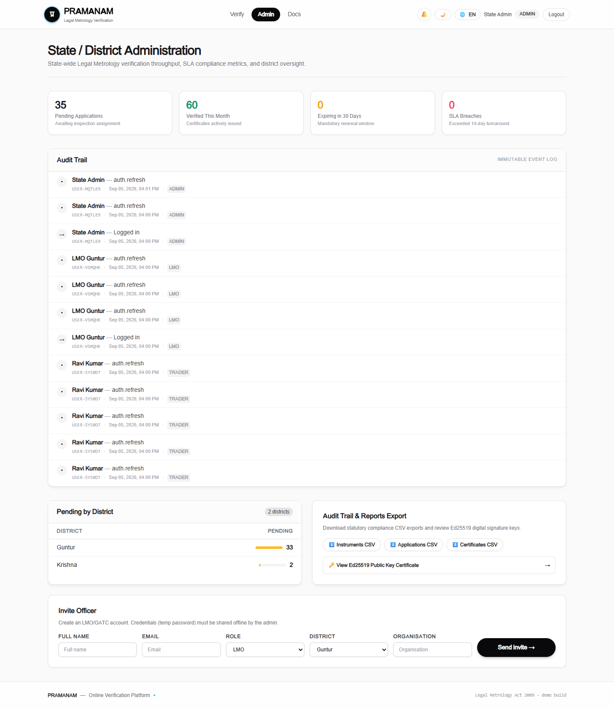
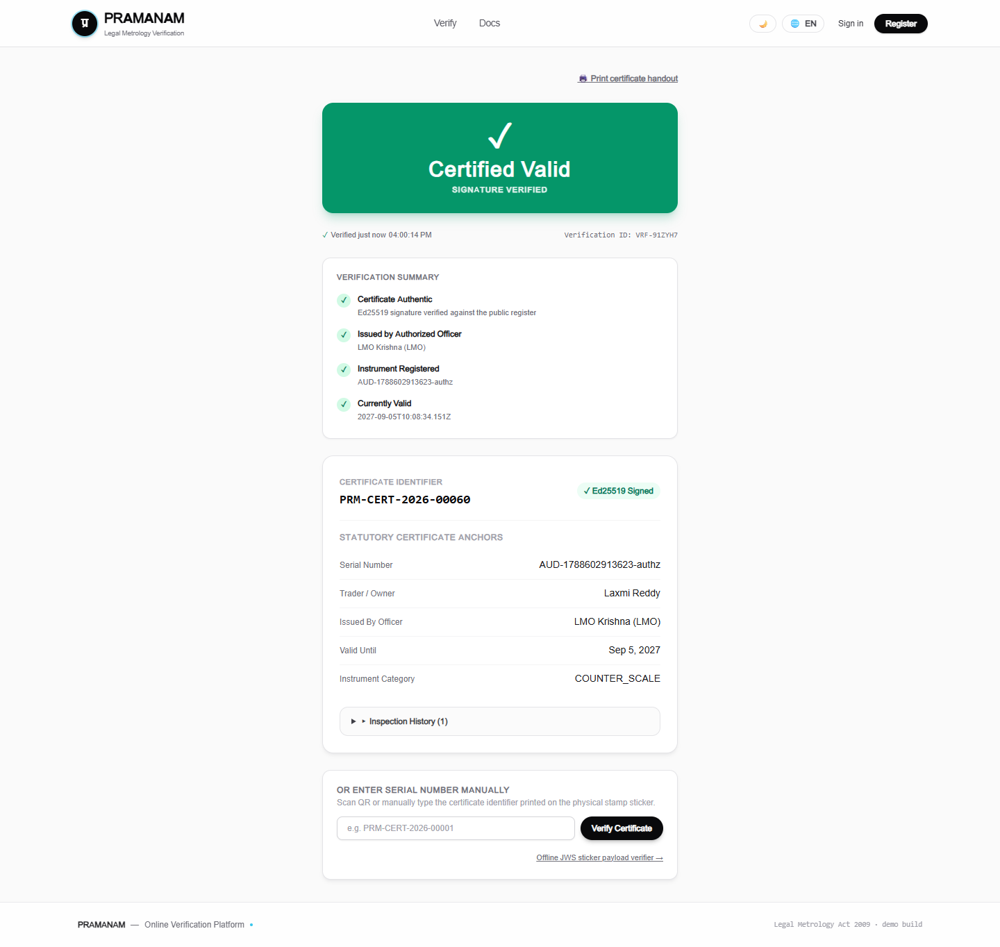
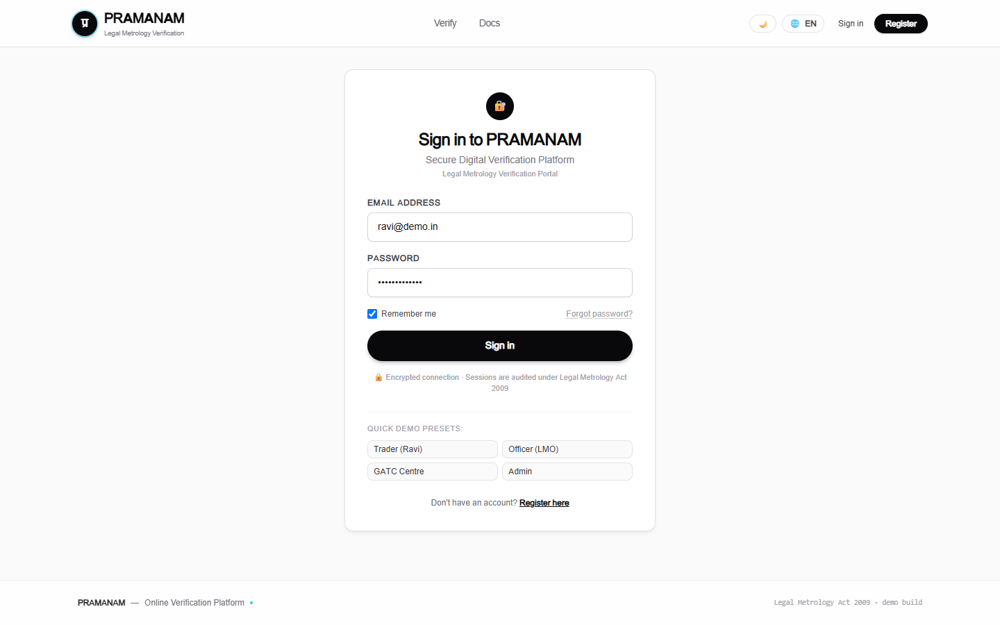
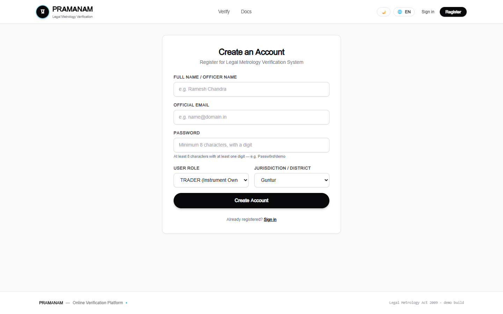
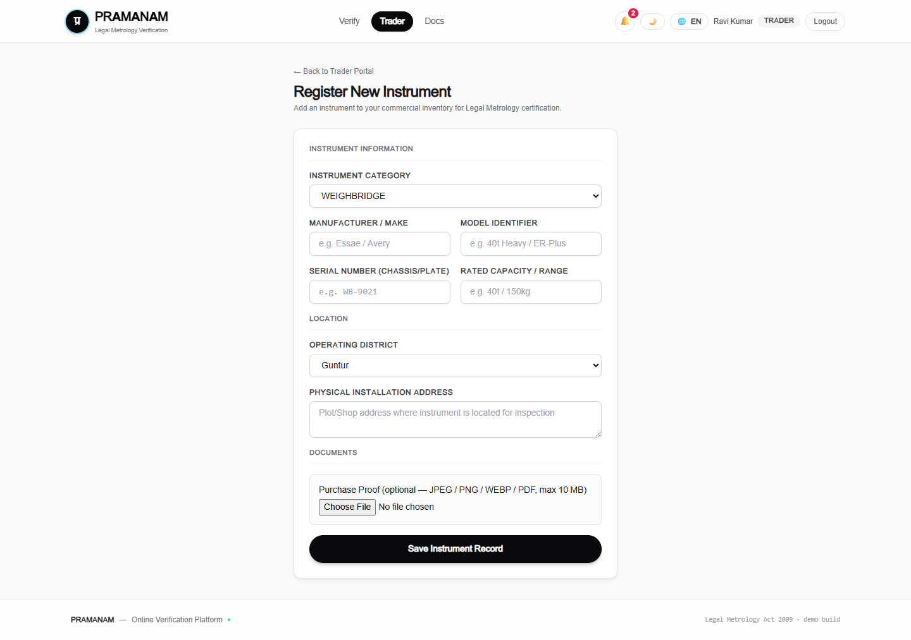
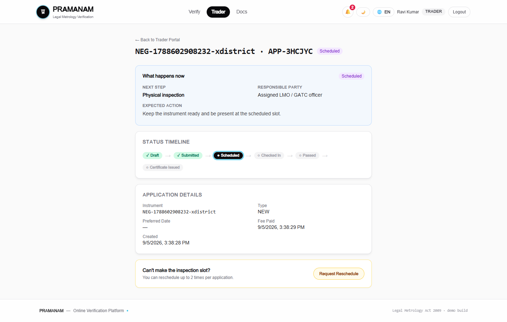

<p align="center">
  
  
  <a href="https://sih-2026-pramanam.vercel.app/"></a>
  
  
  
  
  
</p>

<h1 align="center">
  🏛️ PRAMANAM
</h1>

<p align="center">
  <strong>प्रमाणम् — Digital Verification of Weighing & Measuring Instruments</strong>
  <br />
  <em>Online verification system under the Legal Metrology Act, 2009</em>
  <br />
  <em>Department of Consumer Affairs, Government of India</em>
</p>

<p align="center">
  <a href="#1-project-information">Project Info</a> •
  <a href="#3-proposed-solution">Solution</a> •
  <a href="#6-architecture">Architecture</a> •
  <a href="#11-installation">Install</a> •
  <a href="#12-run">Run</a> •
  <a href="#10-screenshots--prototype-photos">Screenshots</a> •
  <a href="#15-demo-accounts">Demo Accounts</a>
</p>

---

## 1. Project Information

| Field | Value |
|-------|-------|
| **Project Title** | PRAMANAM (प्रमाणम्) |
| **PS ID** | SIH26036 |
| **PS Title** | Online Verification of Weighing and Measuring Instruments |
| **Category** | Software |
| **Theme** | Smart Automation / Legal Metrology / Governance |
| **Live URL** | <https://sih-2026-pramanam.vercel.app/> |

---

## 2. Problem Statement

Under the **Legal Metrology Act, 2009**, every commercial weighing and measuring instrument must be periodically verified by government-authorized officers. The current process suffers from **regulatory friction** at every step:

- **Paper certificates** are hand-issued with no cryptographic integrity — they can be forged, altered, or reused after expiry.
- **Traders physically visit offices** to file applications and collect certificates — days of lost business per instrument.
- **No public verification** — a consumer or inspector standing at a shop counter has no way to confirm a certificate is genuine.
- **No offline verification** — verification fails exactly where it matters most: fields, godowns, and markets with poor connectivity.
- **Zero traceability** — no immutable record of who inspected what, when, and with what result.

---

## 3. Proposed Solution

PRAMANAM digitizes the **entire lifecycle** end-to-end — from Trader to Officer to Public Verifier:

1. **Traders** register instruments and apply for verification online
2. **Legal Metrology Officers (LMO)** and **GATC centres** receive auto-allocated inspection schedules
3. Officers conduct field inspections with photo evidence and GPS
4. On PASS, the system issues an **Ed25519-signed JWS certificate** with a QR payload
5. **Anyone** — including consumers — can verify a certificate's authenticity by scanning the QR, even **fully offline** from a printed sticker

### End-to-End Flow

```
Trader                    PRAMANAM                          LMO / GATC               Public
  │                          │                                 │                        │
  │  1. Register & Login     │   JWT + RBAC + Jurisdiction     │                        │
  │─────────────────────────►│                                 │                        │
  │  2. Add Instrument       │   Proof upload → MinIO          │                        │
  │  3. Apply → Pay → Submit │   DRAFT → SUBMITTED             │                        │
  │                          │────────────────────────────────►│  Auto-allocation       │
  │                          │   SUBMITTED → SCHEDULED         │  (least loaded officer)│
  │                          │                                 │  4. View queue         │
  │                          │                                 │  5. GPS check-in       │
  │                          │                                 │  6. Inspection         │
  │                          │◄────────────────────────────────│     PASS / FAIL        │
  │                          │   emitInspectionPass() hook     │                        │
  │  7. 🔔 CERT_ISSUED  ◄─── │   Certificate (JWS + QR)        │                        │
  │                          │                                 │                        │
  │                          │                                 │     8. Verify badge /  │
  │                          │                                 │        QR / sticker ───┤
```

### 8-State Finite State Machine

```
                 pay + declaration        auto-allocation           check-in (any time)
  ┌──────┐                        ┌───────────┐            ┌───────────┐             ┌────────────┐
  │ DRAFT├───────────────────────►│ SUBMITTED ├───────────►│ SCHEDULED ├────────────►│ CHECKED_IN │
  └──────┘                        └─────┬─────┘            └─────┬─────┘             └──────┬─────┘
                                        │                        │                          │
                                        │  reschedule (max 2)    │                          ▼
                                        ▼                        │                   ┌──────────────┐
                                  ┌──────────┐                   │                   │  PASS / FAIL │
                                  │ REJECTED │     missed slot   │                   └──────┬───────┘
                                  └────┬─────┘       (SLA)       │                          │
                                       │    re-apply             │                          │
                                       └─────────────────────────┘                          │
                                                                                            │
                                                          ┌──────▼──┐                ┌──────▼──┐
                                                          │  FAILED │                │ PASSED  │
                                                          └─────────┘                └────┬────┘
                                                                                          │
                                                                                    cert hook
                                                                                          │
                                                                                   ┌──────▼──────┐
                                                                                   │ CERT_ISSUED │
                                                                                   └─────────────┘
```

Transitions are defined in `packages/shared/constants.ts` (`TRANSITIONS` map). Any illegal state transition returns:

```json
{
  "ok": false,
  "error": {
    "code": "INVALID_STATE_TRANSITION",
    "message": "...",
    "details": { "from": "SCHEDULED", "to": "CERT_ISSUED" }
  }
}
```

---

## 4. Key Features

| Category | Features |
|----------|----------|
| 🔐 **Security & RBAC** | JWT access + refresh tokens (HS256, 15 min / 7 d) · durable Postgres-backed refresh-token **families with replay detection** · role-based access control (TRADER, LMO, GATC, ADMIN) · **jurisdiction guards** — officers can only access their district · admin invites with one-time passwords |
| 📜 **Cryptographic Certificates** | **Ed25519 (EdDSA)** signatures · compact JWS with `pmnm.v1` QR envelope · **fully offline verification** from QR sticker · isomorphic WebCrypto (same verification in Node.js and browser) · dual QR codes — offline JWS + online URL fallback |
| 📱 **Officer Field Inspection PWA** | Auto-allocation to the least-loaded officer in district · **GPS check-in** with time-window enforcement · multipart photo upload with **magic-byte validation** · structured observations against frozen config · reschedule (max 2, with reason) |
| 📊 **Admin Analytics** | Org-wide KPIs · district pendency breakdown · top-officer productivity · CSV export (BOM + formula-injection guard, role-scoped) |
| 🔔 **Notifications & Automation** | In-app notification bell with read/unread tracking · per-user notification preferences · **BullMQ expiry ladder** — nightly sweep at 00:30 IST (ACTIVE → EXPIRING_SOON → EXPIRED) |
| 🌐 **Public Trust Surface** | Public certificate badge with verdict + signature check · serial/ID lookup — **no authentication required** · `.well-known/pramanam-public-key` for third-party verification · public aggregate statistics · OpenAPI 3.0 documentation with drift guard |

---

## 5. Technology Stack

| Layer | Technology | Purpose |
|-------|------------|---------|
| **Framework** | Next.js 14 (App Router) | Full-stack TypeScript monolith |
| **Frontend** | React 18 + Tailwind CSS | Responsive UI with role-specific dashboards |
| **Language** | TypeScript 5 | End-to-end type safety |
| **Database** | PostgreSQL 16 + Prisma ORM v6 | Relational data, audit logs, refresh families |
| **Queue** | Redis 7 + BullMQ | Background jobs, expiry ladder, rate limiting |
| **Storage** | MinIO (S3-compatible) | Purchase proofs, inspection photos, certificate PDFs |
| **Auth** | `jose` (JWT) + `zod` (validation) | Stateless access tokens, durable refresh rotation |
| **Crypto** | Ed25519 — `node:crypto` + WebCrypto | Certificate signing, isomorphic verification |
| **PDF** | `pdf-lib` + `qrcode` | A4 certificate sheets, A6 QR stickers |
| **State** | `zustand` | Client-side session management |
| **Styling** | TailwindCSS | Institutional design system, i18n-ready |
| **Testing** | Vitest | Unit + E2E integration tests |
| **Deployment** | Vercel (live) + Render Blueprint | IaC: web, worker, MinIO, Postgres, Redis |

---

## 6. Architecture

Full architecture deep-dive: **[`docs/architecture.md`](./docs/architecture.md)**

PRAMANAM is a single Next.js 14 (App Router) full-stack TypeScript monolith: React client pages in `app/**/page.tsx` talk to versioned REST route handlers under `app/api/v1`, all answering one JSON envelope (`{ ok, data | error }`, closed error-code set). Route handlers share server libraries — `lib/auth` (JWT sessions, RBAC, jurisdiction guards, state-machine transitions, audit log), `lib/uploads` (MinIO multipart with magic-byte sniffing), `lib/crypto` (Ed25519 JWS signing, QR envelopes, certificate issuance), and `lib/pdf` — over PostgreSQL via Prisma (`prisma/schema.prisma` is frozen). Cross-cutting reactions go through the frozen `emitInspectionPass` hook into the worker registry (`workers/`), which also runs the nightly BullMQ expiry ladder; frozen shared contracts (`packages/shared`) keep UI, API, and seed in lock-step, with an OpenAPI drift guard failing the build when they diverge.

```
┌─────────────────────────────────────────────────────────────────────────────┐
│                              PRAMANAM SYSTEM                                │
├─────────────────────────────────────────────────────────────────────────────┤
│                                                                             │
│  ┌──────────────┐   ┌──────────────┐   ┌──────────────┐   ┌─────────────┐   │
│  │   Trader UI  │   │  Officer UI  │   │   Admin UI   │   │  Public UI  │   │
│  │  /trader/*   │   │  /officer/*  │   │   /admin/*   │   │  /verify/*  │   │
│  └──────┬───────┘   └──────┬───────┘   └──────┬───────┘   └──────┬──────┘   │ 
│         │                  │                   │                  │         │
│         └──────────────────┼───────────────────┼──────────────────┘         │
│                            │                   │                            │
│                    ┌───────▼───────────────────▼────────┐                   │
│                    │        REST API (app/api/v1)       │                   │
│                    │   JSON Envelope { ok, data|error } │                   │
│                    │     Zod validation · RBAC guards   │                   │
│                    └───────┬──────────┬─────────┬───────┘                   │
│                            │          │         │                           │
│              ┌─────────────┤          │         ├─────────────┐             │
│              │             │          │         │             │             │
│  ┌───────────▼──┐ ┌────────▼───┐ ┌────▼─────┐ ┌▼──────────┐ ┌▼──────────┐   │
│  │  lib/auth    │ │lib/uploads │ │lib/crypto│ │  lib/pdf  │ │lib/notify │   │
│  │  JWT·RBAC    │ │  MinIO·S3  │ │ Ed25519  │ │ A4 · A6   │ │   Bell    │   │
│  │  Transition  │ │  Multipart │ │ JWS · QR │ │ Sticker   │ │ Prefs     │   │
│  └──────┬───────┘ └─────┬──────┘ └────┬─────┘ └─────┬─────┘ └─────┬─────┘   │
│         │               │             │             │             │         │
│  ┌──────▼───────────────▼─────────────▼─────────────▼─────────────▼─────┐   │
│  │                        PostgreSQL (Prisma ORM)                        │  │
│  │   Users · Instruments · Applications · Schedules · Inspections        │  │
│  │   Certificates · Notifications · AuditLogs · RefreshFamilies          │  │
│  └──────────────────────────────┬────────────────────────────────────────┘  │
│                                 │                                           │
│  ┌──────────────────────────────┼────────────────────────────────────────┐  │
│  │                    Infrastructure                                     │  │
│  │  ┌─────────────┐   ┌────────▼────┐   ┌──────────────────────────┐     │  │
│  │  │    MinIO    │   │    Redis    │   │   BullMQ Worker Process  │     │  │
│  │  │  S3 Storage │   │   Queues    │   │  Expiry Ladder 00:30 IST │     │  │
│  │  │  Versioned  │   │  Rate Limit │   │  Repair Sweep on Boot    │     │  │
│  │  └─────────────┘   └─────────────┘   └──────────────────────────┘     │  │
│  └──────────────────────────────────────────────────────────────────────-┘  │
└─────────────────────────────────────────────────────────────────────────────┘
```

### 6.1 Cryptographic Security Model (Ed25519 JWS)

A certificate is a **compact JWS** signed with **Ed25519** (`alg: "EdDSA"`), produced in `lib/crypto/`:

| File | Purpose |
|------|---------|
| `keys.ts` | Key generation, env loading. Ephemeral dev pair if unset (printed on boot) |
| `jws.ts` | `signCredential` (server, node:crypto) + `verifyCredential` (isomorphic WebCrypto) |
| `qr.ts` | `pmnm.v1` QR envelope — signed JWS travels inside QR for offline verification |
| `issue.ts` | Certificate issuance service (idempotent per application, writes notification) |

```
┌─────────────────────────────────────────────────────────┐
│                   Certificate JWS                       │
│                                                         │
│  Header: { "alg": "EdDSA", "kid": "pramanam-2026-...",  │
│            "typ": "JWT" }                               │
│                                                         │
│  Payload: { "iss": "pramanam:doca",                     │
│             "sub": "PRM-CERT-2026-00001",               │
│             "instrumentSerial": "CS-4412",              │
│             "ownerName": "Ravi Kumar",                  │
│             "issuedBy": "LMO Guntur",                   │
│             "category": "COUNTER_SCALE",                │
│             "validFrom": "...", "validUntil": "..." }   │
│                                                         │
│  Signature: Ed25519(header.payload, privateKey)         │
└─────────────────────────────────────────────────────────┘
                            │
                            ▼
               ┌─────────────────────┐
               │     QR Sticker      │
               │  pmnm.v1=b64url({   │
               │    v, alg, kid,     │
               │    s: <JWS>         │
               │  })                 │
               │                     │
               │  Works OFFLINE —    │
               │  no network needed  │
               └─────────────────────┘
```

The public key is served at `/.well-known/pramanam-public-key` (JWK + fingerprint) so any third party can independently verify certificates. Self-check: `npx tsx lib/crypto/selftest.ts`.

### 6.2 API Reference

All endpoints respond with a unified JSON envelope:

```json
{ "ok": true,  "data": { ... } }
{ "ok": false, "error": { "code": "AUTH_REQUIRED", "message": "...", "details": {} } }
```

**Error codes**

| Code | HTTP | Description |
|------|:----:|-------------|
| `VALIDATION_ERROR` | 400 | Zod schema validation failed |
| `AUTH_REQUIRED` | 401 | Missing or expired access token |
| `AUTH_FORBIDDEN` | 403 | Insufficient role for this action |
| `JURISDICTION_FORBIDDEN` | 403 | Officer accessing outside their district |
| `NOT_FOUND` | 404 | Resource does not exist |
| `CONFLICT` | 409 | Duplicate resource (e.g., serial + district) |
| `INVALID_STATE_TRANSITION` | 409 | Illegal status change (includes `from`/`to`) |
| `RESCHEDULE_BUDGET_EXHAUSTED` | 409 | Maximum reschedules (2) reached |
| `UNSUPPORTED_MEDIA_TYPE` | 415 | Upload failed magic-byte sniff |
| `RATE_LIMITED` | 429 | Too many requests |
| `INTERNAL` | 500 | Unexpected server error |

**Auth**

| Method | Path | Description |
|:------:|------|-------------|
| `POST` | `/api/v1/auth/register` | Public signup (trader-only). Password: 8+ chars with a digit, max 72 |
| `POST` | `/api/v1/auth/invite` | ADMIN only — creates LMO/GATC with one-time password (shown once) |
| `POST` | `/api/v1/auth/login` | Returns `{ accessToken, user }` + sets `pm_refresh` cookie. Rate-limited per account |
| `POST` | `/api/v1/auth/refresh` | Rotates refresh token (Postgres family). Replaying old token revokes the whole family |
| `POST` | `/api/v1/auth/change-password` | Authenticated rotation. Clears `mustChangePassword` for invited officers |
| `POST` | `/api/v1/auth/logout` | Clears refresh cookie |
| `GET` | `/api/v1/auth/me` | Returns current authenticated user |

**Instruments**

| Method | Path | Description |
|:------:|------|-------------|
| `GET` | `/api/v1/instruments` | List instruments — traders see own, officers their district, admin all. Filters: `district`, `category`, `q` |
| `POST` | `/api/v1/instruments` | Trader only. Multipart with optional purchase proof. Serial + district must be unique |
| `GET` | `/api/v1/instruments/{id}` | Detail — owner, same-district officer, or admin |
| `PATCH` | `/api/v1/instruments/{id}` | Update `address` and `capacity` only |
| `GET` | `/api/v1/instruments/{id}/sticker` | A6 sticker PDF for the instrument's ACTIVE certificate. Returns presigned download URL |

**Applications**

| Method | Path | Description |
|:------:|------|-------------|
| `GET` | `/api/v1/applications` | Trader's own applications |
| `POST` | `/api/v1/applications` | Create a new application (DRAFT). Must own the instrument. One open app per instrument |
| `GET` | `/api/v1/applications/{id}` | Application detail |
| `POST` | `/api/v1/applications/{id}/pay` | Record payment (DRAFT only, idempotent). `PAYMENT_MODE=demo` runs mock |
| `POST` | `/api/v1/applications/{id}/submit` | Atomic: declaration + payment gate + officer allocation → SCHEDULED |
| `POST` | `/api/v1/applications/{id}/reschedule` | Trader, while SCHEDULED. Max 2 reschedules. Requires `{ reason, newDate }` |
| `POST` | `/api/v1/applications/{id}/photos` | Upload photos (trader or assigned officer) → MinIO keys |

**Scheduling & Inspection**

| Method | Path | Description |
|:------:|------|-------------|
| `GET` | `/api/v1/schedule/mine` | Officer's inspection queue — ordered by date, overdue flagged |
| `POST` | `/api/v1/schedule/checkin` | Check-in any time (before/on/after the scheduled date) |
| `POST` | `/api/v1/schedule/allocate` | Manual re-run of officer allocation |
| `POST` | `/api/v1/inspections` | Multipart: result, observations, ≥1 photo, GPS. PASS → certificate issued in same transaction |

**Certificates**

| Method | Path | Description |
|:------:|------|-------------|
| `POST` | `/api/v1/certificates/issue` | Manual certificate issuance (ADMIN or assigned officer). Idempotent |
| `GET` | `/api/v1/certificates/{id}` | Certificate detail with JWS and QR payload. Role-scoped |
| `GET` | `/api/v1/certificates/{id}/pdf` | Download A4 certificate PDF (presigned URL, regenerated if stale) |
| `POST` | `/api/v1/certificates/{id}/revoke` | Revoke a certificate (ADMIN only). Requires reason |
| `POST` | `/api/v1/certificates/expiry/scan` | ADMIN trigger for the expiry sweep |

**Notifications**

| Method | Path | Description |
|:------:|------|-------------|
| `GET` | `/api/v1/notifications` | Own notifications, newest first |
| `PATCH` | `/api/v1/notifications/read` | Mark notifications as read: `{ ids: [...] }` |
| `GET` | `/api/v1/notifications/preferences` | Get notification preferences |
| `PUT` | `/api/v1/notifications/preferences` | Update preferences (cert, revoke, expiry, SLA toggles) |

**Dashboards**

| Method | Path | Description |
|:------:|------|-------------|
| `GET` | `/api/v1/dashboards/trader` | Pending apps, verified this month, expiring in 30d, SLA breaches |
| `GET` | `/api/v1/dashboards/officer` | Today's queue, overdue count, personal statistics |
| `GET` | `/api/v1/dashboards/admin` | Org-wide KPIs, district pendency, top 5 officers by inspections |

**Reports & Public**

| Method | Path | Description |
|:------:|------|-------------|
| `GET` | `/api/v1/reports/export` | CSV export: `?entity=instruments\|applications\|certificates`. Role-scoped, Excel-safe (BOM + formula guard) |
| `GET` | `/api/v1/public/certificates/{certId}` | Public verification badge — no auth required |
| `GET` | `/api/v1/public/certificates/lookup` | Lookup by serial or certId — returns badge or `{ found: false }` |
| `GET` | `/api/v1/public/stats` | Public aggregate statistics |
| `GET` | `/.well-known/pramanam-public-key` | Ed25519 public key (JWK + fingerprint) for third-party verification |
| `GET` | `/api/v1/openapi.json` | OpenAPI 3.0 specification — bundled at build, no runtime file read |

---

## 7. Repository Structure

```
pramanam/
│
├── app/                          # Next.js App Router
│   ├── api/v1/                   # REST API route handlers
│   │   ├── auth/                 #   Authentication (register, login, refresh, logout, invite)
│   │   ├── instruments/          #   Instrument CRUD + sticker
│   │   ├── applications/         #   Application lifecycle (pay, submit, reschedule, photos)
│   │   ├── schedule/             #   Officer queue, check-in, allocation
│   │   ├── inspections/          #   Inspection submission (multipart)
│   │   ├── certificates/         #   Issuance, PDF, revocation, expiry scan
│   │   ├── dashboards/           #   Role-specific dashboards (trader, officer, admin)
│   │   ├── notifications/        #   Bell + preferences
│   │   ├── reports/              #   CSV export
│   │   ├── public/               #   Badge, lookup, stats
│   │   ├── search/               #   Cross-entity search
│   │   ├── .well-known/          #   Public Ed25519 key
│   │   └── openapi.json/         #   OpenAPI 3.0 spec
│   │
│   ├── admin/                    # Admin dashboard pages
│   ├── officer/                  # Officer queue + job pages
│   ├── trader/                   # Trader portal pages
│   ├── verify/                   # Public verification + offline verify
│   ├── login/                    # Authentication pages
│   ├── register/                 # Registration pages
│   └── docs/                     # OpenAPI documentation viewer
│
├── components/                   # Shared React components
│   ├── Header.tsx                #   App header with auth + role chip
│   ├── Footer.tsx                #   App footer
│   ├── Badge.tsx                 #   Certificate verification badge
│   ├── StatusChip.tsx            #   Application status indicator
│   ├── PhotoInput.tsx            #   Photo upload with preview
│   ├── CountdownRing.tsx         #   Animated countdown timer
│   ├── NotificationBell.tsx      #   In-app notification dropdown
│   ├── export-buttons.tsx        #   CSV export UI
│   ├── api-client.ts             #   Fetch wrapper (Bearer, refresh, single-flight)
│   └── verdict.ts                #   Certificate verdict renderer
│
├── lib/                          # Server-side libraries
│   ├── auth/                     #   JWT, session, RBAC, jurisdiction, transitions, audit
│   ├── crypto/                   #   Ed25519 keys, JWS, QR envelope, certificate issuance
│   ├── pdf/                      #   A4 certificate sheet + A6 sticker + versioned MinIO
│   ├── uploads/                  #   MinIO client, multipart parsing, magic-byte sniffing
│   ├── notify/                   #   Notification helper
│   ├── public/                   #   Badge builder
│   ├── search/                   #   Cross-entity search
│   ├── security/                 #   Production env boot gate
│   ├── i18n/                     #   English + Hindi translations
│   ├── db.ts                     #   🔒 Frozen: Prisma singleton
│   ├── hooks.ts                  #   🔒 Frozen: PASS hook registry
│   └── hash.ts                   #   🔒 Frozen: scrypt hashing
│
├── packages/shared/              # 🔒 Frozen contracts
│   ├── constants.ts              #   Categories, fees, transitions, observation config
│   ├── types.ts                  #   Shared TypeScript types
│   ├── api.ts                    #   API envelope types
│   └── mock.ts                   #   Mock data for seeding
│
├── prisma/                       # Database
│   ├── schema.prisma             #   🔒 Frozen: 11 models
│   ├── search-indexes.sql        #   pg_trgm GIN + FK btree indexes
│   ├── seed.ts                   #   Idempotent demo seed (6 users, 6 instruments)
│   └── seed-10k.ts               #   Bulk seed for load testing
│
├── workers/                      # Background processes
│   ├── index.ts                  #   Worker registry (registerWorkers)
│   ├── expiry-scan.ts            #   Nightly expiry ladder (ACTIVE → EXPIRING_SOON → EXPIRED)
│   └── worker-entry.ts           #   Standalone worker process entry point
│
├── tests/                        # Test suites
│   ├── smoke.spec.ts             #   PRD §14 happy path E2E (5 tests)
│   ├── negative.spec.ts          #   Error envelope assertions (3 tests)
│   ├── audit.spec.ts             #   Audit log verification
│   └── helpers.ts                #   Test utilities (envelope fetch, login, polling)
│
├── scripts/                      # Build & validation scripts
│   ├── openapi.json              #   OpenAPI 3.0 spec (hand-maintained)
│   ├── check-openapi.mjs         #   Drift guard (spec vs live routes)
│   ├── secret-scan.mjs           #   Pre-submission secret scanner
│   └── screenshot-pages.mjs      #   Automated screenshot capture
│
├── docs/                         # Documentation
│   └── architecture.md           #   Full architecture deep-dive
│
├── submission/                   # SIH submission materials
│   ├── PRESENTATION.md           #   Final presentation
│   └── DEMO.md                   #   Demo video script + links
│
├── assets/screenshots/           # Screenshot gallery (see section 10)
│
├── docker-compose.yml            # 🔒 Local dev: Postgres + Redis + MinIO
├── render.yaml                   # Render Blueprint IaC (5 services)
└── prestart.sh                   # Boot sequence: db:push → db:indexes → seed → start
```

### What goes where?

| Path | Contents |
|------|----------|
| `docs/` | Technical documentation — architecture deep-dive and design notes |
| `submission/` | SIH evaluation materials — final presentation (`PRESENTATION.md`) and demo video (`DEMO.md`) |
| `assets/screenshots/` | UI screenshots gallery with captions — see [`assets/screenshots/README.md`](./assets/screenshots/README.md) |
| `PRD.pdf` | Product Requirements Document (§14 defines the E2E happy path covered by tests) |
| `BOOK_MANAV_API_CORE.pdf` | API core reference book |

> 🔒 **Frozen contracts** — the following files are shared across builders and must never be modified: `packages/shared/*`, `prisma/schema.prisma`, `lib/db.ts`, `lib/hooks.ts`, `lib/hash.ts`, `.env.example`, `docker-compose.yml`. Import them, do not edit them.
---

## 8. Final Presentation

- **📊 View Presentation Deck (Google Slides / PPTX):** [PRAMANAM SIH 2026 Presentation Deck](https://docs.google.com/presentation/d/1zYBJx-gNdT75g270ny9U7AVmReAEHLaX/edit?usp=sharing&ouid=112145670920107356148&rtpof=true&sd=true)
- **Presentation Details & Hub:** [`submission/PRESENTATION.md`](./submission/PRESENTATION.md)

Supporting documents referenced by the presentation:

| Document | Description |
|----------|-------------|
| [`PRD.pdf`](./PRD.pdf) | Product Requirements Document — full feature specification |
| [`BOOK_MANAV_API_CORE.pdf`](./BOOK_MANAV_API_CORE.pdf) | API core reference — endpoint contracts and crypto design |

---

## 9. Demo Video
- **🎬 Watch Demo Video (Google Drive):** [Google Drive Video Demonstration](https://drive.google.com/file/d/1J5M8EqGVGurHe1Wyyx9-EhdL5dR0_XqC/view?usp=drive_link)
- **Walkthrough Agenda & Script:** [`submission/DEMO.md`](./submission/DEMO.md)
- **Live Production App:** [https://sih-2026-pramanam.vercel.app/](https://sih-2026-pramanam.vercel.app/)

The video covers the complete story: Trader registers an instrument → submits application → officer auto-allocation → GPS field inspection with photo evidence → Ed25519 certificate issuance → public QR verification → **offline verification with internet disconnected** → admin oversight and audit trail. Demo credentials for following along are in [section 15](#15-demo-accounts).

---

## 10. Screenshots / Prototype Photos

Full gallery with captions: **[`assets/screenshots/README.md`](./assets/screenshots/README.md)**

### Landing Page
<p align="center">
  
</p>

### Trader Dashboard
<p align="center">
  
</p>

### Officer Inspection Queue
<p align="center">
  
</p>

### Admin Dashboard
<p align="center">
  
</p>

### Certificate Verification (Online)
<p align="center">
  
</p>

### Certificate Verification (Offline)
<p align="center">
  
</p>

<details>
<summary><strong>📸 More Screenshots</strong></summary>

#### Login & Registration
<p align="center">
  
  
</p>

#### Trader Flows
<p align="center">
  
  
</p>

<p align="center">
  
  
</p>

#### Officer Flows
<p align="center">
  
</p>

#### API Documentation
<p align="center">
  
</p>

</details>

---

## 11. Installation

### Prerequisites

| Requirement | Version | Why |
|-------------|---------|-----|
| **Node.js** | ≥ 20 | WebCrypto Ed25519 for offline verification |
| **Docker** | Latest | Postgres + Redis + MinIO containers |
| **npm** | ≥ 10 | Lockfile-exact dependency install |

### Steps

```bash
# 1. Clone the repository
git clone https://github.com/smarpitm/SIH_2026.git
cd SIH_2026

# 2. Install dependencies (lockfile-exact, mirrors Vercel/Render)
npm ci

# 3. Start infrastructure (Postgres + Redis + MinIO)
docker compose up -d

# 4. Configure environment
cp .env.example .env
# Edit .env — fill in secrets (never commit real keys)

# 5. Push database schema, search indexes & seed demo data
npm run db:push
npm run db:indexes
npm run db:seed

# 6. Start the development server
npm run dev
```

### Environment Variables

| Variable | Purpose | Notes |
|----------|---------|-------|
| `DATABASE_URL` | Postgres connection string | Required |
| `REDIS_URL` | Redis connection | Optional for API-only development |
| `JWT_SECRET` | Signs access tokens | HS256, 15-minute expiry |
| `JWT_REFRESH_SECRET` | Signs refresh tokens | 7-day rotating refresh |
| `ED25519_PRIVATE_KEY` | Certificate signing key | Base64 PKCS8 PEM. If unset, ephemeral dev pair generated on boot |
| `ED25519_PUBLIC_KEY` | Certificate verification key | Base64 SPKI PEM. Paste into `.env`, never commit |
| `S3_ENDPOINT` | MinIO server URL | Default: `http://localhost:9000` |
| `S3_ACCESS_KEY` | MinIO access key | Bucket created automatically with versioning |
| `S3_SECRET_KEY` | MinIO secret key | |
| `S3_BUCKET` | Storage bucket name | Default: `pramanam-docs` |
| `NEXT_PUBLIC_APP_URL` | Public app base URL | Used for QR codes and certificate links |
| `PAYMENT_MODE` | Payment gateway mode | `demo` = mock payment; production requires `ALLOW_DEMO_PAYMENT=true` |
| `TRUST_PROXY` | Enable `x-forwarded-for` | Set `true` only behind a trusted reverse proxy |
| `NEXT_PUBLIC_DEMO_MODE` | Show demo presets on login | `true` shows credential presets on the login page |

### Access Points

| Service | URL | Credentials |
|---------|-----|-------------|
| 🌍 **Live (Vercel)** | <https://sih-2026-pramanam.vercel.app/> | Demo account seeded on prod DB |
| 🌐 **Web App** | <http://localhost:3000> | See [section 15](#15-demo-accounts) |
| 📦 **MinIO Console** | <http://localhost:9001> | `pramanam` / `pramanam123` |
| 📄 **API Docs** | <http://localhost:3000/docs> | OpenAPI 3.0 spec |

> **Dev/Build Isolation:** `next dev` writes to `.next` and `next build` writes to `.next-build` (configured in `next.config.mjs`), so running a production build **never corrupts** a running dev server. Override with `NEXT_DIST_DIR` if needed.
>
> **Proxy Note:** Behind a real proxy, enforce an upload body limit (e.g. nginx `client_max_body_size 25m`) — the API additionally rejects oversized requests from the `Content-Length` header before buffering.

---

## 12. Run

### Development

```bash
npm run dev          # Start Next.js development server on http://localhost:3000
```

### Tests & Checks

```bash
npm test             # Vitest test suites (require a live dev server)
npm run typecheck    # TypeScript compiler (tsc --noEmit)
npm run lint         # ESLint
```

Tests run against a **live dev server** on `http://localhost:3000` (override with `PRAMANAM_TEST_URL`):

```bash
# Fresh database → start server → run tests
npx prisma db push --force-reset && npm run db:seed   # Terminal 1
npm run dev                                            # Terminal 1
npm test                                               # Terminal 2
```

| Suite | Tests | What It Covers |
|-------|:-----:|----------------|
| `smoke.spec.ts` | 5 | **PRD §14 happy path**: login → create instrument with photo → apply → pay → submit (auto-allocate) → officer check-in → inspection PASS → certificate ACTIVE with 3-segment JWS → public badge VALID with passing signature and exactly 5 anchors |
| `negative.spec.ts` | 3 | **Error envelopes**: cross-district LMO fetch → `JURISDICTION_FORBIDDEN`, forced issue on non-PASSED app → `INVALID_STATE_TRANSITION`, text file renamed `.jpg` → `UNSUPPORTED_MEDIA_TYPE` |
| `audit.spec.ts` | 4 | Audit log trail verification — concurrent PASS inspections issue distinct certIds, jurisdiction enforcement, credential rotation |
| Component tests | 18+ | API client, export buttons, offline verify, verdict rendering, i18n |

### Crypto Selftest

```bash
npx tsx lib/crypto/selftest.ts        # Ed25519 + JWS + QR round-trip
npx tsx lib/pdf/pdf-selftest.ts       # PDF rendering + MinIO versioning
```

The crypto selftest covers: key generation, JWK shape, signing, genuine verification, payload tampering → `BAD_SIGNATURE`, signature flipping, kid mismatch, QR round-trip, and junk input handling.

### Background Workers

```bash
ENABLE_WORKERS=true npm run worker    # Standalone BullMQ worker process
```

Workers run the **nightly expiry ladder** (00:30 IST: ACTIVE → EXPIRING_SOON → EXPIRED) plus a repair sweep on boot. On Vercel, the same sweep runs via Vercel Cron.

### Utility Scripts

| Command | Description |
|---------|-------------|
| `npm run build` | Create production build |
| `npm run start` | Start production server |
| `npm run db:indexes` | Apply pg_trgm GIN + FK btree indexes (idempotent) |
| `npm run db:seed` | Run idempotent seed (prints "seeded already" on rerun) |
| `npm run seed:10k` | Bulk seed with 10,000 records for load testing |
| `npm run openapi:check` | Drift guard: verify OpenAPI spec matches live route tree |
| `npm run i18n:check` | Check English/Hindi translation parity |

### Deployment

**🟢 Live:** [https://sih-2026-pramanam.vercel.app/](https://sih-2026-pramanam.vercel.app/) — Vercel (Next.js preset, Vercel Cron for the expiry sweep). The repo also ships a **Render Blueprint** (`render.yaml`) with the full web + BullMQ-worker topology. `lib/security/env.ts` **refuses to boot** in production unless all secrets are set with real, non-demo values (no ephemeral Ed25519 keys, no demo MinIO credentials, `https://` app URL).

---

## 13. Future Scope

- **IoT smart-scale calibration** — direct telemetry from BLE/Wi-Fi-enabled weighing instruments: auto-scheduled verification when drift is detected, tamper events reported in real time.
- **Regional-language voice assistant** — voice-guided instrument registration and certificate verification in Hindi, Telugu, Tamil and other regional languages for low-literacy traders.
- **DigiLocker / W3C Verifiable Credentials** — push certificates into DigiLocker and issue W3C VC-compliant credentials so any relying party can verify cryptographically, beyond the QR sticker.
- **Computer-vision seal verification** — ML-based inspection photos: verify legal seals/stamps and detect instrument tampering automatically during officer inspections.

---

## 14. Team & Roles

| Member | Role | Modules |
|--------|------|---------|
| **Manav** | Backend Lead | Auth, RBAC, instruments, applications, uploads, scheduling, allocation, inspection, dashboards, notifications, exports, OpenAPI |
| **Smarpit** | Crypto & Backend | Ed25519 keys, JWS, QR, certificate issuance, PDF generation, sticker rendering, expiry ladder, BullMQ workers |
| **Kush** | Frontend Lead | UI shell, real auth flows, trader portal, officer portal, admin dashboard, verify pages, notification bell |
| **Nishka** | i18n & Docs | English/Hindi translations, documentation |
| **Shreyus** | Testing & QA Automation | Test suites, smoke/negative flows, regression battery, verification checklists, deployment smoke checks |
| **Kanishka** | Research & Documentation | Problem-statement research, Legal Metrology domain notes, docs, presentation & demo materials |

---

## 15. Demo Accounts

All seeded accounts use the password: **`Passw0rd!demo`**

| Role | Email | District | Description |
|:----:|-------|----------|-------------|
| 🔴 **ADMIN** | `admin@demo.in` | — | State Administrator |
| 🟢 **TRADER** | `ravi@demo.in` | Guntur | Ravi Traders |
| 🟢 **TRADER** | `laxmi@demo.in` | Krishna | Laxmi Enterprises |
| 🔵 **LMO** | `lmo.guntur@demo.in` | Guntur | Legal Metrology Officer |
| 🔵 **LMO** | `lmo.krishna@demo.in` | Krishna | Legal Metrology Officer |
| 🟣 **GATC** | `gatc@demo.in` | Guntur | Govt. Approved Test Centre |

> **Reset to pristine state:** `npx prisma db push --force-reset && npm run db:seed`

---

## Important

**Pre-submission security guidelines:**

- **Zero exposed secrets** — no API keys, private keys, passwords, or tokens are committed to this repository. `scripts/secret-scan.mjs` runs a pre-submission scan to enforce this.
- Ed25519 signing keys are supplied via environment variables only (`ED25519_PRIVATE_KEY`); the repo contains only the **public** verification key (`.well-known/pramanam-public-key`).
- Demo credentials above are seeded for evaluation purposes only and are not valid on production infrastructure.
- `.env` is git-ignored; `.env.example` documents every variable without real values.
- Production boot is gated by `lib/security/env.ts`, which refuses to start unless all production secrets are present and non-demo.

---

## 📄 License

Built for **Smart India Hackathon 2026** — Digitalization of Legal Metrology verification for the **Department of Consumer Affairs**, Government of India.

Licensed under the **MIT License** — see [LICENSE](./LICENSE).

---

<p align="center">
  <strong>🏛️ PRAMANAM — प्रमाणम्</strong>
  <br />
  <em>"Proof" in Sanskrit — because every measurement deserves verifiable truth.</em>
</p>
