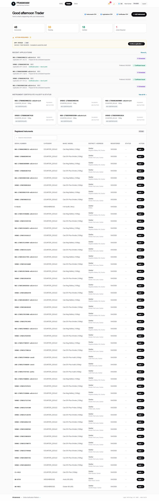
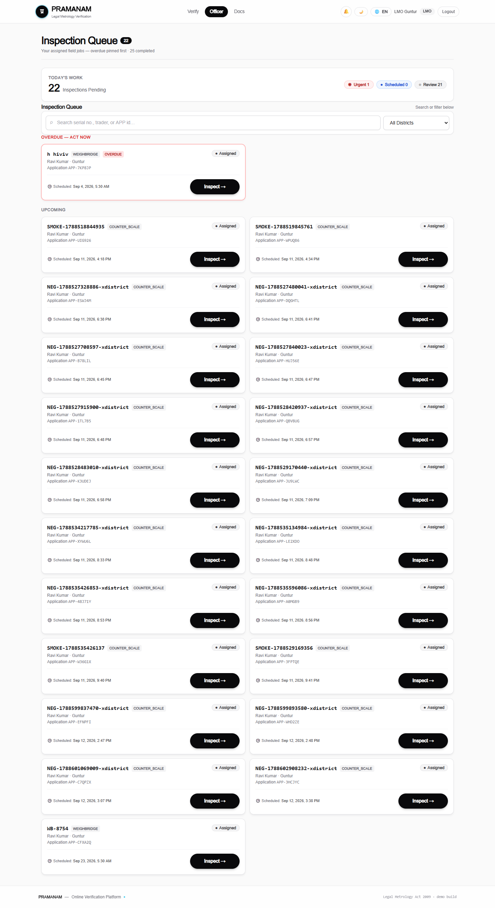
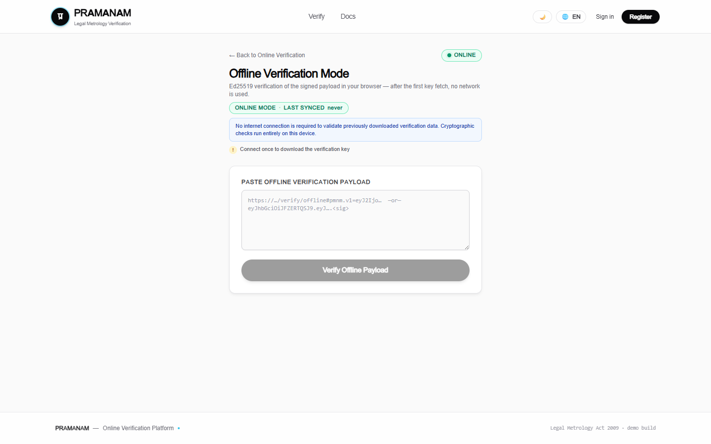
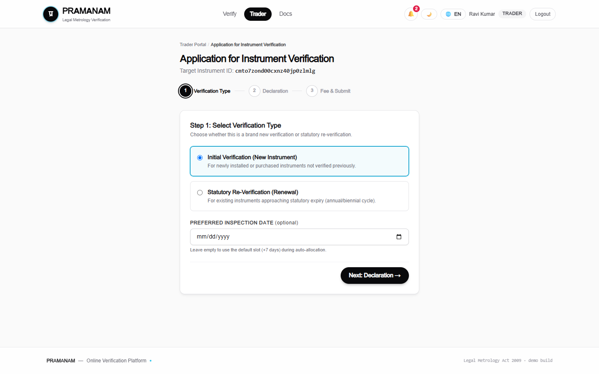
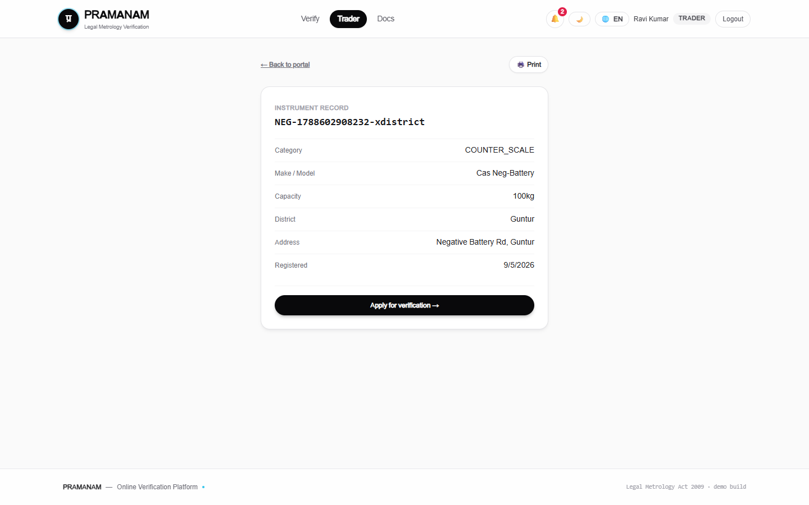
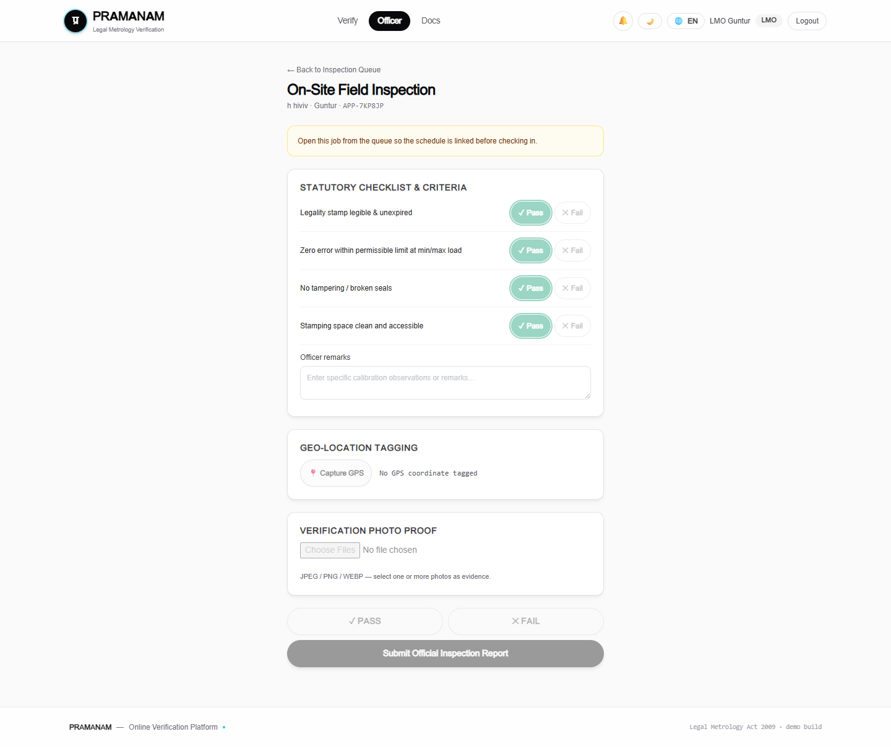
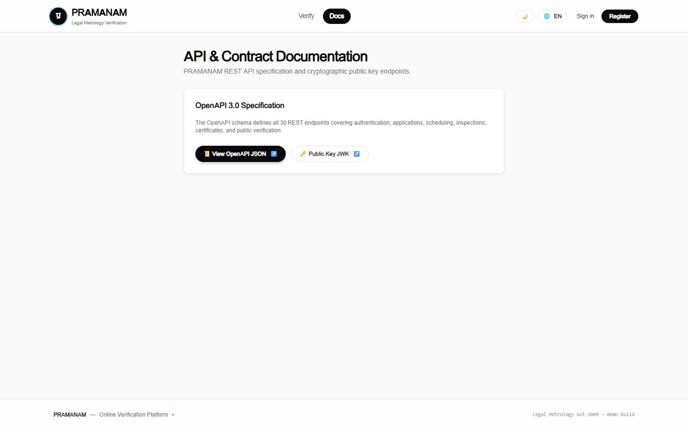

<p align="center">
  
  
  <a href="https://sih-2026-pramanam.vercel.app/"></a>
  
  
  
  
  
</p>

<h1 align="center">
  🏛️ PRAMANAM
</h1>

<p align="center">
  <strong>प्रमाणम् — Digital Verification of Weighing & Measuring Instruments</strong>
  <br />
  <em>Online verification system under the Legal Metrology Act, 2009</em>
  <br />
  <em>Department of Consumer Affairs, Government of India</em>
</p>

<p align="center">
  <a href="#-quick-start">Quick Start</a> •
  <a href="#-features">Features</a> •
  <a href="#-architecture">Architecture</a> •
  <a href="#-api-reference">API Reference</a> •
  <a href="#-screenshots">Screenshots</a> •
  <a href="#-deployment">Deployment</a>
</p>

---

## 📋 Table of Contents

- [Overview](#-overview)
- [How It Works](#-how-it-works)
- [Features](#-features)
- [Tech Stack](#-tech-stack)
- [Architecture](#-architecture)
- [Quick Start](#-quick-start)
- [Environment Variables](#-environment-variables)
- [Demo Accounts](#-demo-accounts)
- [Scripts & Commands](#-scripts--commands)
- [Application State Machine](#-application-state-machine)
- [API Reference](#-api-reference)
- [Certificates & Cryptography](#-certificates--cryptography)
- [Project Structure](#-project-structure)
- [Testing](#-testing)
- [Deployment](#-deployment)
- [Screenshots](#-screenshots)
- [Frozen Contracts](#-frozen-contracts)
- [Team](#-team)

---

## 🌟 Overview

**PRAMANAM** is a full-stack digital platform that modernizes the verification and certification of weighing & measuring instruments under India's Legal Metrology framework. Built for **Smart India Hackathon 2026** (Problem Statement **SIH26036**), it replaces paper-based processes with a secure, auditable, and fully online workflow.

### The Problem

Under the Legal Metrology Act, 2009, every commercial weighing and measuring instrument must be periodically verified by government-authorized officers. The current process is manual, paper-driven, and prone to fraud — traders physically visit offices, certificates are hand-issued with no cryptographic integrity, and public verification of authenticity is impossible.

### Our Solution

PRAMANAM digitizes the **entire lifecycle**:

1. **Traders** register instruments and apply for verification online
2. **Legal Metrology Officers (LMO)** and **GATC centres** receive auto-allocated inspection schedules
3. Officers conduct field inspections with photo evidence and GPS
4. On PASS, the system issues an **Ed25519-signed JWS certificate** with a QR payload
5. **Anyone** — including consumers — can verify a certificate's authenticity by scanning the QR, even **fully offline** from a printed sticker

---

## 🔄 How It Works

```
Trader                    PRAMANAM                          LMO / GATC               Public
  │                          │                                 │                        │
  │  1. Register & Login     │   JWT + RBAC + Jurisdiction     │                        │
  │─────────────────────────►│                                 │                        │
  │  2. Add Instrument       │   Proof upload → MinIO          │                        │
  │  3. Apply → Pay → Submit │   DRAFT → SUBMITTED             │                        │
  │                          │────────────────────────────────►│  Auto-allocation       │
  │                          │   SUBMITTED → SCHEDULED         │  (least loaded officer)│
  │                          │                                 │  4. View queue         │
  │                          │                                 │  5. GPS check-in       │
  │                          │                                 │  6. Inspection         │
  │                          │◄────────────────────────────────│     PASS / FAIL        │
  │                          │   emitInspectionPass() hook     │                        │
  │  7. 🔔 CERT_ISSUED  ◄─── │   Certificate (JWS + QR)        │                        │
  │                          │                                 │                        │
  │                          │                                 │     8. Verify badge /  │
  │                          │                                 │        QR / sticker ───┤
```

### Step-by-Step Flow

| Step | Actor | Action | Details |
|:----:|:-----:|--------|---------|
| **1** | Trader | Register & add instruments | Six categories supported. Purchase proof uploaded (magic-byte sniffed: JPEG/PNG/WEBP/PDF, 10 MB cap) to MinIO |
| **2** | Trader | Apply for verification | Chooses NEW or RE_VERIFICATION. Pays fee (demo mock). Submits with declaration |
| **3** | System | Auto-allocate officer | Picks the least-loaded LMO/GATC in the instrument's district. Application → SCHEDULED |
| **4** | Officer | View inspection queue | `/schedule/mine` — ordered by date, overdue jobs flagged |
| **5** | Officer | GPS check-in | Within `[scheduledFor - 2h, +8h]` time window |
| **6** | Officer | Conduct inspection | Records result, observations (validated config), photos, GPS coordinates |
| **7** | System | Issue certificate | Ed25519-signed JWS + QR payload. Trader notified via bell |
| **8** | Public | Verify authenticity | By certificate ID, QR scan, or offline sticker — signature verified in-browser via WebCrypto |

---

## ✨ Features

<table>
<tr>
<td width="50%">

### 🔐 Security & Authentication
- **JWT access + refresh tokens** (HS256, 15min / 7d)
- **Durable refresh-token families** with replay detection (Postgres-backed)
- **Role-Based Access Control** (TRADER, LMO, GATC, ADMIN)
- **Jurisdiction guards** — officers can only access their district
- **Admin invites** — LMO/GATC accounts with one-time password

</td>
<td width="50%">

### 📜 Digital Certificates
- **Ed25519 (EdDSA)** cryptographic signatures
- **Compact JWS** format with `pmnm.v1` QR envelope
- **Offline verification** — QR sticker works without internet
- **WebCrypto isomorphic** — same verification in Node.js and browser
- **Dual QR codes** — offline JWS + online URL fallback

</td>
</tr>
<tr>
<td>

### 📊 Dashboards & Analytics
- **Trader dashboard** — pending apps, verified count, expiring soon, SLA
- **Officer dashboard** — today's queue, overdue count, personal stats
- **Admin dashboard** — org-wide KPIs, district pendency, top officers
- **CSV export** — BOM + formula-injection guard, role-scoped

</td>
<td>

### 🔔 Notifications & Automation
- **In-app notification bell** with read/unread tracking
- **Per-user notification preferences** (cert, revoke, expiry, SLA)
- **BullMQ expiry ladder** — nightly sweep at 00:30 IST
- **Auto status transitions** — ACTIVE → EXPIRING_SOON → EXPIRED

</td>
</tr>
<tr>
<td>

### 📱 Inspection Workflow
- **Auto-allocation** — least-loaded officer in district
- **GPS check-in** with time-window enforcement
- **Multipart photo upload** with magic-byte validation
- **Structured observations** against frozen config
- **Reschedule** — trader can reschedule up to 2 times

</td>
<td>

### 🌐 Public Trust Surface
- **Public certificate badge** with verdict + signature check
- **Serial/ID lookup** — no authentication required
- **`.well-known/pramanam-public-key`** for third-party verification
- **Aggregate public statistics**
- **OpenAPI 3.0 documentation** with drift guard

</td>
</tr>
</table>

---

## 🛠 Tech Stack

| Layer | Technology | Purpose |
|-------|------------|---------|
| **Framework** | Next.js 14 (App Router) | Full-stack TypeScript monolith |
| **Frontend** | React 18 + Tailwind CSS | Responsive UI with role-specific dashboards |
| **Database** | PostgreSQL 16 + Prisma ORM v6 | Relational data, audit logs, refresh families |
| **Queue** | Redis + BullMQ | Background jobs, expiry ladder, rate limiting |
| **Storage** | MinIO (S3-compatible) | Purchase proofs, inspection photos, certificate PDFs |
| **Auth** | `jose` (JWT) + `zod` (validation) | Stateless access tokens, durable refresh rotation |
| **Crypto** | `node:crypto` Ed25519 + WebCrypto | Certificate signing, isomorphic verification |
| **PDF** | `pdf-lib` + `qrcode` | A4 certificate sheets, A6 QR stickers |
| **State** | `zustand` | Client-side session management |
| **Testing** | Vitest | Unit + E2E integration tests |
| **Deployment** | Render (Blueprint) | IaC: web, worker, MinIO, Postgres, Redis |
| **Mobile** | React Native (Expo) | Android companion app (in development) |

---

## 🏗 Architecture

### Architecture in One Paragraph

PRAMANAM is a single Next.js 14 (App Router) full-stack TypeScript monolith: React client pages in `app/**/page.tsx` talk to versioned REST route handlers under `app/api/v1`, all answering one JSON envelope (`{ ok, data | error }`, closed error-code set). Route handlers share server libraries — `lib/auth` (JWT sessions, RBAC, jurisdiction guards, state-machine transitions, audit log), `lib/uploads` (MinIO multipart with magic-byte sniffing), `lib/crypto` (Ed25519 JWS signing, QR envelopes, certificate issuance), and `lib/pdf` — over PostgreSQL via Prisma (`prisma/schema.prisma` is frozen). Cross-cutting reactions go through the frozen `emitInspectionPass` hook into the worker registry (`workers/`), which also runs the nightly BullMQ expiry ladder; frozen shared contracts (`packages/shared`) keep UI, API, and seed in lock-step, with an OpenAPI drift guard failing the build when they diverge.

### System Diagram

```
┌─────────────────────────────────────────────────────────────────────────────┐
│                              PRAMANAM SYSTEM                                │
├─────────────────────────────────────────────────────────────────────────────┤
│                                                                             │
│  ┌──────────────┐   ┌──────────────┐   ┌──────────────┐   ┌─────────────┐  │
│  │   Trader UI  │   │  Officer UI  │   │   Admin UI   │   │  Public UI  │  │
│  │  /trader/*   │   │  /officer/*  │   │   /admin/*   │   │  /verify/*  │  │
│  └──────┬───────┘   └──────┬───────┘   └──────┬───────┘   └──────┬──────┘  │
│         │                  │                   │                  │         │
│         └──────────────────┼───────────────────┼──────────────────┘         │
│                            │                   │                            │
│                    ┌───────▼───────────────────▼────────┐                   │
│                    │        REST API (app/api/v1)        │                   │
│                    │   JSON Envelope { ok, data|error }  │                   │
│                    │     Zod validation · RBAC guards    │                   │
│                    └───────┬──────────┬─────────┬───────┘                   │
│                            │          │         │                            │
│              ┌─────────────┤          │         ├─────────────┐             │
│              │             │          │         │             │             │
│  ┌───────────▼──┐ ┌────────▼───┐ ┌────▼─────┐ ┌▼──────────┐ ┌▼──────────┐ │
│  │  lib/auth    │ │lib/uploads │ │lib/crypto│ │  lib/pdf  │ │lib/notify │ │
│  │  JWT·RBAC    │ │  MinIO·S3  │ │ Ed25519  │ │ A4 · A6   │ │   Bell    │ │
│  │  Transition  │ │  Multipart │ │ JWS · QR │ │ Sticker   │ │ Prefs     │ │
│  └──────┬───────┘ └─────┬──────┘ └────┬─────┘ └─────┬─────┘ └─────┬─────┘ │
│         │               │             │             │             │        │
│  ┌──────▼───────────────▼─────────────▼─────────────▼─────────────▼─────┐  │
│  │                        PostgreSQL (Prisma ORM)                        │  │
│  │   Users · Instruments · Applications · Schedules · Inspections        │  │
│  │   Certificates · Notifications · AuditLogs · RefreshFamilies          │  │
│  └──────────────────────────────┬────────────────────────────────────────┘  │
│                                 │                                           │
│  ┌──────────────────────────────┼────────────────────────────────────────┐  │
│  │                    Infrastructure                                     │  │
│  │  ┌─────────────┐   ┌────────▼────┐   ┌──────────────────────────┐    │  │
│  │  │    MinIO     │   │    Redis    │   │   BullMQ Worker Process  │    │  │
│  │  │  S3 Storage  │   │   Queues    │   │  Expiry Ladder 00:30 IST │    │  │
│  │  │  Versioned   │   │  Rate Limit │   │  Repair Sweep on Boot    │    │  │
│  │  └─────────────┘   └─────────────┘   └──────────────────────────┘    │  │
│  └──────────────────────────────────────────────────────────────────────┘  │
└─────────────────────────────────────────────────────────────────────────────┘
```

### Database Schema

The Prisma schema defines **12 models** powering the entire system:

| Model | Purpose |
|-------|---------|
| `User` | Traders, LMOs, GATC officers, Admins (with district-based jurisdiction) |
| `Instrument` | Registered weighing/measuring devices (6 categories, unique serial per district) |
| `Application` | Verification requests — tracks the full lifecycle from DRAFT to CERT_ISSUED |
| `Schedule` | Officer inspection assignments with reschedule tracking |
| `InspectionReport` | Inspection results with observations, photos (MinIO), and GPS |
| `Certificate` | Signed JWS certificates with QR payloads, status tracking, and versioned PDFs |
| `Notification` | In-app notification rows with dedupe keys for sweep idempotency |
| `NotificationPreference` | Per-user toggle for cert, revoke, expiry, and SLA notifications |
| `AuditLog` | Immutable audit trail for every state change and action |
| `RefreshFamily` | Durable refresh-token families for replay detection across restarts |
| `CertCounter` | Atomic sequence for deterministic certificate numbering |

---

## 🚀 Quick Start

### Prerequisites

| Requirement | Version | Why |
|-------------|---------|-----|
| **Node.js** | ≥ 20 | WebCrypto Ed25519 for offline verification |
| **Docker** | Latest | Postgres + Redis + MinIO containers |

### Installation

```bash
# 1. Clone the repository
git clone https://github.com/your-org/pramanam.git
cd pramanam

# 2. Install dependencies
npm install

# 3. Start infrastructure (Postgres + Redis + MinIO)
docker compose up -d

# 4. Configure environment
cp .env.example .env
# Edit .env — fill in secrets (never commit real keys)

# 5. Push database schema & seed demo data
npm run db:push
npm run db:seed

# 6. Start the development server
npm run dev
```

### Access Points

| Service | URL | Credentials |
|---------|-----|-------------|
| 🌍 **Live (Vercel)** | https://sih-2026-pramanam.vercel.app/ | Demo account seeded on prod DB |
| 🌐 **Web App** | http://localhost:3000 | See [Demo Accounts](#-demo-accounts) |
| 📦 **MinIO Console** | http://localhost:9001 | `pramanam` / `pramanam123` |
| 📄 **API Docs** | http://localhost:3000/docs | OpenAPI 3.0 spec |

### Dev/Build Isolation

`next dev` writes to `.next` and `next build` writes to `.next-build` (configured in `next.config.mjs`), so running a production build **never corrupts** a running dev server. Override with `NEXT_DIST_DIR` if needed.

> **Proxy Note:** Behind a real proxy, enforce an upload body limit (e.g. nginx `client_max_body_size 25m`) — the API additionally rejects oversized requests from the `Content-Length` header before buffering.

---

## 🔑 Environment Variables

| Variable | Purpose | Notes |
|----------|---------|-------|
| `DATABASE_URL` | Postgres connection string | Required |
| `REDIS_URL` | Redis connection | Optional for API-only development |
| `JWT_SECRET` | Signs access tokens | HS256, 15-minute expiry |
| `JWT_REFRESH_SECRET` | Signs refresh tokens | 7-day rotating refresh |
| `ED25519_PRIVATE_KEY` | Certificate signing key | Base64 PKCS8 PEM. If unset, ephemeral dev pair generated on boot |
| `ED25519_PUBLIC_KEY` | Certificate verification key | Base64 SPKI PEM. Paste into `.env`, never commit |
| `S3_ENDPOINT` | MinIO server URL | Default: `http://localhost:9000` |
| `S3_ACCESS_KEY` | MinIO access key | Bucket created automatically with versioning |
| `S3_SECRET_KEY` | MinIO secret key | |
| `S3_BUCKET` | Storage bucket name | Default: `pramanam-docs` |
| `NEXT_PUBLIC_APP_URL` | Public app base URL | Used for QR codes and certificate links |
| `PAYMENT_MODE` | Payment gateway mode | `demo` = mock payment; production requires `ALLOW_DEMO_PAYMENT=true` |
| `TRUST_PROXY` | Enable `x-forwarded-for` | Set `true` only behind a trusted reverse proxy |
| `NEXT_PUBLIC_DEMO_MODE` | Show demo presets on login | `true` shows credential presets on the login page |

---

## 👥 Demo Accounts

All seeded accounts use the password: **`Passw0rd!demo`**

| Role | Email | District | Description |
|:----:|-------|----------|-------------|
| 🔴 **ADMIN** | `admin@demo.in` | — | State Administrator |
| 🟢 **TRADER** | `ravi@demo.in` | Guntur | Ravi Traders |
| 🟢 **TRADER** | `laxmi@demo.in` | Krishna | Laxmi Enterprises |
| 🔵 **LMO** | `lmo.guntur@demo.in` | Guntur | Legal Metrology Officer |
| 🔵 **LMO** | `lmo.krishna@demo.in` | Krishna | Legal Metrology Officer |
| 🟣 **GATC** | `gatc@demo.in` | Guntur | Govt. Approved Test Centre |

> **Reset to pristine state:** `npx prisma db push --force-reset && npm run db:seed`

---

## 📜 Scripts & Commands

| Command | Description |
|---------|-------------|
| `npm run dev` | Start Next.js development server |
| `npm run build` | Create production build |
| `npm run start` | Start production server |
| `npm run typecheck` | Run TypeScript compiler (`tsc --noEmit`) |
| `npm run lint` | Run ESLint |
| `npm run test` | Run Vitest test suites |
| `npm run db:push` | Push Prisma schema to database |
| `npm run db:indexes` | Apply pg_trgm GIN + FK btree indexes (idempotent) |
| `npm run db:seed` | Run idempotent seed (prints "seeded already" on rerun) |
| `npm run seed:10k` | Bulk seed with 10,000 records for load testing |
| `npm run openapi:check` | Drift guard: verify OpenAPI spec matches live route tree |
| `npm run i18n:check` | Check English/Hindi translation parity |
| `npm run worker` | Start BullMQ worker process (`ENABLE_WORKERS=true`) |

---

## 🔀 Application State Machine

```
                 pay + declaration        auto-allocation           check-in window
  ┌──────┐                        ┌───────────┐            ┌───────────┐             ┌────────────┐
  │ DRAFT├───────────────────────►│ SUBMITTED ├───────────►│ SCHEDULED ├────────────►│ CHECKED_IN │
  └──────┘                        └─────┬─────┘            └─────┬─────┘             └──────┬─────┘
                                        │                        │                          │
                                        │  reschedule (max 2)    │                          ▼
                                        ▼                        │                   ┌──────────────┐
                                  ┌──────────┐                   │                   │  PASS / FAIL │
                                  │ REJECTED │     missed slot   │                   └──────┬───────┘
                                  └──────────┘       (SLA)       │                          │
                                                                 │                          │
                                                          ┌──────▼──┐                ┌──────▼──┐
                                                          │  FAILED │                │ PASSED  │
                                                          └─────────┘                └────┬────┘
                                                                                          │
                                                                                    cert hook
                                                                                          │
                                                                                   ┌──────▼──────┐
                                                                                   │ CERT_ISSUED │
                                                                                   └─────────────┘
```

Transitions are defined in `packages/shared/constants.ts` (`TRANSITIONS` map). Any illegal state transition returns:

```json
{
  "ok": false,
  "error": {
    "code": "INVALID_STATE_TRANSITION",
    "message": "...",
    "details": { "from": "SCHEDULED", "to": "CERT_ISSUED" }
  }
}
```

---

## 📡 API Reference

All endpoints respond with a unified JSON envelope:

```json
// Success
{ "ok": true,  "data": { ... } }

// Error
{ "ok": false, "error": { "code": "AUTH_REQUIRED", "message": "...", "details": {} } }
```

### Error Codes

| Code | HTTP | Description |
|------|:----:|-------------|
| `VALIDATION_ERROR` | 400 | Zod schema validation failed |
| `AUTH_REQUIRED` | 401 | Missing or expired access token |
| `AUTH_FORBIDDEN` | 403 | Insufficient role for this action |
| `JURISDICTION_FORBIDDEN` | 403 | Officer accessing outside their district |
| `NOT_FOUND` | 404 | Resource does not exist |
| `CONFLICT` | 409 | Duplicate resource (e.g., serial + district) |
| `INVALID_STATE_TRANSITION` | 409 | Illegal status change (includes `from`/`to`) |
| `RESCHEDULE_BUDGET_EXHAUSTED` | 409 | Maximum reschedules (2) reached |
| `UNSUPPORTED_MEDIA_TYPE` | 415 | Upload failed magic-byte sniff |
| `RATE_LIMITED` | 429 | Too many requests |
| `INTERNAL` | 500 | Unexpected server error |

---

### 🔐 Auth Endpoints

| Method | Path | Description |
|:------:|------|-------------|
| `POST` | `/api/v1/auth/register` | Public signup (trader-only). Password: 8+ chars with a digit, max 72 |
| `POST` | `/api/v1/auth/invite` | ADMIN only — creates LMO/GATC with one-time password (shown once) |
| `POST` | `/api/v1/auth/login` | Returns `{ accessToken, user }` + sets `pm_refresh` cookie. Rate-limited per account |
| `POST` | `/api/v1/auth/refresh` | Rotates refresh token (Postgres family). Replaying old token revokes the whole family |
| `POST` | `/api/v1/auth/change-password` | Authenticated rotation. Clears `mustChangePassword` for invited officers |
| `POST` | `/api/v1/auth/logout` | Clears refresh cookie |
| `GET` | `/api/v1/auth/me` | Returns current authenticated user |

---

### 🔧 Instruments

| Method | Path | Description |
|:------:|------|-------------|
| `GET` | `/api/v1/instruments` | List instruments — traders see own, officers their district, admin all. Filters: `district`, `category`, `q` |
| `POST` | `/api/v1/instruments` | Trader only. Multipart with optional purchase proof. Serial + district must be unique |
| `GET` | `/api/v1/instruments/{id}` | Detail — owner, same-district officer, or admin |
| `PATCH` | `/api/v1/instruments/{id}` | Update `address` and `capacity` only |
| `GET` | `/api/v1/instruments/{id}/sticker` | A6 sticker PDF for the instrument's ACTIVE certificate. Returns presigned download URL |

---

### 📋 Applications

| Method | Path | Description |
|:------:|------|-------------|
| `GET` | `/api/v1/applications` | Trader's own applications |
| `POST` | `/api/v1/applications` | Create a new application (DRAFT). Must own the instrument. One open app per instrument |
| `GET` | `/api/v1/applications/{id}` | Application detail |
| `POST` | `/api/v1/applications/{id}/pay` | Record payment (DRAFT only, idempotent). `PAYMENT_MODE=demo` runs mock |
| `POST` | `/api/v1/applications/{id}/submit` | Atomic: declaration + payment gate + officer allocation → SCHEDULED |
| `POST` | `/api/v1/applications/{id}/reschedule` | Trader, while SCHEDULED. Max 2 reschedules. Requires `{ reason, newDate }` |
| `POST` | `/api/v1/applications/{id}/photos` | Upload photos (trader or assigned officer) → MinIO keys |

---

### 📅 Scheduling & Inspection

| Method | Path | Description |
|:------:|------|-------------|
| `GET` | `/api/v1/schedule/mine` | Officer's inspection queue — ordered by date, overdue flagged |
| `POST` | `/api/v1/schedule/checkin` | Check-in within `[scheduledFor - 2h, +8h]` window |
| `POST` | `/api/v1/schedule/allocate` | Manual re-run of officer allocation |
| `POST` | `/api/v1/inspections` | Multipart: result, observations, ≥1 photo, GPS. PASS → certificate issued in same transaction |

---

### 📜 Certificates

| Method | Path | Description |
|:------:|------|-------------|
| `POST` | `/api/v1/certificates/issue` | Manual certificate issuance (ADMIN or assigned officer). Idempotent |
| `GET` | `/api/v1/certificates/{id}` | Certificate detail with JWS and QR payload. Role-scoped |
| `GET` | `/api/v1/certificates/{id}/pdf` | Download A4 certificate PDF (presigned URL, regenerated if stale) |
| `POST` | `/api/v1/certificates/{id}/revoke` | Revoke a certificate (ADMIN only). Requires reason |
| `POST` | `/api/v1/certificates/expiry/scan` | ADMIN trigger for the expiry sweep |

---

### 🔔 Notifications

| Method | Path | Description |
|:------:|------|-------------|
| `GET` | `/api/v1/notifications` | Own notifications, newest first |
| `PATCH` | `/api/v1/notifications/read` | Mark notifications as read: `{ ids: [...] }` |
| `GET` | `/api/v1/notifications/preferences` | Get notification preferences |
| `PUT` | `/api/v1/notifications/preferences` | Update preferences (cert, revoke, expiry, SLA toggles) |

---

### 📊 Dashboards

| Method | Path | Description |
|:------:|------|-------------|
| `GET` | `/api/v1/dashboards/trader` | Pending apps, verified this month, expiring in 30d, SLA breaches |
| `GET` | `/api/v1/dashboards/officer` | Today's queue, overdue count, personal statistics |
| `GET` | `/api/v1/dashboards/admin` | Org-wide KPIs, district pendency, top 5 officers by inspections |

---

### 📤 Reports & Public

| Method | Path | Description |
|:------:|------|-------------|
| `GET` | `/api/v1/reports/export` | CSV export: `?entity=instruments\|applications\|certificates`. Role-scoped, Excel-safe (BOM + formula guard) |
| `GET` | `/api/v1/public/certificates/{certId}` | Public verification badge — no auth required |
| `GET` | `/api/v1/public/certificates/lookup` | Lookup by serial or certId — returns badge or `{ found: false }` |
| `GET` | `/api/v1/public/stats` | Public aggregate statistics |
| `GET` | `/.well-known/pramanam-public-key` | Ed25519 public key (JWK + fingerprint) for third-party verification |
| `GET` | `/api/v1/openapi.json` | OpenAPI 3.0 specification — bundled at build, no runtime file read |

---

## 🔏 Certificates & Cryptography

A certificate is a **compact JWS** signed with **Ed25519** (`alg: "EdDSA"`), produced in `lib/crypto/`:

### Crypto Module Architecture

| File | Purpose |
|------|---------|
| `keys.ts` | Key generation, env loading. Ephemeral dev pair if unset (printed on boot) |
| `jws.ts` | `signCredential` (server, node:crypto) + `verifyCredential` (isomorphic WebCrypto) |
| `qr.ts` | `pmnm.v1` QR envelope — signed JWS travels inside QR for offline verification |
| `issue.ts` | Certificate issuance service (idempotent per application, writes notification) |

### How Certificate Verification Works

```
┌─────────────────────────────────────────────────────────┐
│                   Certificate JWS                        │
│                                                         │
│  Header: { "alg": "EdDSA", "kid": "pramanam-2026-...", │
│            "typ": "JWT" }                               │
│                                                         │
│  Payload: { "iss": "pramanam:doca",                     │
│             "sub": "PRM-CERT-2026-00001",               │
│             "instrumentSerial": "CS-4412",              │
│             "ownerName": "Ravi Kumar",                  │
│             "issuedBy": "LMO Guntur",                   │
│             "category": "COUNTER_SCALE",                │
│             "validFrom": "...", "validUntil": "..." }   │
│                                                         │
│  Signature: Ed25519(header.payload, privateKey)         │
└─────────────────────────────────────────────────────────┘
                            │
                            ▼
               ┌─────────────────────┐
               │     QR Sticker      │
               │  pmnm.v1=b64url({   │
               │    v, alg, kid,     │
               │    s: <JWS>         │
               │  })                 │
               │                     │
               │  Works OFFLINE —    │
               │  no network needed  │
               └─────────────────────┘
```

### Self-Check

```bash
npx tsx lib/crypto/selftest.ts
```

Covers: key generation, JWK shape, signing, genuine verification, payload tampering → `BAD_SIGNATURE`, signature flipping, kid mismatch, QR round-trip, and junk input handling.

---

## 📁 Project Structure

```
pramanam/
│
├── app/                          # Next.js App Router
│   ├── api/v1/                   # REST API route handlers
│   │   ├── auth/                 #   Authentication (register, login, refresh, logout, invite)
│   │   ├── instruments/          #   Instrument CRUD + sticker
│   │   ├── applications/         #   Application lifecycle (pay, submit, reschedule, photos)
│   │   ├── schedule/             #   Officer queue, check-in, allocation
│   │   ├── inspections/          #   Inspection submission (multipart)
│   │   ├── certificates/         #   Issuance, PDF, revocation, expiry scan
│   │   ├── dashboards/           #   Role-specific dashboards (trader, officer, admin)
│   │   ├── notifications/        #   Bell + preferences
│   │   ├── reports/              #   CSV export
│   │   ├── public/               #   Badge, lookup, stats
│   │   ├── search/               #   Cross-entity search
│   │   ├── .well-known/          #   Public Ed25519 key
│   │   └── openapi.json/         #   OpenAPI 3.0 spec
│   │
│   ├── admin/                    # Admin dashboard pages
│   ├── officer/                  # Officer queue + job pages
│   ├── trader/                   # Trader portal pages
│   ├── verify/                   # Public verification + offline verify
│   ├── login/                    # Authentication pages
│   ├── register/                 # Registration pages
│   └── docs/                     # OpenAPI documentation viewer
│
├── components/                   # Shared React components
│   ├── Header.tsx                #   App header with auth + role chip
│   ├── Footer.tsx                #   App footer
│   ├── Badge.tsx                 #   Certificate verification badge
│   ├── StatusChip.tsx            #   Application status indicator
│   ├── PhotoInput.tsx            #   Photo upload with preview
│   ├── CountdownRing.tsx         #   Animated countdown timer
│   ├── NotificationBell.tsx      #   In-app notification dropdown
│   ├── export-buttons.tsx        #   CSV export UI
│   ├── api-client.ts             #   Fetch wrapper (Bearer, refresh, single-flight)
│   └── verdict.ts                #   Certificate verdict renderer
│
├── lib/                          # Server-side libraries
│   ├── auth/                     #   JWT, session, RBAC, jurisdiction, transitions, audit
│   ├── crypto/                   #   Ed25519 keys, JWS, QR envelope, certificate issuance
│   ├── pdf/                      #   A4 certificate sheet + A6 sticker + versioned MinIO
│   ├── uploads/                  #   MinIO client, multipart parsing, magic-byte sniffing
│   ├── notify/                   #   Notification helper
│   ├── public/                   #   Badge builder
│   ├── search/                   #   Cross-entity search
│   ├── security/                 #   Production env boot gate
│   ├── i18n/                     #   English + Hindi translations
│   ├── db.ts                     #   🔒 Frozen: Prisma singleton
│   ├── hooks.ts                  #   🔒 Frozen: PASS hook registry
│   └── hash.ts                   #   🔒 Frozen: scrypt hashing
│
├── packages/shared/              # 🔒 Frozen contracts
│   ├── constants.ts              #   Categories, fees, transitions, observation config
│   ├── types.ts                  #   Shared TypeScript types
│   ├── api.ts                    #   API envelope types
│   └── mock.ts                   #   Mock data for seeding
│
├── prisma/                       # Database
│   ├── schema.prisma             #   🔒 Frozen: 12 models
│   ├── search-indexes.sql        #   pg_trgm GIN + FK btree indexes
│   ├── seed.ts                   #   Idempotent demo seed (6 users, 6 instruments)
│   └── seed-10k.ts               #   Bulk seed for load testing
│
├── workers/                      # Background processes
│   ├── index.ts                  #   Worker registry (registerWorkers)
│   ├── expiry-scan.ts            #   Nightly expiry ladder (ACTIVE → EXPIRING_SOON → EXPIRED)
│   └── worker-entry.ts           #   Standalone worker process entry point
│
├── tests/                        # Test suites
│   ├── smoke.spec.ts             #   PRD §14 happy path E2E (5 tests)
│   ├── negative.spec.ts          #   Error envelope assertions (3 tests)
│   ├── audit.spec.ts             #   Audit log verification
│   └── helpers.ts                #   Test utilities (envelope fetch, login, polling)
│
├── scripts/                      # Build & validation scripts
│   ├── openapi.json              #   OpenAPI 3.0 spec (hand-maintained)
│   ├── check-openapi.mjs         #   Drift guard (spec vs live routes)
│   └── screenshot-pages.mjs      #   Automated screenshot capture
│
├── mobile/                       # React Native (Expo) Android app
│   ├── android/                  #   Native Android build
│   └── src/                      #   Mobile source (components, hooks, constants)
│
├── docker-compose.yml            # 🔒 Local dev: Postgres + Redis + MinIO
├── render.yaml                   # Render Blueprint IaC (5 services)
├── prestart.sh                   # Boot sequence: db:push → db:indexes → seed → start
└── context.txt                   # Live project state & ownership matrix
```

---

## 🧪 Testing

### Test Suites

Tests run against a **live dev server** on `http://localhost:3000` (override with `PRAMANAM_TEST_URL`):

```bash
# Fresh database → start server → run tests
npx prisma db push --force-reset && npm run db:seed   # Terminal 1
npm run dev                                            # Terminal 1
npm test                                               # Terminal 2
```

| Suite | Tests | What It Covers |
|-------|:-----:|----------------|
| `smoke.spec.ts` | 5 | **PRD §14 happy path**: login → create instrument with photo → apply → pay → submit (auto-allocate) → officer check-in → inspection PASS → certificate ACTIVE with 3-segment JWS → public badge VALID with passing signature and exactly 5 anchors |
| `negative.spec.ts` | 3 | **Error envelopes**: cross-district LMO fetch → `JURISDICTION_FORBIDDEN`, forced issue on non-PASSED app → `INVALID_STATE_TRANSITION`, text file renamed `.jpg` → `UNSUPPORTED_MEDIA_TYPE` |
| `audit.spec.ts` | — | Audit log trail verification |
| Component tests | 18+ | API client, export buttons, offline verify, verdict rendering, i18n |

### Crypto Self-Tests

```bash
npx tsx lib/crypto/selftest.ts        # Ed25519 + JWS + QR round-trip
npx tsx lib/pdf/pdf-selftest.ts       # PDF rendering + MinIO versioning
```

---

## 🚢 Deployment

**🟢 Live now:** [https://sih-2026-pramanam.vercel.app/](https://sih-2026-pramanam.vercel.app/) — deployed on **Vercel** (Next.js preset, Vercel Cron for the nightly expiry sweep). Full Vercel setup + env var guide: [`VERCEL_DEPLOYMENT.md`](./VERCEL_DEPLOYMENT.md).

The repo also ships a **Render** topology (`render.yaml`) as a classic long-running Node deployment — useful as a fallback or for the full web + BullMQ-worker model.

### Why Not Vercel? (original assessment)

The app requires: a persistent Postgres, Redis for BullMQ, MinIO (no filesystem upload fallback), and a separate long-running worker process. Vercel's serverless model has none of these. Render fits the "one long-lived process" model natively. *(Since updated: Vercel works by moving the worker into a cron route and using hosted Postgres/Redis/S3 — see `VERCEL_DEPLOYMENT.md`.)*

### Render Blueprint Architecture

Everything is defined in **one infra-as-code file** (`render.yaml`):

| Service | Type | Description |
|---------|------|-------------|
| **pramanam-web** | Web | Next.js UI + all `/api/v1` routes |
| **pramanam-worker** | Worker | BullMQ: nightly expiry ladder (00:30 IST) + repair sweep |
| **pramanam-minio** | Docker | S3-compatible storage on persistent disk |
| **pramanam-postgres** | Managed DB | PostgreSQL (free tier) |
| **pramanam-redis** | Managed DB | Redis (free tier) |

### Required Production Environment Variables

`lib/security/env.ts` **refuses to boot** in production unless ALL of these are set with real, non-demo values:

| Variable | Purpose | Notes |
|----------|---------|-------|
| `DATABASE_URL` | Postgres | Wired from Blueprint |
| `REDIS_URL` | Redis + BullMQ | Wired from Blueprint |
| `JWT_SECRET` | Access token signing | ≥32 chars, no demo markers |
| `JWT_REFRESH_SECRET` | Refresh tokens | ≥32 chars |
| `ED25519_PRIVATE_KEY` | Certificate signing | Base64 PKCS8 (ephemeral gen DISABLED in prod) |
| `ED25519_PUBLIC_KEY` | Public verify key | Base64 SPKI |
| `S3_*` | MinIO credentials | Must NOT be demo `pramanam/pramanam123` |
| `NEXT_PUBLIC_APP_URL` | QR/badge links | Must be `https://` |

### One-Click Deploy

1. Push `main` to your repo
2. On [Render Dashboard](https://dashboard.render.com): **New → Blueprint** → select the repo
3. Render parses `render.yaml` and proposes services/add-ons — accept
4. Set the `sync: false` secrets on **pramanam-web**, worker, and MinIO in the dashboard
5. Render deploys. Health check (`/api/v1/public/stats`) turns green when ready

---

## 📸 Screenshots

### Landing Page
<p align="center">
  
</p>

### Trader Dashboard
<p align="center">
  
</p>

### Officer Inspection Queue
<p align="center">
  
</p>

### Admin Dashboard
<p align="center">
  
</p>

### Certificate Verification
<p align="center">
  
</p>

### Offline Verification
<p align="center">
  
</p>

<details>
<summary><strong>📸 More Screenshots</strong></summary>

#### Login & Registration
<p align="center">
  
  
</p>

#### Trader Flows
<p align="center">
  
  
</p>

<p align="center">
  
  
</p>

#### Officer Flows
<p align="center">
  
</p>

#### API Documentation
<p align="center">
  
</p>

</details>

---

## 🔒 Frozen Contracts

The following files are **shared across builders** and must never be modified — import them, do not edit them:

| Category | Files |
|----------|-------|
| **Shared Types** | `packages/shared/constants.ts`, `types.ts`, `api.ts`, `mock.ts` |
| **Database** | `prisma/schema.prisma` |
| **Core Libraries** | `lib/db.ts`, `lib/hooks.ts`, `lib/hash.ts` |
| **Infrastructure** | `.env.example`, `docker-compose.yml` |

Ownership and day-to-day status live in `context.txt`.

---

## 👨‍💻 Team

| Member | Role | Modules |
|--------|------|---------|
| **Manav** | Backend Lead | Auth, RBAC, instruments, applications, uploads, scheduling, allocation, inspection, dashboards, notifications, exports, OpenAPI |
| **Smarpit** | Crypto & Backend | Ed25519 keys, JWS, QR, certificate issuance, PDF generation, sticker rendering, expiry ladder, BullMQ workers |
| **Kush** | Frontend Lead | UI shell, real auth flows, trader portal, officer portal, admin dashboard, verify pages, notification bell |
| **Nishka** | i18n & Docs | English/Hindi translations, documentation |

---

## 📄 License

Built for **Smart India  Hackathon 2026** — Digitalization of Legal Metrology verification for the **Department of Consumer Affairs**, Government of India.

---

<p align="center">
  <strong>🏛️ PRAMANAM — प्रमाणम्</strong>
  <br />
  <em>"Proof" in Sanskrit — because every measurement deserves verifiable truth.</em>
</p>
